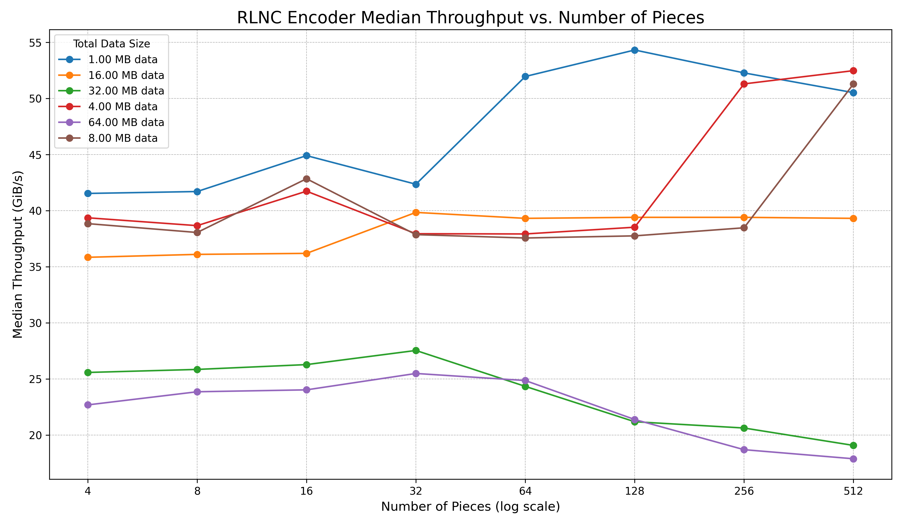
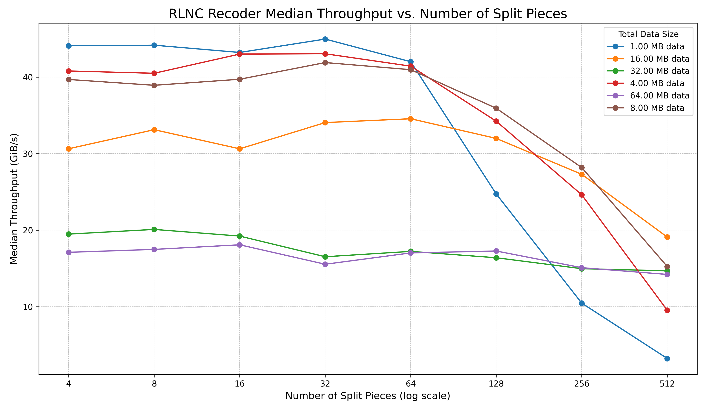
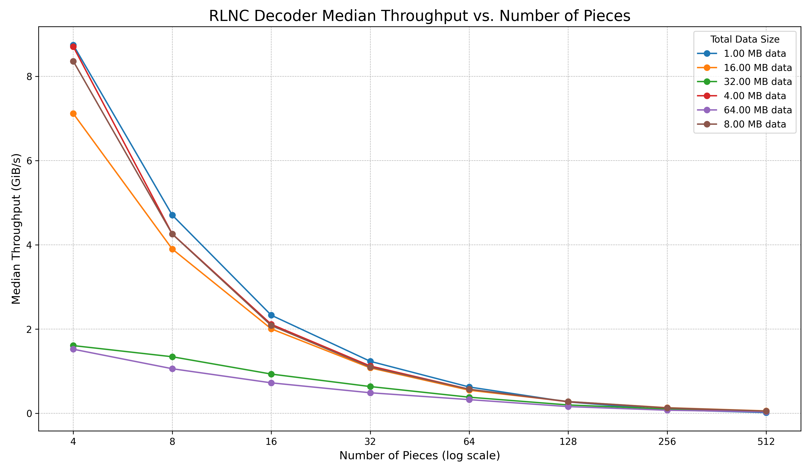

# rlnc

Blazing Fast Erasure-Coding with Random Linear Network Coding (RLNC)

## Introduction

`rlnc` is a Rust library crate that implements an advanced erasure-coding technique Random Linear Network Coding (RLNC) over galois field $GF(2^8)$ with irreducible polynomial $x^8 + x^4 + x^3 + x + 1$. This library provides functionalities for blazing fast erasure-coding of data, reconstructing original data from coded pieces, and recoding existing coded pieces to new erasure-coded pieces, without ever decoding it back to original data. It performs runtime introspection of platform and uses the best of GFNI, AVX512, AVX2 and SSSE3 intrinsics on `x86_64` and NEON intrinsics on `arm64`, for fast vector multiplication by a single scalar over $GF(2^8)$.

Following charts show performance of RLNC encoder, recoder and decoder on **AWS EC2 `m7a.large` with AMD EPYC 9R14** - which has GFNI + AVX512 support. More performance benchmark results [below](#benchmarking).







---
**Let's take a practical example of how RLNC can be useful.**

Imagine you want to send a book, split into 10 chapters, to a friend over a very unreliable mail service that often loses envelopes.

The old way is to send each of the 10 chapters in a separate envelope. If even 1 envelope gets lost, your friend can't read the whole book. They have to ask you to send that specific missing chapter again, which is slow and inefficient.

Random Linear Network Coding (RLNC) works like this: instead of sending the original chapters, you create 20 new "summary" envelopes. Each summary envelope is a unique, random mix of sentences from all the original 10 chapters. You then mail these 20 summary envelopes.

The magic is that your friend only needs to receive any 10 of these summary envelopes to perfectly reconstruct the entire book. It doesn't matter if the third one you sent gets lost, as long as another one arrives. Because each envelope contains information from the whole book, any 10 of them provide enough clues to solve the puzzle and rebuild the original 10 chapters.

This makes the transfer incredibly robust and efficient, as you don't need to worry about specific envelopes getting lost, just that enough of them make it to the destination.

RLNC can be used for erasure-coding both data-in-transit and data-in-rest - essentially increasing availability of original data by spreading it into many more pieces s.t. each of them is equally important. For a quick understanding of RLNC, have a look at my blog post @ <https://itzmeanjan.in/pages/rlnc-in-depth.html>.

---

Random Linear Network Coding (RLNC) excels in highly dynamic and lossy environments like multicast, peer-to-peer networks, and distributed storage, due to interesting properties such as encoding with random-sampled coefficients, any `k` out of `n` coded-pieces are sufficient to recover and recoding new pieces with existing erasure-coded pieces. Unlike Reed-Solomon, which requires specific symbols for deterministic recovery, RLNC allows decoding from *any* set of linearly independent packets. Compared to Fountain Codes, RLNC offers robust algebraic linearity with coding vector overhead, whereas Fountain codes prioritize very low decoding complexity and indefinite symbol generation, often for large-scale broadcasts.

## Features

For now this crate implements only **Full RLNC** scheme.

- **Encoder**: Splits original data into fixed-size pieces and generates new coded pieces by linearly combining these original pieces with random coefficients, sampled from $GF(2^8)$.
- **Decoder**: Receives coded pieces, applies Gaussian elimination to recover the original data, and handles linearly dependent pieces gracefully.
- **Recoder**: Takes already coded pieces and generates new coded pieces from them, facilitating multi-hop data distribution without requiring intermediate decoding.
- **Error Handling**: Defines a custom `RLNCError` enum to provide clear error messages for various operational failures.

## Prerequisites

Rust stable toolchain; see <https://rustup.rs> for installation guide. MSRV for this crate is 1.89.0.

 ```bash
# While developing this library, I was using
$ rustc --version
rustc 1.89.0 (29483883e 2025-08-04)
```

## Testing

For ensuring functional correctness of RLNC operations, the library includes a comprehensive test suite. Run all the tests by running following commands.

```bash
# Testing on host, first with `default` feature, then with `parallel` feature enabled.
make test

# Testing on web assembly target, using `wasmtime`.
rustup target add wasm32-wasip1
rustup target add wasm32-wasip2
cargo install wasmtime-cli@35.0.0 --locked

make test-wasm
```

```bash
running 17 tests
test full::decoder::tests::test_decoder_decode_invalid_piece_length ... ok
test full::decoder::tests::test_decoder_new_invalid_inputs ... ok
test full::encoder::tests::test_encoder_code_with_buf_invalid_inputs ... ok
test full::decoder_matrix::test::test_swap_rows ... ok
test full::encoder::tests::test_encoder_code_with_coding_vector_invalid_inputs ... ok
test full::encoder::tests::test_encoder_getters ... ok
test full::decoder::tests::test_decoder_getters ... ok
test full::encoder::tests::test_encoder_new_invalid_inputs ... ok
test full::encoder::tests::test_encoder_without_padding_invalid_data ... ok
test full::recoder::tests::test_recoder_getters ... ok
test full::recoder::tests::test_recoder_new_invalid_inputs ... ok
test full::recoder::tests::test_recoder_recode_with_buf_invalid_inputs ... ok
test common::gf256::test::prop_test_gf256_operations ... ok
test full::decoder_matrix::test::prop_test_rref_is_idempotent ... ok
test full::tests::prop_test_rlnc_encoder_decoder ... ok
test full::tests::prop_test_rlnc_decoding_with_useless_pieces ... ok
test full::tests::prop_test_rlnc_encoder_recoder_decoder has been running for over 60 seconds
test full::tests::prop_test_rlnc_encoder_recoder_decoder ... ok

test result: ok. 17 passed; 0 failed; 0 ignored; 0 measured; 0 filtered out; finished in 72.24s

   Doc-tests rlnc

running 3 tests
test src/common/simd_mul_table.rs - common::simd_mul_table (line 25) ... ignored
test src/common/simd_mul_table.rs - common::simd_mul_table (line 8) ... ignored
test src/lib.rs - (line 58) ... ok

test result: ok. 1 passed; 0 failed; 2 ignored; 0 measured; 0 filtered out; finished in 0.00s
```

### Code Coverage

To generate a detailed code coverage report in HTML format, use [cargo-tarpaulin](https://github.com/xd009642/tarpaulin):

```bash
# Install cargo-tarpaulin if not already installed
cargo install cargo-tarpaulin
make coverage
```

```bash
Coverage Results:
|| Tested/Total Lines:
|| src/common/errors.rs: 0/1
|| src/common/gf256.rs: 9/11
|| src/common/simd/mod.rs: 8/12
|| src/common/simd/x86/avx2.rs: 10/10
|| src/common/simd/x86/avx512.rs: 0/10
|| src/common/simd/x86/gfni/m128i.rs: 0/5
|| src/common/simd/x86/gfni/m256i.rs: 0/5
|| src/common/simd/x86/gfni/m512i.rs: 0/5
|| src/common/simd/x86/mod.rs: 18/33
|| src/common/simd/x86/ssse3.rs: 0/10
|| src/full/decoder.rs: 26/31
|| src/full/decoder_matrix.rs: 51/58
|| src/full/encoder.rs: 25/33
|| src/full/recoder.rs: 27/39
||
66.16% coverage, 174/263 lines covered
```

This will create an HTML coverage report at `tarpaulin-report.html` that you can open in your web browser to view detailed line-by-line coverage information for all source files.

> [!NOTE]
> There is a help menu, which introduces you to all available commands; just run `$ make` from the root directory of this project.

## Benchmarking

Performance benchmarks for several input configurations are included to evaluate the efficiency of this RLNC implementation.

To run the benchmarks, execute the following command from the root of the project:

```bash
make bench # First with `default` feature, then with `parallel` feature enabled.
```

> [!WARNING]
> When benchmarking make sure you've disabled CPU frequency scaling, otherwise numbers you see can be misleading. I find <https://github.com/google/benchmark/blob/b40db869/docs/reducing_variance.md> helpful.

For visualizing benchmark results see [plots](./plots) directory.

### On 12th Gen Intel(R) Core(TM) i7-1260P

Running benchmarks on `Linux 6.14.0-27-generic x86_64`, compiled with `rustc 1.88.0 (6b00bc388 2025-06-23)`.

Component | Peak Median Throughput (`default` feature) | Peak Median Throughput (`parallel` feature) | Impact of number of pieces on performance
--- | --- | --- | ---
Full RLNC Encoder | **30.14 GiB/s** | **23.39 GiB/s** | The number of pieces original data got split into has a **minimal** impact on the encoding speed.
Full RLNC Recoder | **27.26 GiB/s** | **12.63 GiB/s** | Similar to the encoder, the recoder's performance remains largely consistent regardless of how many pieces the original data is split into.
Full RLNC Decoder | **1.59 GiB/s** | **Doesn't yet implement a parallel decoding mode** | As the number of pieces increases, the decoding time increases substantially, leading to a considerable drop in throughput. This indicates that decoding is the most computationally intensive part of the full RLNC scheme, and its performance is inversely proportional to the number of pieces.

In summary, the full RLNC implementation demonstrates excellent encoding and recoding speeds, consistently achieving GiB/s throughputs with minimal sensitivity to the number of data pieces. The `parallel` feature, leveraging Rust `rayon` data-parallelism framework, also provides good performance for both encoding and recoding. Whether you want to use that feature, completely depends on your usecase. However, decoding remains a much slower operation, with its performance significantly diminishing as the data is split into a greater number of pieces, and currently does **not** implement a parallel decoding algorithm.

<details>
<summary>Click to view detailed benchmark results 👇</summary>

#### Full RLNC Encoder

```bash
# Encoding with AVX2-powered SIMD vector x scalar multiplication

Timer precision: 22 ns
full_rlnc_encoder                             fastest       │ slowest       │ median        │ mean          │ samples │ iters
╰─ encode                                                   │               │               │               │         │
   ├─ 1.00 MB data split into 16 pieces    32.89 µs      │ 127.4 µs      │ 40.52 µs      │ 41.51 µs      │ 100     │ 100
   │                                          31.54 GiB/s   │ 8.141 GiB/s   │ 25.6 GiB/s    │ 24.99 GiB/s   │         │
   │                                          max alloc:    │               │               │               │         │
   │                                            2           │ 2             │ 2             │ 2             │         │
   │                                            64.03 KiB   │ 64.03 KiB     │ 64.03 KiB     │ 64.03 KiB     │         │
   │                                          alloc:        │               │               │               │         │
   │                                            2           │ 2             │ 2             │ 2             │         │
   │                                            64.03 KiB   │ 64.03 KiB     │ 64.03 KiB     │ 64.03 KiB     │         │
   │                                          dealloc:      │               │               │               │         │
   │                                            1           │ 1             │ 1             │ 1             │         │
   │                                            16 B        │ 16 B          │ 16 B          │ 16 B          │         │
   ├─ 1.00 MB data split into 32 pieces    41.24 µs      │ 56.61 µs      │ 43.1 µs       │ 43.33 µs      │ 100     │ 100
   │                                          24.41 GiB/s   │ 17.78 GiB/s   │ 23.36 GiB/s   │ 23.24 GiB/s   │         │
   │                                          max alloc:    │               │               │               │         │
   │                                            2           │ 2             │ 2             │ 2             │         │
   │                                            32.06 KiB   │ 32.06 KiB     │ 32.06 KiB     │ 32.06 KiB     │         │
   │                                          alloc:        │               │               │               │         │
   │                                            2           │ 2             │ 2             │ 2             │         │
   │                                            32.06 KiB   │ 32.06 KiB     │ 32.06 KiB     │ 32.06 KiB     │         │
   │                                          dealloc:      │               │               │               │         │
   │                                            1           │ 1             │ 1             │ 1             │         │
   │                                            32 B        │ 32 B          │ 32 B          │ 32 B          │         │
   ├─ 1.00 MB data split into 64 pieces    31.63 µs      │ 43.55 µs      │ 32.9 µs       │ 33.61 µs      │ 100     │ 100
   │                                          31.36 GiB/s   │ 22.77 GiB/s   │ 30.14 GiB/s   │ 29.51 GiB/s   │         │
   │                                          max alloc:    │               │               │               │         │
   │                                            2           │ 2             │ 2             │ 2             │         │
   │                                            16.12 KiB   │ 16.12 KiB     │ 16.12 KiB     │ 16.12 KiB     │         │
   │                                          alloc:        │               │               │               │         │
   │                                            2           │ 2             │ 2             │ 2             │         │
   │                                            16.12 KiB   │ 16.12 KiB     │ 16.12 KiB     │ 16.12 KiB     │         │
   │                                          dealloc:      │               │               │               │         │
   │                                            1           │ 1             │ 1             │ 1             │         │
   │                                            64 B        │ 64 B          │ 64 B          │ 64 B          │         │
   ├─ 1.00 MB data split into 128 pieces   35.49 µs      │ 60.33 µs      │ 36.4 µs       │ 37.23 µs      │ 100     │ 100
   │                                          27.73 GiB/s   │ 16.31 GiB/s   │ 27.04 GiB/s   │ 26.43 GiB/s   │         │
   │                                          max alloc:    │               │               │               │         │
   │                                            2           │ 2             │ 2             │ 2             │         │
   │                                            8.25 KiB    │ 8.25 KiB      │ 8.25 KiB      │ 8.25 KiB      │         │
   │                                          alloc:        │               │               │               │         │
   │                                            2           │ 2             │ 2             │ 2             │         │
   │                                            8.25 KiB    │ 8.25 KiB      │ 8.25 KiB      │ 8.25 KiB      │         │
   │                                          dealloc:      │               │               │               │         │
   │                                            1           │ 1             │ 1             │ 1             │         │
   │                                            128 B       │ 128 B         │ 128 B         │ 128 B         │         │
   ├─ 1.00 MB data split into 256 pieces   33.35 µs      │ 41.93 µs      │ 36.74 µs      │ 36.01 µs      │ 100     │ 100
   │                                          29.4 GiB/s    │ 23.39 GiB/s   │ 26.69 GiB/s   │ 27.23 GiB/s   │         │
   │                                          max alloc:    │               │               │               │         │
   │                                            2           │ 2             │ 2             │ 2             │         │
   │                                            4.5 KiB     │ 4.5 KiB       │ 4.5 KiB       │ 4.5 KiB       │         │
   │                                          alloc:        │               │               │               │         │
   │                                            2           │ 2             │ 2             │ 2             │         │
   │                                            4.5 KiB     │ 4.5 KiB       │ 4.5 KiB       │ 4.5 KiB       │         │
   │                                          dealloc:      │               │               │               │         │
   │                                            1           │ 1             │ 1             │ 1             │         │
   │                                            256 B       │ 256 B         │ 256 B         │ 256 B         │         │
   ├─ 16.00 MB data split into 16 pieces   1.034 ms      │ 2.273 ms      │ 1.094 ms      │ 1.173 ms      │ 100     │ 100
   │                                          16.04 GiB/s   │ 7.301 GiB/s   │ 15.17 GiB/s   │ 14.14 GiB/s   │         │
   │                                          max alloc:    │               │               │               │         │
   │                                            2           │ 2             │ 2             │ 2             │         │
   │                                            1 MiB       │ 1 MiB         │ 1 MiB         │ 1 MiB         │         │
   │                                          alloc:        │               │               │               │         │
   │                                            2           │ 2             │ 2             │ 2             │         │
   │                                            1 MiB       │ 1 MiB         │ 1 MiB         │ 1 MiB         │         │
   │                                          dealloc:      │               │               │               │         │
   │                                            1           │ 1             │ 1             │ 1             │         │
   │                                            16 B        │ 16 B          │ 16 B          │ 16 B          │         │
   ├─ 16.00 MB data split into 32 pieces   941.6 µs      │ 1.658 ms      │ 1.009 ms      │ 1.027 ms      │ 100     │ 100
   │                                          17.11 GiB/s   │ 9.713 GiB/s   │ 15.96 GiB/s   │ 15.67 GiB/s   │         │
   │                                          max alloc:    │               │               │               │         │
   │                                            2           │ 2             │ 2             │ 2             │         │
   │                                            512 KiB     │ 512 KiB       │ 512 KiB       │ 512 KiB       │         │
   │                                          alloc:        │               │               │               │         │
   │                                            2           │ 2             │ 2             │ 2             │         │
   │                                            512 KiB     │ 512 KiB       │ 512 KiB       │ 512 KiB       │         │
   │                                          dealloc:      │               │               │               │         │
   │                                            1           │ 1             │ 1             │ 1             │         │
   │                                            32 B        │ 32 B          │ 32 B          │ 32 B          │         │
   ├─ 16.00 MB data split into 64 pieces   965.5 µs      │ 1.552 ms      │ 1.009 ms      │ 1.021 ms      │ 100     │ 100
   │                                          16.43 GiB/s   │ 10.22 GiB/s   │ 15.72 GiB/s   │ 15.52 GiB/s   │         │
   │                                          max alloc:    │               │               │               │         │
   │                                            2           │ 2             │ 2             │ 2             │         │
   │                                            256.1 KiB   │ 256.1 KiB     │ 256.1 KiB     │ 256.1 KiB     │         │
   │                                          alloc:        │               │               │               │         │
   │                                            2           │ 2             │ 2             │ 2             │         │
   │                                            256.1 KiB   │ 256.1 KiB     │ 256.1 KiB     │ 256.1 KiB     │         │
   │                                          dealloc:      │               │               │               │         │
   │                                            1           │ 1             │ 1             │ 1             │         │
   │                                            64 B        │ 64 B          │ 64 B          │ 64 B          │         │
   ├─ 16.00 MB data split into 128 pieces  923.9 µs      │ 1.534 ms      │ 940.6 µs      │ 956.9 µs      │ 100     │ 100
   │                                          17.04 GiB/s   │ 10.26 GiB/s   │ 16.74 GiB/s   │ 16.45 GiB/s   │         │
   │                                          max alloc:    │               │               │               │         │
   │                                            2           │ 2             │ 2             │ 2             │         │
   │                                            128.2 KiB   │ 128.2 KiB     │ 128.2 KiB     │ 128.2 KiB     │         │
   │                                          alloc:        │               │               │               │         │
   │                                            2           │ 2             │ 2             │ 2             │         │
   │                                            128.2 KiB   │ 128.2 KiB     │ 128.2 KiB     │ 128.2 KiB     │         │
   │                                          dealloc:      │               │               │               │         │
   │                                            1           │ 1             │ 1             │ 1             │         │
   │                                            128 B       │ 128 B         │ 128 B         │ 128 B         │         │
   ├─ 16.00 MB data split into 256 pieces  926 µs        │ 1.843 ms      │ 946.9 µs      │ 990.5 µs      │ 100     │ 100
   │                                          16.93 GiB/s   │ 8.507 GiB/s   │ 16.56 GiB/s   │ 15.83 GiB/s   │         │
   │                                          max alloc:    │               │               │               │         │
   │                                            2           │ 2             │ 2             │ 2             │         │
   │                                            64.5 KiB    │ 64.5 KiB      │ 64.5 KiB      │ 64.5 KiB      │         │
   │                                          alloc:        │               │               │               │         │
   │                                            2           │ 2             │ 2             │ 2             │         │
   │                                            64.5 KiB    │ 64.5 KiB      │ 64.5 KiB      │ 64.5 KiB      │         │
   │                                          dealloc:      │               │               │               │         │
   │                                            1           │ 1             │ 1             │ 1             │         │
   │                                            256 B       │ 256 B         │ 256 B         │ 256 B         │         │
   ├─ 32.00 MB data split into 16 pieces   2.665 ms      │ 3.902 ms      │ 2.914 ms      │ 2.927 ms      │ 100     │ 100
   │                                          12.45 GiB/s   │ 8.507 GiB/s   │ 11.39 GiB/s   │ 11.34 GiB/s   │         │
   │                                          max alloc:    │               │               │               │         │
   │                                            2           │ 2             │ 2             │ 2             │         │
   │                                            2 MiB       │ 2 MiB         │ 2 MiB         │ 2 MiB         │         │
   │                                          alloc:        │               │               │               │         │
   │                                            2           │ 2             │ 2             │ 2             │         │
   │                                            2 MiB       │ 2 MiB         │ 2 MiB         │ 2 MiB         │         │
   │                                          dealloc:      │               │               │               │         │
   │                                            1           │ 1             │ 1             │ 1             │         │
   │                                            16 B        │ 16 B          │ 16 B          │ 16 B          │         │
   ├─ 32.00 MB data split into 32 pieces   1.934 ms      │ 2.755 ms      │ 2.049 ms      │ 2.076 ms      │ 100     │ 100
   │                                          16.66 GiB/s   │ 11.69 GiB/s   │ 15.72 GiB/s   │ 15.52 GiB/s   │         │
   │                                          max alloc:    │               │               │               │         │
   │                                            2           │ 2             │ 2             │ 2             │         │
   │                                            1 MiB       │ 1 MiB         │ 1 MiB         │ 1 MiB         │         │
   │                                          alloc:        │               │               │               │         │
   │                                            2           │ 2             │ 2             │ 2             │         │
   │                                            1 MiB       │ 1 MiB         │ 1 MiB         │ 1 MiB         │         │
   │                                          dealloc:      │               │               │               │         │
   │                                            1           │ 1             │ 1             │ 1             │         │
   │                                            32 B        │ 32 B          │ 32 B          │ 32 B          │         │
   ├─ 32.00 MB data split into 64 pieces   1.845 ms      │ 2.32 ms       │ 1.94 ms       │ 1.944 ms      │ 100     │ 100
   │                                          17.19 GiB/s   │ 13.67 GiB/s   │ 16.35 GiB/s   │ 16.31 GiB/s   │         │
   │                                          max alloc:    │               │               │               │         │
   │                                            2           │ 2             │ 2             │ 2             │         │
   │                                            512.1 KiB   │ 512.1 KiB     │ 512.1 KiB     │ 512.1 KiB     │         │
   │                                          alloc:        │               │               │               │         │
   │                                            2           │ 2             │ 2             │ 2             │         │
   │                                            512.1 KiB   │ 512.1 KiB     │ 512.1 KiB     │ 512.1 KiB     │         │
   │                                          dealloc:      │               │               │               │         │
   │                                            1           │ 1             │ 1             │ 1             │         │
   │                                            64 B        │ 64 B          │ 64 B          │ 64 B          │         │
   ├─ 32.00 MB data split into 128 pieces  1.847 ms      │ 2.436 ms      │ 1.914 ms      │ 1.942 ms      │ 100     │ 100
   │                                          17.05 GiB/s   │ 12.92 GiB/s   │ 16.45 GiB/s   │ 16.21 GiB/s   │         │
   │                                          max alloc:    │               │               │               │         │
   │                                            2           │ 2             │ 2             │ 2             │         │
   │                                            256.2 KiB   │ 256.2 KiB     │ 256.2 KiB     │ 256.2 KiB     │         │
   │                                          alloc:        │               │               │               │         │
   │                                            2           │ 2             │ 2             │ 2             │         │
   │                                            256.2 KiB   │ 256.2 KiB     │ 256.2 KiB     │ 256.2 KiB     │         │
   │                                          dealloc:      │               │               │               │         │
   │                                            1           │ 1             │ 1             │ 1             │         │
   │                                            128 B       │ 128 B         │ 128 B         │ 128 B         │         │
   ╰─ 32.00 MB data split into 256 pieces  1.777 ms      │ 2.306 ms      │ 1.834 ms      │ 1.841 ms      │ 100     │ 100
                                              17.65 GiB/s   │ 13.6 GiB/s    │ 17.1 GiB/s    │ 17.04 GiB/s   │         │
                                              max alloc:    │               │               │               │         │
                                                2           │ 2             │ 2             │ 2             │         │
                                                128.5 KiB   │ 128.5 KiB     │ 128.5 KiB     │ 128.5 KiB     │         │
                                              alloc:        │               │               │               │         │
                                                2           │ 2             │ 2             │ 2             │         │
                                                128.5 KiB   │ 128.5 KiB     │ 128.5 KiB     │ 128.5 KiB     │         │
                                              dealloc:      │               │               │               │         │
                                                1           │ 1             │ 1             │ 1             │         │
                                                256 B       │ 256 B         │ 256 B         │ 256 B         │         │

# ---------------------------------------------------------------------------------------------------------------------------
# Encoding with `rayon` data-parallelism, also using AVX2 intrinsics for faster vector x scalar multiplication

Timer precision: 23 ns
full_rlnc_encoder                             fastest       │ slowest       │ median        │ mean          │ samples │ iters
╰─ encode                                                   │               │               │               │         │
   ├─ 1.00 MB data split into 16 pieces    185.7 µs      │ 1.688 ms      │ 226.5 µs      │ 277.7 µs      │ 100     │ 100
   │                                          5.584 GiB/s   │ 629.2 MiB/s   │ 4.579 GiB/s   │ 3.736 GiB/s   │         │
   │                                          max alloc:    │               │               │               │         │
   │                                            1           │ 1             │ 1             │ 2.68          │         │
   │                                            32 B        │ 32 B          │ 32 B          │ 607.5 B       │         │
   │                                          alloc:        │               │               │               │         │
   │                                            2           │ 2             │ 2             │ 3.73          │         │
   │                                            64.03 KiB   │ 64.03 KiB     │ 64.03 KiB     │ 64.6 KiB      │         │
   │                                          dealloc:      │               │               │               │         │
   │                                            3           │ 3             │ 3             │ 3.07          │         │
   │                                            128 KiB     │ 128 KiB       │ 128 KiB       │ 128 KiB       │         │
   │                                          grow:         │               │               │               │         │
   │                                            0           │ 0             │ 0             │ 0.02          │         │
   │                                            0 B         │ 0 B           │ 0 B           │ 2.56 B        │         │
   ├─ 1.00 MB data split into 32 pieces    54.8 µs       │ 169.4 µs      │ 93.37 µs      │ 96.09 µs      │ 100     │ 100
   │                                          18.37 GiB/s   │ 5.942 GiB/s   │ 10.78 GiB/s   │ 10.48 GiB/s   │         │
   │                                          max alloc:    │               │               │               │         │
   │                                            1           │ 1             │ 1             │ 1.02          │         │
   │                                            64 B        │ 64 B          │ 64 B          │ 94.4 B        │         │
   │                                          alloc:        │               │               │               │         │
   │                                            2           │ 2             │ 2             │ 2.02          │         │
   │                                            32.06 KiB   │ 32.06 KiB     │ 32.06 KiB     │ 32.09 KiB     │         │
   │                                          dealloc:      │               │               │               │         │
   │                                            3           │ 3             │ 3             │ 3             │         │
   │                                            64.03 KiB   │ 64.03 KiB     │ 64.03 KiB     │ 64.03 KiB     │         │
   ├─ 1.00 MB data split into 64 pieces    54.04 µs      │ 220.4 µs      │ 96.38 µs      │ 102.1 µs      │ 100     │ 100
   │                                          18.35 GiB/s   │ 4.499 GiB/s   │ 10.29 GiB/s   │ 9.706 GiB/s   │         │
   │                                          max alloc:    │               │               │               │         │
   │                                            1           │ 1             │ 1             │ 1.01          │         │
   │                                            128 B       │ 128 B         │ 128 B         │ 143.2 B       │         │
   │                                          alloc:        │               │               │               │         │
   │                                            2           │ 2             │ 2             │ 2.01          │         │
   │                                            16.12 KiB   │ 16.12 KiB     │ 16.12 KiB     │ 16.14 KiB     │         │
   │                                          dealloc:      │               │               │               │         │
   │                                            3           │ 3             │ 3             │ 3             │         │
   │                                            32.06 KiB   │ 32.06 KiB     │ 32.06 KiB     │ 32.06 KiB     │         │
   ├─ 1.00 MB data split into 128 pieces   44.13 µs      │ 667.3 µs      │ 103 µs        │ 107.2 µs      │ 100     │ 100
   │                                          22.3 GiB/s    │ 1.475 GiB/s   │ 9.554 GiB/s   │ 9.175 GiB/s   │         │
   │                                          max alloc:    │               │               │               │         │
   │                                            1           │ 1             │ 1             │ 1.02          │         │
   │                                            256 B       │ 256 B         │ 256 B         │ 286.4 B       │         │
   │                                          alloc:        │               │               │               │         │
   │                                            2           │ 2             │ 2             │ 2.02          │         │
   │                                            8.25 KiB    │ 8.25 KiB      │ 8.25 KiB      │ 8.28 KiB      │         │
   │                                          dealloc:      │               │               │               │         │
   │                                            3           │ 3             │ 3             │ 3             │         │
   │                                            16.12 KiB   │ 16.12 KiB     │ 16.12 KiB     │ 16.12 KiB     │         │
   ├─ 1.00 MB data split into 256 pieces   45.19 µs      │ 792.5 µs      │ 109.4 µs      │ 132 µs        │ 100     │ 100
   │                                          21.7 GiB/s    │ 1.237 GiB/s   │ 8.959 GiB/s   │ 7.429 GiB/s   │         │
   │                                          max alloc:    │               │               │               │         │
   │                                            1           │ 1             │ 1             │ 1.01          │         │
   │                                            512 B       │ 512 B         │ 512 B         │ 527.2 B       │         │
   │                                          alloc:        │               │               │               │         │
   │                                            2           │ 2             │ 2             │ 2.01          │         │
   │                                            4.5 KiB     │ 4.5 KiB       │ 4.5 KiB       │ 4.515 KiB     │         │
   │                                          dealloc:      │               │               │               │         │
   │                                            3           │ 3             │ 3             │ 3             │         │
   │                                            8.251 KiB   │ 8.251 KiB     │ 8.251 KiB     │ 8.251 KiB     │         │
   ├─ 16.00 MB data split into 16 pieces   4.305 ms      │ 8.177 ms      │ 4.703 ms      │ 4.741 ms      │ 100     │ 100
   │                                          3.855 GiB/s   │ 2.03 GiB/s    │ 3.529 GiB/s   │ 3.501 GiB/s   │         │
   │                                          max alloc:    │               │               │               │         │
   │                                            1           │ 1             │ 1             │ 1.02          │         │
   │                                            32 B        │ 32 B          │ 32 B          │ 62.4 B        │         │
   │                                          alloc:        │               │               │               │         │
   │                                            2           │ 2             │ 2             │ 2.02          │         │
   │                                            1 MiB       │ 1 MiB         │ 1 MiB         │ 1 MiB         │         │
   │                                          dealloc:      │               │               │               │         │
   │                                            3           │ 3             │ 3             │ 3             │         │
   │                                            2 MiB       │ 2 MiB         │ 2 MiB         │ 2 MiB         │         │
   ├─ 16.00 MB data split into 32 pieces   2.63 ms       │ 3.415 ms      │ 2.963 ms      │ 2.982 ms      │ 100     │ 100
   │                                          6.126 GiB/s   │ 4.718 GiB/s   │ 5.437 GiB/s   │ 5.403 GiB/s   │         │
   │                                          max alloc:    │               │               │               │         │
   │                                            1           │ 1             │ 1             │ 1.02          │         │
   │                                            64 B        │ 64 B          │ 64 B          │ 94.4 B        │         │
   │                                          alloc:        │               │               │               │         │
   │                                            2           │ 2             │ 2             │ 2.02          │         │
   │                                            512 KiB     │ 512 KiB       │ 512 KiB       │ 512 KiB       │         │
   │                                          dealloc:      │               │               │               │         │
   │                                            3           │ 3             │ 3             │ 3             │         │
   │                                            1 MiB       │ 1 MiB         │ 1 MiB         │ 1 MiB         │         │
   ├─ 16.00 MB data split into 64 pieces   1.153 ms      │ 1.697 ms      │ 1.273 ms      │ 1.273 ms      │ 100     │ 100
   │                                          13.76 GiB/s   │ 9.347 GiB/s   │ 12.46 GiB/s   │ 12.45 GiB/s   │         │
   │                                          max alloc:    │               │               │               │         │
   │                                            1           │ 1             │ 1             │ 1.01          │         │
   │                                            128 B       │ 128 B         │ 128 B         │ 143.2 B       │         │
   │                                          alloc:        │               │               │               │         │
   │                                            2           │ 2             │ 2             │ 2.01          │         │
   │                                            256.1 KiB   │ 256.1 KiB     │ 256.1 KiB     │ 256.1 KiB     │         │
   │                                          dealloc:      │               │               │               │         │
   │                                            3           │ 3             │ 3             │ 3             │         │
   │                                            512 KiB     │ 512 KiB       │ 512 KiB       │ 512 KiB       │         │
   ├─ 16.00 MB data split into 128 pieces  743.5 µs      │ 1.294 ms      │ 862 µs        │ 880.4 µs      │ 100     │ 100
   │                                          21.17 GiB/s   │ 12.16 GiB/s   │ 18.26 GiB/s   │ 17.88 GiB/s   │         │
   │                                          max alloc:    │               │               │               │         │
   │                                            1           │ 1             │ 1             │ 1.02          │         │
   │                                            256 B       │ 256 B         │ 256 B         │ 286.4 B       │         │
   │                                          alloc:        │               │               │               │         │
   │                                            2           │ 2             │ 2             │ 2.02          │         │
   │                                            128.2 KiB   │ 128.2 KiB     │ 128.2 KiB     │ 128.2 KiB     │         │
   │                                          dealloc:      │               │               │               │         │
   │                                            3           │ 3             │ 3             │ 3             │         │
   │                                            256.1 KiB   │ 256.1 KiB     │ 256.1 KiB     │ 256.1 KiB     │         │
   ├─ 16.00 MB data split into 256 pieces  586.7 µs      │ 1.195 ms      │ 670.4 µs      │ 684.4 µs      │ 100     │ 100
   │                                          26.73 GiB/s   │ 13.12 GiB/s   │ 23.39 GiB/s   │ 22.91 GiB/s   │         │
   │                                          max alloc:    │               │               │               │         │
   │                                            1           │ 1             │ 1             │ 1.01          │         │
   │                                            512 B       │ 512 B         │ 512 B         │ 527.2 B       │         │
   │                                          alloc:        │               │               │               │         │
   │                                            2           │ 2             │ 2             │ 2.01          │         │
   │                                            64.5 KiB    │ 64.5 KiB      │ 64.5 KiB      │ 64.51 KiB     │         │
   │                                          dealloc:      │               │               │               │         │
   │                                            3           │ 3             │ 3             │ 3             │         │
   │                                            128.2 KiB   │ 128.2 KiB     │ 128.2 KiB     │ 128.2 KiB     │         │
   ├─ 32.00 MB data split into 16 pieces   12.81 ms      │ 14.98 ms      │ 13.78 ms      │ 13.75 ms      │ 100     │ 100
   │                                          2.591 GiB/s   │ 2.216 GiB/s   │ 2.409 GiB/s   │ 2.414 GiB/s   │         │
   │                                          max alloc:    │               │               │               │         │
   │                                            1           │ 1             │ 1             │ 1.02          │         │
   │                                            32 B        │ 32 B          │ 32 B          │ 62.4 B        │         │
   │                                          alloc:        │               │               │               │         │
   │                                            2           │ 2             │ 2             │ 2.02          │         │
   │                                            2 MiB       │ 2 MiB         │ 2 MiB         │ 2 MiB         │         │
   │                                          dealloc:      │               │               │               │         │
   │                                            3           │ 3             │ 3             │ 3             │         │
   │                                            4 MiB       │ 4 MiB         │ 4 MiB         │ 4 MiB         │         │
   ├─ 32.00 MB data split into 32 pieces   8.681 ms      │ 11.02 ms      │ 9.191 ms      │ 9.226 ms      │ 100     │ 100
   │                                          3.712 GiB/s   │ 2.924 GiB/s   │ 3.506 GiB/s   │ 3.492 GiB/s   │         │
   │                                          max alloc:    │               │               │               │         │
   │                                            1           │ 1             │ 1             │ 1.02          │         │
   │                                            64 B        │ 64 B          │ 64 B          │ 94.4 B        │         │
   │                                          alloc:        │               │               │               │         │
   │                                            2           │ 2             │ 2             │ 2.02          │         │
   │                                            1 MiB       │ 1 MiB         │ 1 MiB         │ 1 MiB         │         │
   │                                          dealloc:      │               │               │               │         │
   │                                            3           │ 3             │ 3             │ 3             │         │
   │                                            2 MiB       │ 2 MiB         │ 2 MiB         │ 2 MiB         │         │
   ├─ 32.00 MB data split into 64 pieces   4.778 ms      │ 6.972 ms      │ 5.617 ms      │ 5.632 ms      │ 100     │ 100
   │                                          6.642 GiB/s   │ 4.552 GiB/s   │ 5.65 GiB/s    │ 5.635 GiB/s   │         │
   │                                          max alloc:    │               │               │               │         │
   │                                            1           │ 1             │ 1             │ 1.01          │         │
   │                                            128 B       │ 128 B         │ 128 B         │ 143.2 B       │         │
   │                                          alloc:        │               │               │               │         │
   │                                            2           │ 2             │ 2             │ 2.01          │         │
   │                                            512.1 KiB   │ 512.1 KiB     │ 512.1 KiB     │ 512.1 KiB     │         │
   │                                          dealloc:      │               │               │               │         │
   │                                            3           │ 3             │ 3             │ 3             │         │
   │                                            1 MiB       │ 1 MiB         │ 1 MiB         │ 1 MiB         │         │
   ├─ 32.00 MB data split into 128 pieces  2.21 ms       │ 3.055 ms      │ 2.433 ms      │ 2.444 ms      │ 100     │ 100
   │                                          14.24 GiB/s   │ 10.3 GiB/s    │ 12.94 GiB/s   │ 12.88 GiB/s   │         │
   │                                          max alloc:    │               │               │               │         │
   │                                            1           │ 1             │ 1             │ 1.02          │         │
   │                                            256 B       │ 256 B         │ 256 B         │ 286.4 B       │         │
   │                                          alloc:        │               │               │               │         │
   │                                            2           │ 2             │ 2             │ 2.02          │         │
   │                                            256.2 KiB   │ 256.2 KiB     │ 256.2 KiB     │ 256.2 KiB     │         │
   │                                          dealloc:      │               │               │               │         │
   │                                            3           │ 3             │ 3             │ 3             │         │
   │                                            512.1 KiB   │ 512.1 KiB     │ 512.1 KiB     │ 512.1 KiB     │         │
   ╰─ 32.00 MB data split into 256 pieces  1.386 ms      │ 2.209 ms      │ 1.629 ms      │ 1.619 ms      │ 100     │ 100
                                              22.62 GiB/s   │ 14.2 GiB/s    │ 19.25 GiB/s   │ 19.37 GiB/s   │         │
                                              max alloc:    │               │               │               │         │
                                                1           │ 1             │ 1             │ 1.01          │         │
                                                512 B       │ 512 B         │ 512 B         │ 527.2 B       │         │
                                              alloc:        │               │               │               │         │
                                                2           │ 2             │ 2             │ 2.01          │         │
                                                128.5 KiB   │ 128.5 KiB     │ 128.5 KiB     │ 128.5 KiB     │         │
                                              dealloc:      │               │               │               │         │
                                                3           │ 3             │ 3             │ 3             │         │
                                                256.2 KiB   │ 256.2 KiB     │ 256.2 KiB     │ 256.2 KiB     │         │
```

#### Full RLNC Recoder

```bash
# Recoding with AVX2-powered SIMD vector x scalar multiplication

Timer precision: 14 ns
full_rlnc_recoder                                                       fastest       │ slowest       │ median        │ mean          │ samples │ iters
╰─ recode                                                                             │               │               │               │         │
   ├─ 1.00 MB data split into 16 pieces, recoding with 8 pieces      22.06 µs      │ 37.4 µs       │ 25.77 µs      │ 26.23 µs      │ 100     │ 100
   │                                                                    24.89 GiB/s   │ 14.69 GiB/s   │ 21.32 GiB/s   │ 20.94 GiB/s   │         │
   │                                                                    max alloc:    │               │               │               │         │
   │                                                                      4           │ 4             │ 4             │ 4             │         │
   │                                                                      128 KiB     │ 128 KiB       │ 128 KiB       │ 128 KiB       │         │
   │                                                                    alloc:        │               │               │               │         │
   │                                                                      4           │ 4             │ 4             │ 4             │         │
   │                                                                      128 KiB     │ 128 KiB       │ 128 KiB       │ 128 KiB       │         │
   │                                                                    dealloc:      │               │               │               │         │
   │                                                                      3           │ 3             │ 3             │ 3             │         │
   │                                                                      64.03 KiB   │ 64.03 KiB     │ 64.03 KiB     │ 64.03 KiB     │         │
   ├─ 1.00 MB data split into 32 pieces, recoding with 16 pieces     19.39 µs      │ 27.08 µs      │ 22.65 µs      │ 22.32 µs      │ 100     │ 100
   │                                                                    26.77 GiB/s   │ 19.17 GiB/s   │ 22.92 GiB/s   │ 23.26 GiB/s   │         │
   │                                                                    max alloc:    │               │               │               │         │
   │                                                                      4           │ 4             │ 4             │ 4             │         │
   │                                                                      64.09 KiB   │ 64.09 KiB     │ 64.09 KiB     │ 64.09 KiB     │         │
   │                                                                    alloc:        │               │               │               │         │
   │                                                                      4           │ 4             │ 4             │ 4             │         │
   │                                                                      64.09 KiB   │ 64.09 KiB     │ 64.09 KiB     │ 64.09 KiB     │         │
   │                                                                    dealloc:      │               │               │               │         │
   │                                                                      3           │ 3             │ 3             │ 3             │         │
   │                                                                      32.06 KiB   │ 32.06 KiB     │ 32.06 KiB     │ 32.06 KiB     │         │
   ├─ 1.00 MB data split into 64 pieces, recoding with 32 pieces     17.73 µs      │ 22.41 µs      │ 18.54 µs      │ 18.53 µs      │ 100     │ 100
   │                                                                    28.5 GiB/s    │ 22.55 GiB/s   │ 27.26 GiB/s   │ 27.28 GiB/s   │         │
   │                                                                    max alloc:    │               │               │               │         │
   │                                                                      4           │ 4             │ 4             │ 4             │         │
   │                                                                      32.18 KiB   │ 32.18 KiB     │ 32.18 KiB     │ 32.18 KiB     │         │
   │                                                                    alloc:        │               │               │               │         │
   │                                                                      4           │ 4             │ 4             │ 4             │         │
   │                                                                      32.18 KiB   │ 32.18 KiB     │ 32.18 KiB     │ 32.18 KiB     │         │
   │                                                                    dealloc:      │               │               │               │         │
   │                                                                      3           │ 3             │ 3             │ 3             │         │
   │                                                                      16.12 KiB   │ 16.12 KiB     │ 16.12 KiB     │ 16.12 KiB     │         │
   ├─ 1.00 MB data split into 128 pieces, recoding with 64 pieces    23.28 µs      │ 38.67 µs      │ 24.12 µs      │ 24.57 µs      │ 100     │ 100
   │                                                                    21.63 GiB/s   │ 13.02 GiB/s   │ 20.87 GiB/s   │ 20.49 GiB/s   │         │
   │                                                                    max alloc:    │               │               │               │         │
   │                                                                      4           │ 4             │ 4             │ 4             │         │
   │                                                                      16.37 KiB   │ 16.37 KiB     │ 16.37 KiB     │ 16.37 KiB     │         │
   │                                                                    alloc:        │               │               │               │         │
   │                                                                      4           │ 4             │ 4             │ 4             │         │
   │                                                                      16.37 KiB   │ 16.37 KiB     │ 16.37 KiB     │ 16.37 KiB     │         │
   │                                                                    dealloc:      │               │               │               │         │
   │                                                                      3           │ 3             │ 3             │ 3             │         │
   │                                                                      8.25 KiB    │ 8.25 KiB      │ 8.25 KiB      │ 8.25 KiB      │         │
   ├─ 1.00 MB data split into 256 pieces, recoding with 128 pieces   44.62 µs      │ 60.58 µs      │ 46.58 µs      │ 47.26 µs      │ 100     │ 100
   │                                                                    11.71 GiB/s   │ 8.631 GiB/s   │ 11.22 GiB/s   │ 11.06 GiB/s   │         │
   │                                                                    max alloc:    │               │               │               │         │
   │                                                                      4           │ 4             │ 4             │ 4             │         │
   │                                                                      8.751 KiB   │ 8.751 KiB     │ 8.751 KiB     │ 8.751 KiB     │         │
   │                                                                    alloc:        │               │               │               │         │
   │                                                                      4           │ 4             │ 4             │ 4             │         │
   │                                                                      8.751 KiB   │ 8.751 KiB     │ 8.751 KiB     │ 8.751 KiB     │         │
   │                                                                    dealloc:      │               │               │               │         │
   │                                                                      3           │ 3             │ 3             │ 3             │         │
   │                                                                      4.5 KiB     │ 4.5 KiB       │ 4.5 KiB       │ 4.5 KiB       │         │
   ├─ 16.00 MB data split into 16 pieces, recoding with 8 pieces     544.1 µs      │ 852.5 µs      │ 609.4 µs      │ 609.9 µs      │ 100     │ 100
   │                                                                    16.15 GiB/s   │ 10.3 GiB/s    │ 14.42 GiB/s   │ 14.41 GiB/s   │         │
   │                                                                    max alloc:    │               │               │               │         │
   │                                                                      4           │ 4             │ 4             │ 4             │         │
   │                                                                      2 MiB       │ 2 MiB         │ 2 MiB         │ 2 MiB         │         │
   │                                                                    alloc:        │               │               │               │         │
   │                                                                      4           │ 4             │ 4             │ 4             │         │
   │                                                                      2 MiB       │ 2 MiB         │ 2 MiB         │ 2 MiB         │         │
   │                                                                    dealloc:      │               │               │               │         │
   │                                                                      3           │ 3             │ 3             │ 3             │         │
   │                                                                      1 MiB       │ 1 MiB         │ 1 MiB         │ 1 MiB         │         │
   ├─ 16.00 MB data split into 32 pieces, recoding with 16 pieces    471.7 µs      │ 616.5 µs      │ 519.6 µs      │ 522.2 µs      │ 100     │ 100
   │                                                                    17.59 GiB/s   │ 13.46 GiB/s   │ 15.97 GiB/s   │ 15.89 GiB/s   │         │
   │                                                                    max alloc:    │               │               │               │         │
   │                                                                      4           │ 4             │ 4             │ 4             │         │
   │                                                                      1 MiB       │ 1 MiB         │ 1 MiB         │ 1 MiB         │         │
   │                                                                    alloc:        │               │               │               │         │
   │                                                                      4           │ 4             │ 4             │ 4             │         │
   │                                                                      1 MiB       │ 1 MiB         │ 1 MiB         │ 1 MiB         │         │
   │                                                                    dealloc:      │               │               │               │         │
   │                                                                      3           │ 3             │ 3             │ 3             │         │
   │                                                                      512 KiB     │ 512 KiB       │ 512 KiB       │ 512 KiB       │         │
   ├─ 16.00 MB data split into 64 pieces, recoding with 32 pieces    398.5 µs      │ 587.5 µs      │ 464.5 µs      │ 466.3 µs      │ 100     │ 100
   │                                                                    20.22 GiB/s   │ 13.71 GiB/s   │ 17.34 GiB/s   │ 17.28 GiB/s   │         │
   │                                                                    max alloc:    │               │               │               │         │
   │                                                                      4           │ 4             │ 4             │ 4             │         │
   │                                                                      512.1 KiB   │ 512.1 KiB     │ 512.1 KiB     │ 512.1 KiB     │         │
   │                                                                    alloc:        │               │               │               │         │
   │                                                                      4           │ 4             │ 4             │ 4             │         │
   │                                                                      512.1 KiB   │ 512.1 KiB     │ 512.1 KiB     │ 512.1 KiB     │         │
   │                                                                    dealloc:      │               │               │               │         │
   │                                                                      3           │ 3             │ 3             │ 3             │         │
   │                                                                      256.1 KiB   │ 256.1 KiB     │ 256.1 KiB     │ 256.1 KiB     │         │
   ├─ 16.00 MB data split into 128 pieces, recoding with 64 pieces   427.6 µs      │ 567.9 µs      │ 465.8 µs      │ 467.7 µs      │ 100     │ 100
   │                                                                    18.57 GiB/s   │ 13.98 GiB/s   │ 17.04 GiB/s   │ 16.97 GiB/s   │         │
   │                                                                    max alloc:    │               │               │               │         │
   │                                                                      4           │ 4             │ 4             │ 4             │         │
   │                                                                      256.3 KiB   │ 256.3 KiB     │ 256.3 KiB     │ 256.3 KiB     │         │
   │                                                                    alloc:        │               │               │               │         │
   │                                                                      4           │ 4             │ 4             │ 4             │         │
   │                                                                      256.3 KiB   │ 256.3 KiB     │ 256.3 KiB     │ 256.3 KiB     │         │
   │                                                                    dealloc:      │               │               │               │         │
   │                                                                      3           │ 3             │ 3             │ 3             │         │
   │                                                                      128.2 KiB   │ 128.2 KiB     │ 128.2 KiB     │ 128.2 KiB     │         │
   ├─ 16.00 MB data split into 256 pieces, recoding with 128 pieces  423.1 µs      │ 718.2 µs      │ 490.6 µs      │ 494.2 µs      │ 100     │ 100
   │                                                                    18.67 GiB/s   │ 11 GiB/s      │ 16.1 GiB/s    │ 15.99 GiB/s   │         │
   │                                                                    max alloc:    │               │               │               │         │
   │                                                                      4           │ 4             │ 4             │ 4             │         │
   │                                                                      128.7 KiB   │ 128.7 KiB     │ 128.7 KiB     │ 128.7 KiB     │         │
   │                                                                    alloc:        │               │               │               │         │
   │                                                                      4           │ 4             │ 4             │ 4             │         │
   │                                                                      128.7 KiB   │ 128.7 KiB     │ 128.7 KiB     │ 128.7 KiB     │         │
   │                                                                    dealloc:      │               │               │               │         │
   │                                                                      3           │ 3             │ 3             │ 3             │         │
   │                                                                      64.5 KiB    │ 64.5 KiB      │ 64.5 KiB      │ 64.5 KiB      │         │
   ├─ 32.00 MB data split into 16 pieces, recoding with 8 pieces     1.234 ms      │ 1.604 ms      │ 1.371 ms      │ 1.374 ms      │ 100     │ 100
   │                                                                    14.23 GiB/s   │ 10.95 GiB/s   │ 12.81 GiB/s   │ 12.78 GiB/s   │         │
   │                                                                    max alloc:    │               │               │               │         │
   │                                                                      4           │ 4             │ 4             │ 4             │         │
   │                                                                      4 MiB       │ 4 MiB         │ 4 MiB         │ 4 MiB         │         │
   │                                                                    alloc:        │               │               │               │         │
   │                                                                      4           │ 4             │ 4             │ 4             │         │
   │                                                                      4 MiB       │ 4 MiB         │ 4 MiB         │ 4 MiB         │         │
   │                                                                    dealloc:      │               │               │               │         │
   │                                                                      3           │ 3             │ 3             │ 3             │         │
   │                                                                      2 MiB       │ 2 MiB         │ 2 MiB         │ 2 MiB         │         │
   ├─ 32.00 MB data split into 32 pieces, recoding with 16 pieces    1.112 ms      │ 1.525 ms      │ 1.192 ms      │ 1.194 ms      │ 100     │ 100
   │                                                                    14.91 GiB/s   │ 10.88 GiB/s   │ 13.92 GiB/s   │ 13.89 GiB/s   │         │
   │                                                                    max alloc:    │               │               │               │         │
   │                                                                      4           │ 4             │ 4             │ 4             │         │
   │                                                                      2 MiB       │ 2 MiB         │ 2 MiB         │ 2 MiB         │         │
   │                                                                    alloc:        │               │               │               │         │
   │                                                                      4           │ 4             │ 4             │ 4             │         │
   │                                                                      2 MiB       │ 2 MiB         │ 2 MiB         │ 2 MiB         │         │
   │                                                                    dealloc:      │               │               │               │         │
   │                                                                      3           │ 3             │ 3             │ 3             │         │
   │                                                                      1 MiB       │ 1 MiB         │ 1 MiB         │ 1 MiB         │         │
   ├─ 32.00 MB data split into 64 pieces, recoding with 32 pieces    942.5 µs      │ 1.109 ms      │ 1.019 ms      │ 1.017 ms      │ 100     │ 100
   │                                                                    17.09 GiB/s   │ 14.51 GiB/s   │ 15.81 GiB/s   │ 15.83 GiB/s   │         │
   │                                                                    max alloc:    │               │               │               │         │
   │                                                                      4           │ 4             │ 4             │ 4             │         │
   │                                                                      1 MiB       │ 1 MiB         │ 1 MiB         │ 1 MiB         │         │
   │                                                                    alloc:        │               │               │               │         │
   │                                                                      4           │ 4             │ 4             │ 4             │         │
   │                                                                      1 MiB       │ 1 MiB         │ 1 MiB         │ 1 MiB         │         │
   │                                                                    dealloc:      │               │               │               │         │
   │                                                                      3           │ 3             │ 3             │ 3             │         │
   │                                                                      512.1 KiB   │ 512.1 KiB     │ 512.1 KiB     │ 512.1 KiB     │         │
   ├─ 32.00 MB data split into 128 pieces, recoding with 64 pieces   935.7 µs      │ 1.266 ms      │ 990.8 µs      │ 994.9 µs      │ 100     │ 100
   │                                                                    16.96 GiB/s   │ 12.53 GiB/s   │ 16.02 GiB/s   │ 15.95 GiB/s   │         │
   │                                                                    max alloc:    │               │               │               │         │
   │                                                                      4           │ 4             │ 4             │ 4             │         │
   │                                                                      512.3 KiB   │ 512.3 KiB     │ 512.3 KiB     │ 512.3 KiB     │         │
   │                                                                    alloc:        │               │               │               │         │
   │                                                                      4           │ 4             │ 4             │ 4             │         │
   │                                                                      512.3 KiB   │ 512.3 KiB     │ 512.3 KiB     │ 512.3 KiB     │         │
   │                                                                    dealloc:      │               │               │               │         │
   │                                                                      3           │ 3             │ 3             │ 3             │         │
   │                                                                      256.2 KiB   │ 256.2 KiB     │ 256.2 KiB     │ 256.2 KiB     │         │
   ╰─ 32.00 MB data split into 256 pieces, recoding with 128 pieces  969.1 µs      │ 1.437 ms      │ 1.006 ms      │ 1.015 ms      │ 100     │ 100
                                                                        16.28 GiB/s   │ 10.97 GiB/s   │ 15.67 GiB/s   │ 15.53 GiB/s   │         │
                                                                        max alloc:    │               │               │               │         │
                                                                          4           │ 4             │ 4             │ 4             │         │
                                                                          256.7 KiB   │ 256.7 KiB     │ 256.7 KiB     │ 256.7 KiB     │         │
                                                                        alloc:        │               │               │               │         │
                                                                          4           │ 4             │ 4             │ 4             │         │
                                                                          256.7 KiB   │ 256.7 KiB     │ 256.7 KiB     │ 256.7 KiB     │         │
                                                                        dealloc:      │               │               │               │         │
                                                                          3           │ 3             │ 3             │ 3             │         │
                                                                          128.5 KiB   │ 128.5 KiB     │ 128.5 KiB     │ 128.5 KiB     │         │

# ---------------------------------------------------------------------------------------------------------------------------
# Recoding with `rayon` data-parallelism, also using AVX2 intrinsics for faster vector x scalar multiplication

Timer precision: 25 ns
full_rlnc_recoder                                                       fastest       │ slowest       │ median        │ mean          │ samples │ iters
╰─ recode                                                                             │               │               │               │         │
   ├─ 1.00 MB data split into 16 pieces, recoding with 8 pieces      79.71 µs      │ 314.3 µs      │ 165.7 µs      │ 169.8 µs      │ 100     │ 100
   │                                                                    6.892 GiB/s   │ 1.747 GiB/s   │ 3.314 GiB/s   │ 3.234 GiB/s   │         │
   │                                                                    max alloc:    │               │               │               │         │
   │                                                                      2           │ 2             │ 2             │ 2.01          │         │
   │                                                                      48 B        │ 48 B          │ 48 B          │ 63.2 B        │         │
   │                                                                    alloc:        │               │               │               │         │
   │                                                                      4           │ 4             │ 4             │ 4.01          │         │
   │                                                                      128 KiB     │ 128 KiB       │ 128 KiB       │ 128 KiB       │         │
   │                                                                    dealloc:      │               │               │               │         │
   │                                                                      5           │ 5             │ 5             │ 5             │         │
   │                                                                      192 KiB     │ 192 KiB       │ 192 KiB       │ 192 KiB       │         │
   ├─ 1.00 MB data split into 32 pieces, recoding with 16 pieces     93.73 µs      │ 452.7 µs      │ 248.6 µs      │ 264.1 µs      │ 100     │ 100
   │                                                                    5.54 GiB/s    │ 1.147 GiB/s   │ 2.088 GiB/s   │ 1.965 GiB/s   │         │
   │                                                                    max alloc:    │               │               │               │         │
   │                                                                      2           │ 2             │ 2             │ 2.02          │         │
   │                                                                      96 B        │ 96 B          │ 96 B          │ 126.4 B       │         │
   │                                                                    alloc:        │               │               │               │         │
   │                                                                      4           │ 4             │ 4             │ 4.02          │         │
   │                                                                      64.09 KiB   │ 64.09 KiB     │ 64.09 KiB     │ 64.12 KiB     │         │
   │                                                                    dealloc:      │               │               │               │         │
   │                                                                      5           │ 5             │ 5             │ 5             │         │
   │                                                                      96.06 KiB   │ 96.06 KiB     │ 96.06 KiB     │ 96.06 KiB     │         │
   ├─ 1.00 MB data split into 64 pieces, recoding with 32 pieces     91.63 µs      │ 789.7 µs      │ 211.5 µs      │ 234.4 µs      │ 100     │ 100
   │                                                                    5.517 GiB/s   │ 655.5 MiB/s   │ 2.39 GiB/s    │ 2.156 GiB/s   │         │
   │                                                                    max alloc:    │               │               │               │         │
   │                                                                      2           │ 2             │ 2             │ 2.01          │         │
   │                                                                      192 B       │ 192 B         │ 192 B         │ 207.2 B       │         │
   │                                                                    alloc:        │               │               │               │         │
   │                                                                      4           │ 4             │ 4             │ 4.01          │         │
   │                                                                      32.18 KiB   │ 32.18 KiB     │ 32.18 KiB     │ 32.2 KiB      │         │
   │                                                                    dealloc:      │               │               │               │         │
   │                                                                      5           │ 5             │ 5             │ 5             │         │
   │                                                                      48.12 KiB   │ 48.12 KiB     │ 48.12 KiB     │ 48.12 KiB     │         │
   ├─ 1.00 MB data split into 128 pieces, recoding with 64 pieces    57.64 µs      │ 179.8 µs      │ 102 µs        │ 103.6 µs      │ 100     │ 100
   │                                                                    8.738 GiB/s   │ 2.8 GiB/s     │ 4.934 GiB/s   │ 4.86 GiB/s    │         │
   │                                                                    max alloc:    │               │               │               │         │
   │                                                                      2           │ 2             │ 2             │ 2.02          │         │
   │                                                                      384 B       │ 384 B         │ 384 B         │ 414.4 B       │         │
   │                                                                    alloc:        │               │               │               │         │
   │                                                                      4           │ 4             │ 4             │ 4.02          │         │
   │                                                                      16.37 KiB   │ 16.37 KiB     │ 16.37 KiB     │ 16.4 KiB      │         │
   │                                                                    dealloc:      │               │               │               │         │
   │                                                                      5           │ 5             │ 5             │ 5             │         │
   │                                                                      24.25 KiB   │ 24.25 KiB     │ 24.25 KiB     │ 24.25 KiB     │         │
   ├─ 1.00 MB data split into 256 pieces, recoding with 128 pieces   77.32 µs      │ 240.6 µs      │ 118.5 µs      │ 123.4 µs      │ 100     │ 100
   │                                                                    6.763 GiB/s   │ 2.172 GiB/s   │ 4.409 GiB/s   │ 4.235 GiB/s   │         │
   │                                                                    max alloc:    │               │               │               │         │
   │                                                                      2           │ 2             │ 2             │ 2.01          │         │
   │                                                                      768 B       │ 768 B         │ 768 B         │ 783.2 B       │         │
   │                                                                    alloc:        │               │               │               │         │
   │                                                                      4           │ 4             │ 4             │ 4.01          │         │
   │                                                                      8.751 KiB   │ 8.751 KiB     │ 8.751 KiB     │ 8.766 KiB     │         │
   │                                                                    dealloc:      │               │               │               │         │
   │                                                                      5           │ 5             │ 5             │ 5             │         │
   │                                                                      12.5 KiB    │ 12.5 KiB      │ 12.5 KiB      │ 12.5 KiB      │         │
   ├─ 16.00 MB data split into 16 pieces, recoding with 8 pieces     1.964 ms      │ 3.789 ms      │ 2.371 ms      │ 2.424 ms      │ 100     │ 100
   │                                                                    4.473 GiB/s   │ 2.319 GiB/s   │ 3.706 GiB/s   │ 3.624 GiB/s   │         │
   │                                                                    max alloc:    │               │               │               │         │
   │                                                                      2           │ 2             │ 2             │ 2.01          │         │
   │                                                                      48 B        │ 48 B          │ 48 B          │ 63.2 B        │         │
   │                                                                    alloc:        │               │               │               │         │
   │                                                                      4           │ 4             │ 4             │ 4.01          │         │
   │                                                                      2 MiB       │ 2 MiB         │ 2 MiB         │ 2 MiB         │         │
   │                                                                    dealloc:      │               │               │               │         │
   │                                                                      5           │ 5             │ 5             │ 5             │         │
   │                                                                      3 MiB       │ 3 MiB         │ 3 MiB         │ 3 MiB         │         │
   ├─ 16.00 MB data split into 32 pieces, recoding with 16 pieces    1.716 ms      │ 2.756 ms      │ 1.914 ms      │ 1.958 ms      │ 100     │ 100
   │                                                                    4.836 GiB/s   │ 3.011 GiB/s   │ 4.337 GiB/s   │ 4.238 GiB/s   │         │
   │                                                                    max alloc:    │               │               │               │         │
   │                                                                      2           │ 2             │ 2             │ 2.02          │         │
   │                                                                      96 B        │ 96 B          │ 96 B          │ 126.4 B       │         │
   │                                                                    alloc:        │               │               │               │         │
   │                                                                      4           │ 4             │ 4             │ 4.02          │         │
   │                                                                      1 MiB       │ 1 MiB         │ 1 MiB         │ 1 MiB         │         │
   │                                                                    dealloc:      │               │               │               │         │
   │                                                                      5           │ 5             │ 5             │ 5             │         │
   │                                                                      1.5 MiB     │ 1.5 MiB       │ 1.5 MiB       │ 1.5 MiB       │         │
   ├─ 16.00 MB data split into 64 pieces, recoding with 32 pieces    890.7 µs      │ 1.648 ms      │ 1.062 ms      │ 1.089 ms      │ 100     │ 100
   │                                                                    9.046 GiB/s   │ 4.887 GiB/s   │ 7.581 GiB/s   │ 7.399 GiB/s   │         │
   │                                                                    max alloc:    │               │               │               │         │
   │                                                                      3           │ 2             │ 2             │ 2.02          │         │
   │                                                                      1.671 KiB   │ 192 B         │ 192 B         │ 222.4 B       │         │
   │                                                                    alloc:        │               │               │               │         │
   │                                                                      5           │ 4             │ 4             │ 4.02          │         │
   │                                                                      513.6 KiB   │ 512.1 KiB     │ 512.1 KiB     │ 512.2 KiB     │         │
   │                                                                    dealloc:      │               │               │               │         │
   │                                                                      5           │ 5             │ 5             │ 5             │         │
   │                                                                      768.1 KiB   │ 768.1 KiB     │ 768.1 KiB     │ 768.1 KiB     │         │
   ├─ 16.00 MB data split into 128 pieces, recoding with 64 pieces   609.9 µs      │ 1.144 ms      │ 763.9 µs      │ 787.7 µs      │ 100     │ 100
   │                                                                    13.02 GiB/s   │ 6.939 GiB/s   │ 10.39 GiB/s   │ 10.08 GiB/s   │         │
   │                                                                    max alloc:    │               │               │               │         │
   │                                                                      2           │ 2             │ 2             │ 2.02          │         │
   │                                                                      384 B       │ 384 B         │ 384 B         │ 414.4 B       │         │
   │                                                                    alloc:        │               │               │               │         │
   │                                                                      4           │ 4             │ 4             │ 4.02          │         │
   │                                                                      256.3 KiB   │ 256.3 KiB     │ 256.3 KiB     │ 256.4 KiB     │         │
   │                                                                    dealloc:      │               │               │               │         │
   │                                                                      5           │ 5             │ 5             │ 5             │         │
   │                                                                      384.2 KiB   │ 384.2 KiB     │ 384.2 KiB     │ 384.2 KiB     │         │
   ├─ 16.00 MB data split into 256 pieces, recoding with 128 pieces  593.1 µs      │ 1.428 ms      │ 716.2 µs      │ 770 µs        │ 100     │ 100
   │                                                                    13.32 GiB/s   │ 5.532 GiB/s   │ 11.03 GiB/s   │ 10.26 GiB/s   │         │
   │                                                                    max alloc:    │               │               │               │         │
   │                                                                      2           │ 2             │ 2             │ 2.01          │         │
   │                                                                      768 B       │ 768 B         │ 768 B         │ 783.2 B       │         │
   │                                                                    alloc:        │               │               │               │         │
   │                                                                      4           │ 4             │ 4             │ 4.01          │         │
   │                                                                      128.7 KiB   │ 128.7 KiB     │ 128.7 KiB     │ 128.7 KiB     │         │
   │                                                                    dealloc:      │               │               │               │         │
   │                                                                      5           │ 5             │ 5             │ 5             │         │
   │                                                                      192.5 KiB   │ 192.5 KiB     │ 192.5 KiB     │ 192.5 KiB     │         │
   ├─ 32.00 MB data split into 16 pieces, recoding with 8 pieces     5.115 ms      │ 6.58 ms       │ 5.597 ms      │ 5.633 ms      │ 100     │ 100
   │                                                                    3.436 GiB/s   │ 2.671 GiB/s   │ 3.14 GiB/s    │ 3.12 GiB/s    │         │
   │                                                                    max alloc:    │               │               │               │         │
   │                                                                      2           │ 2             │ 2             │ 2.02          │         │
   │                                                                      48 B        │ 48 B          │ 48 B          │ 78.4 B        │         │
   │                                                                    alloc:        │               │               │               │         │
   │                                                                      4           │ 4             │ 4             │ 4.02          │         │
   │                                                                      4 MiB       │ 4 MiB         │ 4 MiB         │ 4 MiB         │         │
   │                                                                    dealloc:      │               │               │               │         │
   │                                                                      5           │ 5             │ 5             │ 5             │         │
   │                                                                      6 MiB       │ 6 MiB         │ 6 MiB         │ 6 MiB         │         │
   ├─ 32.00 MB data split into 32 pieces, recoding with 16 pieces    4.446 ms      │ 5.619 ms      │ 4.831 ms      │ 4.889 ms      │ 100     │ 100
   │                                                                    3.733 GiB/s   │ 2.954 GiB/s   │ 3.436 GiB/s   │ 3.395 GiB/s   │         │
   │                                                                    max alloc:    │               │               │               │         │
   │                                                                      2           │ 2             │ 2             │ 2.02          │         │
   │                                                                      96 B        │ 96 B          │ 96 B          │ 126.4 B       │         │
   │                                                                    alloc:        │               │               │               │         │
   │                                                                      4           │ 4             │ 4             │ 4.02          │         │
   │                                                                      2 MiB       │ 2 MiB         │ 2 MiB         │ 2 MiB         │         │
   │                                                                    dealloc:      │               │               │               │         │
   │                                                                      5           │ 5             │ 5             │ 5             │         │
   │                                                                      3 MiB       │ 3 MiB         │ 3 MiB         │ 3 MiB         │         │
   ├─ 32.00 MB data split into 64 pieces, recoding with 32 pieces    2.965 ms      │ 4.632 ms      │ 3.2 ms        │ 3.27 ms       │ 100     │ 100
   │                                                                    5.433 GiB/s   │ 3.478 GiB/s   │ 5.035 GiB/s   │ 4.927 GiB/s   │         │
   │                                                                    max alloc:    │               │               │               │         │
   │                                                                      2           │ 2             │ 2             │ 2.02          │         │
   │                                                                      192 B       │ 192 B         │ 192 B         │ 222.4 B       │         │
   │                                                                    alloc:        │               │               │               │         │
   │                                                                      4           │ 4             │ 4             │ 4.02          │         │
   │                                                                      1 MiB       │ 1 MiB         │ 1 MiB         │ 1 MiB         │         │
   │                                                                    dealloc:      │               │               │               │         │
   │                                                                      5           │ 5             │ 5             │ 5             │         │
   │                                                                      1.5 MiB     │ 1.5 MiB       │ 1.5 MiB       │ 1.5 MiB       │         │
   ├─ 32.00 MB data split into 128 pieces, recoding with 64 pieces   1.337 ms      │ 2.332 ms      │ 1.614 ms      │ 1.661 ms      │ 100     │ 100
   │                                                                    11.86 GiB/s   │ 6.807 GiB/s   │ 9.834 GiB/s   │ 9.557 GiB/s   │         │
   │                                                                    max alloc:    │               │               │               │         │
   │                                                                      2           │ 2             │ 2             │ 2.02          │         │
   │                                                                      384 B       │ 384 B         │ 384 B         │ 414.4 B       │         │
   │                                                                    alloc:        │               │               │               │         │
   │                                                                      4           │ 4             │ 4             │ 4.02          │         │
   │                                                                      512.3 KiB   │ 512.3 KiB     │ 512.3 KiB     │ 512.4 KiB     │         │
   │                                                                    dealloc:      │               │               │               │         │
   │                                                                      5           │ 5             │ 5             │ 5             │         │
   │                                                                      768.2 KiB   │ 768.2 KiB     │ 768.2 KiB     │ 768.2 KiB     │         │
   ╰─ 32.00 MB data split into 256 pieces, recoding with 128 pieces  990.8 µs      │ 2.347 ms      │ 1.249 ms      │ 1.286 ms      │ 100     │ 100
                                                                        15.92 GiB/s   │ 6.722 GiB/s   │ 12.63 GiB/s   │ 12.26 GiB/s   │         │
                                                                        max alloc:    │               │               │               │         │
                                                                          2           │ 2             │ 2             │ 2.01          │         │
                                                                          768 B       │ 768 B         │ 768 B         │ 783.2 B       │         │
                                                                        alloc:        │               │               │               │         │
                                                                          4           │ 4             │ 4             │ 4.01          │         │
                                                                          256.7 KiB   │ 256.7 KiB     │ 256.7 KiB     │ 256.7 KiB     │         │
                                                                        dealloc:      │               │               │               │         │
                                                                          5           │ 5             │ 5             │ 5             │         │
                                                                          384.5 KiB   │ 384.5 KiB     │ 384.5 KiB     │ 384.5 KiB     │         │
```

#### Full RLNC Decoder

```bash
# Decoding with AVX2-powered SIMD vector x scalar multiplication

Timer precision: 18 ns
full_rlnc_decoder                             fastest       │ slowest       │ median        │ mean          │ samples │ iters
╰─ decode                                                   │               │               │               │         │
   ├─ 1.00 MB data split into 16 pieces    600 µs        │ 1.041 ms      │ 615.2 µs      │ 622.9 µs      │ 100     │ 100
   │                                          1.627 GiB/s   │ 960.8 MiB/s   │ 1.587 GiB/s   │ 1.568 GiB/s   │         │
   ├─ 1.00 MB data split into 32 pieces    1.18 ms       │ 1.629 ms      │ 1.201 ms      │ 1.207 ms      │ 100     │ 100
   │                                          847.6 MiB/s   │ 614.1 MiB/s   │ 833 MiB/s     │ 829.2 MiB/s   │         │
   ├─ 1.00 MB data split into 64 pieces    2.267 ms      │ 2.404 ms      │ 2.299 ms      │ 2.302 ms      │ 100     │ 100
   │                                          442.7 MiB/s   │ 417.5 MiB/s   │ 436.6 MiB/s   │ 436 MiB/s     │         │
   ├─ 1.00 MB data split into 128 pieces   5.296 ms      │ 5.583 ms      │ 5.333 ms      │ 5.338 ms      │ 100     │ 100
   │                                          191.7 MiB/s   │ 181.9 MiB/s   │ 190.4 MiB/s   │ 190.2 MiB/s   │         │
   ├─ 1.00 MB data split into 256 pieces   15.27 ms      │ 16.21 ms      │ 15.55 ms      │ 15.55 ms      │ 100     │ 100
   │                                          69.59 MiB/s   │ 65.54 MiB/s   │ 68.33 MiB/s   │ 68.32 MiB/s   │         │
   ├─ 16.00 MB data split into 16 pieces   16.4 ms       │ 20.56 ms      │ 16.97 ms      │ 17.08 ms      │ 100     │ 100
   │                                          975.5 MiB/s   │ 778.1 MiB/s   │ 942.4 MiB/s   │ 936.5 MiB/s   │         │
   ├─ 16.00 MB data split into 32 pieces   27.24 ms      │ 30.95 ms      │ 28.12 ms      │ 28.26 ms      │ 100     │ 100
   │                                          587.3 MiB/s   │ 516.8 MiB/s   │ 568.9 MiB/s   │ 566 MiB/s     │         │
   ├─ 16.00 MB data split into 64 pieces   49.54 ms      │ 62.7 ms       │ 49.74 ms      │ 50.23 ms      │ 100     │ 100
   │                                          323 MiB/s     │ 255.2 MiB/s   │ 321.6 MiB/s   │ 318.5 MiB/s   │         │
   ├─ 16.00 MB data split into 128 pieces  98.43 ms      │ 102.1 ms      │ 98.98 ms      │ 99.32 ms      │ 100     │ 100
   │                                          162.6 MiB/s   │ 156.7 MiB/s   │ 161.8 MiB/s   │ 161.2 MiB/s   │         │
   ├─ 16.00 MB data split into 256 pieces  201.8 ms      │ 209.3 ms      │ 202.7 ms      │ 203 ms        │ 100     │ 100
   │                                          79.58 MiB/s   │ 76.73 MiB/s   │ 79.21 MiB/s   │ 79.11 MiB/s   │         │
   ├─ 32.00 MB data split into 16 pieces   46.33 ms      │ 49.04 ms      │ 46.51 ms      │ 46.7 ms       │ 100     │ 100
   │                                          690.5 MiB/s   │ 652.4 MiB/s   │ 687.8 MiB/s   │ 685.1 MiB/s   │         │
   ├─ 32.00 MB data split into 32 pieces   78.74 ms      │ 81.78 ms      │ 79.06 ms      │ 79.29 ms      │ 100     │ 100
   │                                          406.4 MiB/s   │ 391.2 MiB/s   │ 404.7 MiB/s   │ 403.5 MiB/s   │         │
   ├─ 32.00 MB data split into 64 pieces   132.4 ms      │ 137.6 ms      │ 132.9 ms      │ 133.3 ms      │ 100     │ 100
   │                                          241.5 MiB/s   │ 232.4 MiB/s   │ 240.7 MiB/s   │ 239.9 MiB/s   │         │
   ├─ 32.00 MB data split into 128 pieces  241.9 ms      │ 249.3 ms      │ 243.1 ms      │ 243.6 ms      │ 100     │ 100
   │                                          132.3 MiB/s   │ 128.4 MiB/s   │ 131.6 MiB/s   │ 131.4 MiB/s   │         │
   ╰─ 32.00 MB data split into 256 pieces  476 ms        │ 485.5 ms      │ 479.1 ms      │ 479.4 ms      │ 100     │ 100
                                              67.35 MiB/s   │ 66.03 MiB/s   │ 66.9 MiB/s    │ 66.87 MiB/s   │         │
```

</details>

### On AWS EC2 `m8g.large` with Graviton4 CPU

Running benchmarks on `Linux 6.8.0-1029-aws aarch64`, compiled with `rustc 1.89.0 (29483883e 2025-08-04)`.

Component | Peak Median Throughput (`default` feature) | Peak Median Throughput (`parallel` feature) | Impact of number of pieces on performance
--- | --- | --- | ---
Full RLNC Encoder | **19.73 GiB/s** | **12.95 GiB/s** | The number of pieces original data got split into has a **minimal** impact on the encoding speed.
Full RLNC Recoder | **19.2 GiB/s** | **10.43 GiB/s** | Similar to the encoder, the recoder's performance remains largely consistent regardless of how many pieces the original data is split into.
Full RLNC Decoder | **0.84 GiB/s** | **Doesn't yet implement a parallel decoding mode** | As the number of pieces increases, the decoding time increases substantially, leading to a considerable drop in throughput. This indicates that decoding is the most computationally intensive part of the full RLNC scheme, and its performance is inversely proportional to the number of pieces.

In summary, the full RLNC implementation demonstrates excellent encoding and recoding speeds, consistently achieving GiB/s throughputs with minimal sensitivity to the number of data pieces. The `parallel` feature, leveraging Rust `rayon` data-parallelism framework, also provides good performance for both encoding and recoding. Whether you want to use that feature, completely depends on your usecase. However, decoding remains a much slower operation, with its performance significantly diminishing as the data is split into a greater number of pieces, and currently does **not** implement a parallel decoding algorithm.

<details>
<summary>Click to view detailed benchmark results 👇</summary>

#### Full RLNC Encoder

```bash
# Encoding with NEON-powered SIMD vector x scalar multiplication

Timer precision: 30 ns
full_rlnc_encoder                             fastest       │ slowest       │ median        │ mean          │ samples │ iters
╰─ encode                                                   │               │               │               │         │
   ├─ 1.00 MB data split into 16 pieces    48.42 µs      │ 95.57 µs      │ 54.2 µs       │ 58.82 µs      │ 100     │ 100
   │                                          21.42 GiB/s   │ 10.85 GiB/s   │ 19.14 GiB/s   │ 17.63 GiB/s   │         │
   │                                          max alloc:    │               │               │               │         │
   │                                            2           │ 2             │ 2             │ 2             │         │
   │                                            64.03 KiB   │ 64.03 KiB     │ 64.03 KiB     │ 64.03 KiB     │         │
   │                                          alloc:        │               │               │               │         │
   │                                            2           │ 2             │ 2             │ 2             │         │
   │                                            64.03 KiB   │ 64.03 KiB     │ 64.03 KiB     │ 64.03 KiB     │         │
   │                                          dealloc:      │               │               │               │         │
   │                                            1           │ 1             │ 1             │ 1             │         │
   │                                            16 B        │ 16 B          │ 16 B          │ 16 B          │         │
   ├─ 1.00 MB data split into 32 pieces    48.87 µs      │ 79.4 µs       │ 51.04 µs      │ 56.78 µs      │ 100     │ 100
   │                                          20.6 GiB/s    │ 12.68 GiB/s   │ 19.73 GiB/s   │ 17.73 GiB/s   │         │
   │                                          max alloc:    │               │               │               │         │
   │                                            2           │ 2             │ 2             │ 2             │         │
   │                                            32.06 KiB   │ 32.06 KiB     │ 32.06 KiB     │ 32.06 KiB     │         │
   │                                          alloc:        │               │               │               │         │
   │                                            2           │ 2             │ 2             │ 2             │         │
   │                                            32.06 KiB   │ 32.06 KiB     │ 32.06 KiB     │ 32.06 KiB     │         │
   │                                          dealloc:      │               │               │               │         │
   │                                            1           │ 1             │ 1             │ 1             │         │
   │                                            32 B        │ 32 B          │ 32 B          │ 32 B          │         │
   ├─ 1.00 MB data split into 64 pieces    49.69 µs      │ 79.63 µs      │ 51.64 µs      │ 57.23 µs      │ 100     │ 100
   │                                          19.96 GiB/s   │ 12.45 GiB/s   │ 19.2 GiB/s    │ 17.33 GiB/s   │         │
   │                                          max alloc:    │               │               │               │         │
   │                                            2           │ 2             │ 2             │ 2             │         │
   │                                            16.12 KiB   │ 16.12 KiB     │ 16.12 KiB     │ 16.12 KiB     │         │
   │                                          alloc:        │               │               │               │         │
   │                                            2           │ 2             │ 2             │ 2             │         │
   │                                            16.12 KiB   │ 16.12 KiB     │ 16.12 KiB     │ 16.12 KiB     │         │
   │                                          dealloc:      │               │               │               │         │
   │                                            1           │ 1             │ 1             │ 1             │         │
   │                                            64 B        │ 64 B          │ 64 B          │ 64 B          │         │
   ├─ 1.00 MB data split into 128 pieces   50.13 µs      │ 83.67 µs      │ 51.43 µs      │ 57.33 µs      │ 100     │ 100
   │                                          19.63 GiB/s   │ 11.76 GiB/s   │ 19.13 GiB/s   │ 17.16 GiB/s   │         │
   │                                          max alloc:    │               │               │               │         │
   │                                            2           │ 2             │ 2             │ 2             │         │
   │                                            8.25 KiB    │ 8.25 KiB      │ 8.25 KiB      │ 8.25 KiB      │         │
   │                                          alloc:        │               │               │               │         │
   │                                            2           │ 2             │ 2             │ 2             │         │
   │                                            8.25 KiB    │ 8.25 KiB      │ 8.25 KiB      │ 8.25 KiB      │         │
   │                                          dealloc:      │               │               │               │         │
   │                                            1           │ 1             │ 1             │ 1             │         │
   │                                            128 B       │ 128 B         │ 128 B         │ 128 B         │         │
   ├─ 1.00 MB data split into 256 pieces   50.62 µs      │ 80.58 µs      │ 52.07 µs      │ 57.94 µs      │ 100     │ 100
   │                                          19.37 GiB/s   │ 12.17 GiB/s   │ 18.83 GiB/s   │ 16.92 GiB/s   │         │
   │                                          max alloc:    │               │               │               │         │
   │                                            2           │ 2             │ 2             │ 2             │         │
   │                                            4.5 KiB     │ 4.5 KiB       │ 4.5 KiB       │ 4.5 KiB       │         │
   │                                          alloc:        │               │               │               │         │
   │                                            2           │ 2             │ 2             │ 2             │         │
   │                                            4.5 KiB     │ 4.5 KiB       │ 4.5 KiB       │ 4.5 KiB       │         │
   │                                          dealloc:      │               │               │               │         │
   │                                            1           │ 1             │ 1             │ 1             │         │
   │                                            256 B       │ 256 B         │ 256 B         │ 256 B         │         │
   ├─ 16.00 MB data split into 16 pieces   1.187 ms      │ 1.419 ms      │ 1.277 ms      │ 1.287 ms      │ 100     │ 100
   │                                          13.97 GiB/s   │ 11.69 GiB/s   │ 13 GiB/s      │ 12.89 GiB/s   │         │
   │                                          max alloc:    │               │               │               │         │
   │                                            2           │ 2             │ 2             │ 2             │         │
   │                                            1 MiB       │ 1 MiB         │ 1 MiB         │ 1 MiB         │         │
   │                                          alloc:        │               │               │               │         │
   │                                            2           │ 2             │ 2             │ 2             │         │
   │                                            1 MiB       │ 1 MiB         │ 1 MiB         │ 1 MiB         │         │
   │                                          dealloc:      │               │               │               │         │
   │                                            1           │ 1             │ 1             │ 1             │         │
   │                                            16 B        │ 16 B          │ 16 B          │ 16 B          │         │
   ├─ 16.00 MB data split into 32 pieces   1.111 ms      │ 1.316 ms      │ 1.231 ms      │ 1.233 ms      │ 100     │ 100
   │                                          14.49 GiB/s   │ 12.23 GiB/s   │ 13.08 GiB/s   │ 13.06 GiB/s   │         │
   │                                          max alloc:    │               │               │               │         │
   │                                            2           │ 2             │ 2             │ 2             │         │
   │                                            512 KiB     │ 512 KiB       │ 512 KiB       │ 512 KiB       │         │
   │                                          alloc:        │               │               │               │         │
   │                                            2           │ 2             │ 2             │ 2             │         │
   │                                            512 KiB     │ 512 KiB       │ 512 KiB       │ 512 KiB       │         │
   │                                          dealloc:      │               │               │               │         │
   │                                            1           │ 1             │ 1             │ 1             │         │
   │                                            32 B        │ 32 B          │ 32 B          │ 32 B          │         │
   ├─ 16.00 MB data split into 64 pieces   1.171 ms      │ 1.281 ms      │ 1.219 ms      │ 1.219 ms      │ 100     │ 100
   │                                          13.55 GiB/s   │ 12.38 GiB/s   │ 13.01 GiB/s   │ 13.01 GiB/s   │         │
   │                                          max alloc:    │               │               │               │         │
   │                                            2           │ 2             │ 2             │ 2             │         │
   │                                            256.1 KiB   │ 256.1 KiB     │ 256.1 KiB     │ 256.1 KiB     │         │
   │                                          alloc:        │               │               │               │         │
   │                                            2           │ 2             │ 2             │ 2             │         │
   │                                            256.1 KiB   │ 256.1 KiB     │ 256.1 KiB     │ 256.1 KiB     │         │
   │                                          dealloc:      │               │               │               │         │
   │                                            1           │ 1             │ 1             │ 1             │         │
   │                                            64 B        │ 64 B          │ 64 B          │ 64 B          │         │
   ├─ 16.00 MB data split into 128 pieces  1.16 ms       │ 1.254 ms      │ 1.21 ms       │ 1.21 ms       │ 100     │ 100
   │                                          13.57 GiB/s   │ 12.55 GiB/s   │ 13 GiB/s      │ 13 GiB/s      │         │
   │                                          max alloc:    │               │               │               │         │
   │                                            2           │ 2             │ 2             │ 2             │         │
   │                                            128.2 KiB   │ 128.2 KiB     │ 128.2 KiB     │ 128.2 KiB     │         │
   │                                          alloc:        │               │               │               │         │
   │                                            2           │ 2             │ 2             │ 2             │         │
   │                                            128.2 KiB   │ 128.2 KiB     │ 128.2 KiB     │ 128.2 KiB     │         │
   │                                          dealloc:      │               │               │               │         │
   │                                            1           │ 1             │ 1             │ 1             │         │
   │                                            128 B       │ 128 B         │ 128 B         │ 128 B         │         │
   ├─ 16.00 MB data split into 256 pieces  1.125 ms      │ 1.302 ms      │ 1.175 ms      │ 1.179 ms      │ 100     │ 100
   │                                          13.93 GiB/s   │ 12.04 GiB/s   │ 13.34 GiB/s   │ 13.29 GiB/s   │         │
   │                                          max alloc:    │               │               │               │         │
   │                                            2           │ 2             │ 2             │ 2             │         │
   │                                            64.5 KiB    │ 64.5 KiB      │ 64.5 KiB      │ 64.5 KiB      │         │
   │                                          alloc:        │               │               │               │         │
   │                                            2           │ 2             │ 2             │ 2             │         │
   │                                            64.5 KiB    │ 64.5 KiB      │ 64.5 KiB      │ 64.5 KiB      │         │
   │                                          dealloc:      │               │               │               │         │
   │                                            1           │ 1             │ 1             │ 1             │         │
   │                                            256 B       │ 256 B         │ 256 B         │ 256 B         │         │
   ├─ 32.00 MB data split into 16 pieces   2.405 ms      │ 3.332 ms      │ 2.653 ms      │ 2.663 ms      │ 100     │ 100
   │                                          13.8 GiB/s    │ 9.962 GiB/s   │ 12.51 GiB/s   │ 12.46 GiB/s   │         │
   │                                          max alloc:    │               │               │               │         │
   │                                            2           │ 2             │ 2             │ 2             │         │
   │                                            2 MiB       │ 2 MiB         │ 2 MiB         │ 2 MiB         │         │
   │                                          alloc:        │               │               │               │         │
   │                                            2           │ 2             │ 2             │ 2             │         │
   │                                            2 MiB       │ 2 MiB         │ 2 MiB         │ 2 MiB         │         │
   │                                          dealloc:      │               │               │               │         │
   │                                            1           │ 1             │ 1             │ 1             │         │
   │                                            16 B        │ 16 B          │ 16 B          │ 16 B          │         │
   ├─ 32.00 MB data split into 32 pieces   2.388 ms      │ 2.928 ms      │ 2.569 ms      │ 2.602 ms      │ 100     │ 100
   │                                          13.49 GiB/s   │ 11 GiB/s      │ 12.54 GiB/s   │ 12.38 GiB/s   │         │
   │                                          max alloc:    │               │               │               │         │
   │                                            2           │ 2             │ 2             │ 2             │         │
   │                                            1 MiB       │ 1 MiB         │ 1 MiB         │ 1 MiB         │         │
   │                                          alloc:        │               │               │               │         │
   │                                            2           │ 2             │ 2             │ 2             │         │
   │                                            1 MiB       │ 1 MiB         │ 1 MiB         │ 1 MiB         │         │
   │                                          dealloc:      │               │               │               │         │
   │                                            1           │ 1             │ 1             │ 1             │         │
   │                                            32 B        │ 32 B          │ 32 B          │ 32 B          │         │
   ├─ 32.00 MB data split into 64 pieces   2.416 ms      │ 2.704 ms      │ 2.487 ms      │ 2.492 ms      │ 100     │ 100
   │                                          13.13 GiB/s   │ 11.73 GiB/s   │ 12.75 GiB/s   │ 12.73 GiB/s   │         │
   │                                          max alloc:    │               │               │               │         │
   │                                            2           │ 2             │ 2             │ 2             │         │
   │                                            512.1 KiB   │ 512.1 KiB     │ 512.1 KiB     │ 512.1 KiB     │         │
   │                                          alloc:        │               │               │               │         │
   │                                            2           │ 2             │ 2             │ 2             │         │
   │                                            512.1 KiB   │ 512.1 KiB     │ 512.1 KiB     │ 512.1 KiB     │         │
   │                                          dealloc:      │               │               │               │         │
   │                                            1           │ 1             │ 1             │ 1             │         │
   │                                            64 B        │ 64 B          │ 64 B          │ 64 B          │         │
   ├─ 32.00 MB data split into 128 pieces  2.442 ms      │ 2.596 ms      │ 2.501 ms      │ 2.501 ms      │ 100     │ 100
   │                                          12.89 GiB/s   │ 12.12 GiB/s   │ 12.59 GiB/s   │ 12.58 GiB/s   │         │
   │                                          max alloc:    │               │               │               │         │
   │                                            2           │ 2             │ 2             │ 2             │         │
   │                                            256.2 KiB   │ 256.2 KiB     │ 256.2 KiB     │ 256.2 KiB     │         │
   │                                          alloc:        │               │               │               │         │
   │                                            2           │ 2             │ 2             │ 2             │         │
   │                                            256.2 KiB   │ 256.2 KiB     │ 256.2 KiB     │ 256.2 KiB     │         │
   │                                          dealloc:      │               │               │               │         │
   │                                            1           │ 1             │ 1             │ 1             │         │
   │                                            128 B       │ 128 B         │ 128 B         │ 128 B         │         │
   ╰─ 32.00 MB data split into 256 pieces  2.453 ms      │ 2.734 ms      │ 2.499 ms      │ 2.508 ms      │ 100     │ 100
                                              12.78 GiB/s   │ 11.47 GiB/s   │ 12.54 GiB/s   │ 12.5 GiB/s    │         │
                                              max alloc:    │               │               │               │         │
                                                2           │ 2             │ 2             │ 2             │         │
                                                128.5 KiB   │ 128.5 KiB     │ 128.5 KiB     │ 128.5 KiB     │         │
                                              alloc:        │               │               │               │         │
                                                2           │ 2             │ 2             │ 2             │         │
                                                128.5 KiB   │ 128.5 KiB     │ 128.5 KiB     │ 128.5 KiB     │         │
                                              dealloc:      │               │               │               │         │
                                                1           │ 1             │ 1             │ 1             │         │
                                                256 B       │ 256 B         │ 256 B         │ 256 B         │         │

# ---------------------------------------------------------------------------------------------------------------------------
# Encoding with `rayon` data-parallelism, also using NEON intrinsics for faster vector x scalar multiplication

Timer precision: 29 ns
full_rlnc_encoder                             fastest       │ slowest       │ median        │ mean          │ samples │ iters
╰─ encode                                                   │               │               │               │         │
   ├─ 1.00 MB data split into 16 pieces    293.3 µs      │ 586.2 µs      │ 312.7 µs      │ 315.3 µs      │ 100     │ 100
   │                                          3.537 GiB/s   │ 1.77 GiB/s    │ 3.317 GiB/s   │ 3.29 GiB/s    │         │
   │                                          max alloc:    │               │               │               │         │
   │                                            1           │ 28            │ 1             │ 1.28          │         │
   │                                            32 B        │ 8.89 KiB      │ 32 B          │ 137.9 B       │         │
   │                                          alloc:        │               │               │               │         │
   │                                            2           │ 34            │ 2             │ 2.33          │         │
   │                                            64.03 KiB   │ 73.28 KiB     │ 64.03 KiB     │ 64.13 KiB     │         │
   │                                          dealloc:      │               │               │               │         │
   │                                            3           │ 10            │ 3             │ 3.07          │         │
   │                                            128 KiB     │ 128.5 KiB     │ 128 KiB       │ 128 KiB       │         │
   ├─ 1.00 MB data split into 32 pieces    86.27 µs      │ 139.5 µs      │ 117 µs        │ 113.1 µs      │ 100     │ 100
   │                                          11.67 GiB/s   │ 7.218 GiB/s   │ 8.606 GiB/s   │ 8.903 GiB/s   │         │
   │                                          max alloc:    │               │               │               │         │
   │                                            1           │ 1             │ 1             │ 1.02          │         │
   │                                            64 B        │ 64 B          │ 64 B          │ 94.4 B        │         │
   │                                          alloc:        │               │               │               │         │
   │                                            2           │ 2             │ 2             │ 2.02          │         │
   │                                            32.06 KiB   │ 32.06 KiB     │ 32.06 KiB     │ 32.09 KiB     │         │
   │                                          dealloc:      │               │               │               │         │
   │                                            3           │ 3             │ 3             │ 3             │         │
   │                                            64.03 KiB   │ 64.03 KiB     │ 64.03 KiB     │ 64.03 KiB     │         │
   ├─ 1.00 MB data split into 64 pieces    63.67 µs      │ 99.71 µs      │ 94.41 µs      │ 87.67 µs      │ 100     │ 100
   │                                          15.57 GiB/s   │ 9.947 GiB/s   │ 10.5 GiB/s    │ 11.31 GiB/s   │         │
   │                                          max alloc:    │               │               │               │         │
   │                                            1           │ 1             │ 1             │ 1.01          │         │
   │                                            128 B       │ 128 B         │ 128 B         │ 143.2 B       │         │
   │                                          alloc:        │               │               │               │         │
   │                                            2           │ 2             │ 2             │ 2.01          │         │
   │                                            16.12 KiB   │ 16.12 KiB     │ 16.12 KiB     │ 16.14 KiB     │         │
   │                                          dealloc:      │               │               │               │         │
   │                                            3           │ 3             │ 3             │ 3             │         │
   │                                            32.06 KiB   │ 32.06 KiB     │ 32.06 KiB     │ 32.06 KiB     │         │
   ├─ 1.00 MB data split into 128 pieces   61.64 µs      │ 91.68 µs      │ 78.71 µs      │ 75.94 µs      │ 100     │ 100
   │                                          15.97 GiB/s   │ 10.73 GiB/s   │ 12.5 GiB/s    │ 12.96 GiB/s   │         │
   │                                          max alloc:    │               │               │               │         │
   │                                            1           │ 1             │ 1             │ 1.02          │         │
   │                                            256 B       │ 256 B         │ 256 B         │ 286.4 B       │         │
   │                                          alloc:        │               │               │               │         │
   │                                            2           │ 2             │ 2             │ 2.02          │         │
   │                                            8.25 KiB    │ 8.25 KiB      │ 8.25 KiB      │ 8.28 KiB      │         │
   │                                          dealloc:      │               │               │               │         │
   │                                            3           │ 3             │ 3             │ 3             │         │
   │                                            16.12 KiB   │ 16.12 KiB     │ 16.12 KiB     │ 16.12 KiB     │         │
   ├─ 1.00 MB data split into 256 pieces   60.71 µs      │ 89.44 µs      │ 75.68 µs      │ 75.35 µs      │ 100     │ 100
   │                                          16.15 GiB/s   │ 10.96 GiB/s   │ 12.95 GiB/s   │ 13.01 GiB/s   │         │
   │                                          max alloc:    │               │               │               │         │
   │                                            1           │ 1             │ 1             │ 1.01          │         │
   │                                            512 B       │ 512 B         │ 512 B         │ 527.2 B       │         │
   │                                          alloc:        │               │               │               │         │
   │                                            2           │ 2             │ 2             │ 2.01          │         │
   │                                            4.5 KiB     │ 4.5 KiB       │ 4.5 KiB       │ 4.515 KiB     │         │
   │                                          dealloc:      │               │               │               │         │
   │                                            3           │ 3             │ 3             │ 3             │         │
   │                                            8.251 KiB   │ 8.251 KiB     │ 8.251 KiB     │ 8.251 KiB     │         │
   ├─ 16.00 MB data split into 16 pieces   4.133 ms      │ 6.11 ms       │ 4.273 ms      │ 4.311 ms      │ 100     │ 100
   │                                          4.016 GiB/s   │ 2.716 GiB/s   │ 3.885 GiB/s   │ 3.85 GiB/s    │         │
   │                                          max alloc:    │               │               │               │         │
   │                                            1           │ 1             │ 1             │ 1.02          │         │
   │                                            32 B        │ 32 B          │ 32 B          │ 62.4 B        │         │
   │                                          alloc:        │               │               │               │         │
   │                                            2           │ 2             │ 2             │ 2.02          │         │
   │                                            1 MiB       │ 1 MiB         │ 1 MiB         │ 1 MiB         │         │
   │                                          dealloc:      │               │               │               │         │
   │                                            3           │ 3             │ 3             │ 3             │         │
   │                                            2 MiB       │ 2 MiB         │ 2 MiB         │ 2 MiB         │         │
   ├─ 16.00 MB data split into 32 pieces   1.894 ms      │ 2.374 ms      │ 1.928 ms      │ 1.936 ms      │ 100     │ 100
   │                                          8.507 GiB/s   │ 6.785 GiB/s   │ 8.355 GiB/s   │ 8.322 GiB/s   │         │
   │                                          max alloc:    │               │               │               │         │
   │                                            1           │ 1             │ 1.5           │ 1.02          │         │
   │                                            64 B        │ 64 B          │ 824 B         │ 94.4 B        │         │
   │                                          alloc:        │               │               │               │         │
   │                                            2           │ 2             │ 2.5           │ 2.02          │         │
   │                                            512 KiB     │ 512 KiB       │ 512.8 KiB     │ 512 KiB       │         │
   │                                          dealloc:      │               │               │               │         │
   │                                            3           │ 3             │ 3             │ 3             │         │
   │                                            1 MiB       │ 1 MiB         │ 1 MiB         │ 1 MiB         │         │
   ├─ 16.00 MB data split into 64 pieces   1.526 ms      │ 2.026 ms      │ 1.58 ms       │ 1.585 ms      │ 100     │ 100
   │                                          10.39 GiB/s   │ 7.83 GiB/s    │ 10.04 GiB/s   │ 10 GiB/s      │         │
   │                                          max alloc:    │               │               │               │         │
   │                                            1           │ 1             │ 1             │ 1.01          │         │
   │                                            128 B       │ 128 B         │ 128 B         │ 143.2 B       │         │
   │                                          alloc:        │               │               │               │         │
   │                                            2           │ 2             │ 2             │ 2.01          │         │
   │                                            256.1 KiB   │ 256.1 KiB     │ 256.1 KiB     │ 256.1 KiB     │         │
   │                                          dealloc:      │               │               │               │         │
   │                                            3           │ 3             │ 3             │ 3             │         │
   │                                            512 KiB     │ 512 KiB       │ 512 KiB       │ 512 KiB       │         │
   ├─ 16.00 MB data split into 128 pieces  1.401 ms      │ 2.082 ms      │ 1.441 ms      │ 1.449 ms      │ 100     │ 100
   │                                          11.23 GiB/s   │ 7.562 GiB/s   │ 10.92 GiB/s   │ 10.86 GiB/s   │         │
   │                                          max alloc:    │               │               │               │         │
   │                                            1           │ 1             │ 1             │ 1.02          │         │
   │                                            256 B       │ 256 B         │ 256 B         │ 286.4 B       │         │
   │                                          alloc:        │               │               │               │         │
   │                                            2           │ 2             │ 2             │ 2.02          │         │
   │                                            128.2 KiB   │ 128.2 KiB     │ 128.2 KiB     │ 128.2 KiB     │         │
   │                                          dealloc:      │               │               │               │         │
   │                                            3           │ 3             │ 3             │ 3             │         │
   │                                            256.1 KiB   │ 256.1 KiB     │ 256.1 KiB     │ 256.1 KiB     │         │
   ├─ 16.00 MB data split into 256 pieces  1.314 ms      │ 2.428 ms      │ 1.363 ms      │ 1.393 ms      │ 100     │ 100
   │                                          11.93 GiB/s   │ 6.459 GiB/s   │ 11.5 GiB/s    │ 11.25 GiB/s   │         │
   │                                          max alloc:    │               │               │               │         │
   │                                            1           │ 1             │ 1             │ 1.01          │         │
   │                                            512 B       │ 512 B         │ 512 B         │ 527.2 B       │         │
   │                                          alloc:        │               │               │               │         │
   │                                            2           │ 2             │ 2             │ 2.01          │         │
   │                                            64.5 KiB    │ 64.5 KiB      │ 64.5 KiB      │ 64.51 KiB     │         │
   │                                          dealloc:      │               │               │               │         │
   │                                            3           │ 3             │ 3             │ 3             │         │
   │                                            128.2 KiB   │ 128.2 KiB     │ 128.2 KiB     │ 128.2 KiB     │         │
   ├─ 32.00 MB data split into 16 pieces   13.55 ms      │ 15.75 ms      │ 14.09 ms      │ 14.11 ms      │ 100     │ 100
   │                                          2.448 GiB/s   │ 2.108 GiB/s   │ 2.356 GiB/s   │ 2.352 GiB/s   │         │
   │                                          max alloc:    │               │               │               │         │
   │                                            1           │ 1             │ 1             │ 1.02          │         │
   │                                            32 B        │ 32 B          │ 32 B          │ 62.4 B        │         │
   │                                          alloc:        │               │               │               │         │
   │                                            2           │ 2             │ 2             │ 2.02          │         │
   │                                            2 MiB       │ 2 MiB         │ 2 MiB         │ 2 MiB         │         │
   │                                          dealloc:      │               │               │               │         │
   │                                            3           │ 3             │ 3             │ 3             │         │
   │                                            4 MiB       │ 4 MiB         │ 4 MiB         │ 4 MiB         │         │
   ├─ 32.00 MB data split into 32 pieces   5.465 ms      │ 5.93 ms       │ 5.64 ms       │ 5.647 ms      │ 100     │ 100
   │                                          5.896 GiB/s   │ 5.434 GiB/s   │ 5.713 GiB/s   │ 5.706 GiB/s   │         │
   │                                          max alloc:    │               │               │               │         │
   │                                            1           │ 1             │ 1             │ 1.02          │         │
   │                                            64 B        │ 64 B          │ 64 B          │ 94.4 B        │         │
   │                                          alloc:        │               │               │               │         │
   │                                            2           │ 2             │ 2             │ 2.02          │         │
   │                                            1 MiB       │ 1 MiB         │ 1 MiB         │ 1 MiB         │         │
   │                                          dealloc:      │               │               │               │         │
   │                                            3           │ 3             │ 3             │ 3             │         │
   │                                            2 MiB       │ 2 MiB         │ 2 MiB         │ 2 MiB         │         │
   ├─ 32.00 MB data split into 64 pieces   3.184 ms      │ 3.789 ms      │ 3.23 ms       │ 3.237 ms      │ 100     │ 100
   │                                          9.966 GiB/s   │ 8.374 GiB/s   │ 9.825 GiB/s   │ 9.803 GiB/s   │         │
   │                                          max alloc:    │               │               │               │         │
   │                                            1           │ 1             │ 1             │ 1.01          │         │
   │                                            128 B       │ 128 B         │ 128 B         │ 143.2 B       │         │
   │                                          alloc:        │               │               │               │         │
   │                                            2           │ 2             │ 2             │ 2.01          │         │
   │                                            512.1 KiB   │ 512.1 KiB     │ 512.1 KiB     │ 512.1 KiB     │         │
   │                                          dealloc:      │               │               │               │         │
   │                                            3           │ 3             │ 3             │ 3             │         │
   │                                            1 MiB       │ 1 MiB         │ 1 MiB         │ 1 MiB         │         │
   ├─ 32.00 MB data split into 128 pieces  2.812 ms      │ 2.909 ms      │ 2.869 ms      │ 2.867 ms      │ 100     │ 100
   │                                          11.19 GiB/s   │ 10.82 GiB/s   │ 10.97 GiB/s   │ 10.98 GiB/s   │         │
   │                                          max alloc:    │               │               │               │         │
   │                                            1           │ 1             │ 1             │ 1.02          │         │
   │                                            256 B       │ 256 B         │ 256 B         │ 286.4 B       │         │
   │                                          alloc:        │               │               │               │         │
   │                                            2           │ 2             │ 2             │ 2.02          │         │
   │                                            256.2 KiB   │ 256.2 KiB     │ 256.2 KiB     │ 256.2 KiB     │         │
   │                                          dealloc:      │               │               │               │         │
   │                                            3           │ 3             │ 3             │ 3             │         │
   │                                            512.1 KiB   │ 512.1 KiB     │ 512.1 KiB     │ 512.1 KiB     │         │
   ╰─ 32.00 MB data split into 256 pieces  2.765 ms      │ 2.871 ms      │ 2.823 ms      │ 2.825 ms      │ 100     │ 100
                                              11.34 GiB/s   │ 10.92 GiB/s   │ 11.11 GiB/s   │ 11.1 GiB/s    │         │
                                              max alloc:    │               │               │               │         │
                                                1           │ 1             │ 1             │ 1.01          │         │
                                                512 B       │ 512 B         │ 512 B         │ 527.2 B       │         │
                                              alloc:        │               │               │               │         │
                                                2           │ 2             │ 2             │ 2.01          │         │
                                                128.5 KiB   │ 128.5 KiB     │ 128.5 KiB     │ 128.5 KiB     │         │
                                              dealloc:      │               │               │               │         │
                                                3           │ 3             │ 3             │ 3             │         │
                                                256.2 KiB   │ 256.2 KiB     │ 256.2 KiB     │ 256.2 KiB     │         │
```

#### Full RLNC Recoder

```bash
# Recoding with NEON-powered SIMD vector x scalar multiplication

Timer precision: 30 ns
full_rlnc_recoder                                                       fastest       │ slowest       │ median        │ mean          │ samples │ iters
╰─ recode                                                                             │               │               │               │         │
   ├─ 1.00 MB data split into 16 pieces, recoding with 8 pieces      27.49 µs      │ 41.84 µs      │ 28.61 µs      │ 29.38 µs      │ 100     │ 100
   │                                                                    19.98 GiB/s   │ 13.13 GiB/s   │ 19.2 GiB/s    │ 18.69 GiB/s   │         │
   │                                                                    max alloc:    │               │               │               │         │
   │                                                                      4           │ 4             │ 4             │ 4             │         │
   │                                                                      128 KiB     │ 128 KiB       │ 128 KiB       │ 128 KiB       │         │
   │                                                                    alloc:        │               │               │               │         │
   │                                                                      4           │ 4             │ 4             │ 4             │         │
   │                                                                      128 KiB     │ 128 KiB       │ 128 KiB       │ 128 KiB       │         │
   │                                                                    dealloc:      │               │               │               │         │
   │                                                                      3           │ 3             │ 3             │ 3             │         │
   │                                                                      64.03 KiB   │ 64.03 KiB     │ 64.03 KiB     │ 64.03 KiB     │         │
   ├─ 1.00 MB data split into 32 pieces, recoding with 16 pieces     24.3 µs       │ 43.78 µs      │ 36.83 µs      │ 33.03 µs      │ 100     │ 100
   │                                                                    21.36 GiB/s   │ 11.86 GiB/s   │ 14.09 GiB/s   │ 15.72 GiB/s   │         │
   │                                                                    max alloc:    │               │               │               │         │
   │                                                                      4           │ 4             │ 4             │ 4             │         │
   │                                                                      64.09 KiB   │ 64.09 KiB     │ 64.09 KiB     │ 64.09 KiB     │         │
   │                                                                    alloc:        │               │               │               │         │
   │                                                                      4           │ 4             │ 4             │ 4             │         │
   │                                                                      64.09 KiB   │ 64.09 KiB     │ 64.09 KiB     │ 64.09 KiB     │         │
   │                                                                    dealloc:      │               │               │               │         │
   │                                                                      3           │ 3             │ 3             │ 3             │         │
   │                                                                      32.06 KiB   │ 32.06 KiB     │ 32.06 KiB     │ 32.06 KiB     │         │
   ├─ 1.00 MB data split into 64 pieces, recoding with 32 pieces     25.18 µs      │ 44.22 µs      │ 38.97 µs      │ 34.28 µs      │ 100     │ 100
   │                                                                    20.07 GiB/s   │ 11.43 GiB/s   │ 12.97 GiB/s   │ 14.74 GiB/s   │         │
   │                                                                    max alloc:    │               │               │               │         │
   │                                                                      4           │ 4             │ 4             │ 4             │         │
   │                                                                      32.18 KiB   │ 32.18 KiB     │ 32.18 KiB     │ 32.18 KiB     │         │
   │                                                                    alloc:        │               │               │               │         │
   │                                                                      4           │ 4             │ 4             │ 4             │         │
   │                                                                      32.18 KiB   │ 32.18 KiB     │ 32.18 KiB     │ 32.18 KiB     │         │
   │                                                                    dealloc:      │               │               │               │         │
   │                                                                      3           │ 3             │ 3             │ 3             │         │
   │                                                                      16.12 KiB   │ 16.12 KiB     │ 16.12 KiB     │ 16.12 KiB     │         │
   ├─ 1.00 MB data split into 128 pieces, recoding with 64 pieces    32.77 µs      │ 50.62 µs      │ 41.25 µs      │ 40.07 µs      │ 100     │ 100
   │                                                                    15.36 GiB/s   │ 9.95 GiB/s    │ 12.21 GiB/s   │ 12.56 GiB/s   │         │
   │                                                                    max alloc:    │               │               │               │         │
   │                                                                      4           │ 4             │ 4             │ 4             │         │
   │                                                                      16.37 KiB   │ 16.37 KiB     │ 16.37 KiB     │ 16.37 KiB     │         │
   │                                                                    alloc:        │               │               │               │         │
   │                                                                      4           │ 4             │ 4             │ 4             │         │
   │                                                                      16.37 KiB   │ 16.37 KiB     │ 16.37 KiB     │ 16.37 KiB     │         │
   │                                                                    dealloc:      │               │               │               │         │
   │                                                                      3           │ 3             │ 3             │ 3             │         │
   │                                                                      8.25 KiB    │ 8.25 KiB      │ 8.25 KiB      │ 8.25 KiB      │         │
   ├─ 1.00 MB data split into 256 pieces, recoding with 128 pieces   57.61 µs      │ 74.53 µs      │ 59.79 µs      │ 62.69 µs      │ 100     │ 100
   │                                                                    9.076 GiB/s   │ 7.016 GiB/s   │ 8.745 GiB/s   │ 8.341 GiB/s   │         │
   │                                                                    max alloc:    │               │               │               │         │
   │                                                                      4           │ 4             │ 4             │ 4             │         │
   │                                                                      8.751 KiB   │ 8.751 KiB     │ 8.751 KiB     │ 8.751 KiB     │         │
   │                                                                    alloc:        │               │               │               │         │
   │                                                                      4           │ 4             │ 4             │ 4             │         │
   │                                                                      8.751 KiB   │ 8.751 KiB     │ 8.751 KiB     │ 8.751 KiB     │         │
   │                                                                    dealloc:      │               │               │               │         │
   │                                                                      3           │ 3             │ 3             │ 3             │         │
   │                                                                      4.5 KiB     │ 4.5 KiB       │ 4.5 KiB       │ 4.5 KiB       │         │
   ├─ 16.00 MB data split into 16 pieces, recoding with 8 pieces     546.8 µs      │ 692.2 µs      │ 648.8 µs      │ 649.1 µs      │ 100     │ 100
   │                                                                    16.07 GiB/s   │ 12.69 GiB/s   │ 13.54 GiB/s   │ 13.53 GiB/s   │         │
   │                                                                    max alloc:    │               │               │               │         │
   │                                                                      4           │ 4             │ 4             │ 4             │         │
   │                                                                      2 MiB       │ 2 MiB         │ 2 MiB         │ 2 MiB         │         │
   │                                                                    alloc:        │               │               │               │         │
   │                                                                      4           │ 4             │ 4             │ 4             │         │
   │                                                                      2 MiB       │ 2 MiB         │ 2 MiB         │ 2 MiB         │         │
   │                                                                    dealloc:      │               │               │               │         │
   │                                                                      3           │ 3             │ 3             │ 3             │         │
   │                                                                      1 MiB       │ 1 MiB         │ 1 MiB         │ 1 MiB         │         │
   ├─ 16.00 MB data split into 32 pieces, recoding with 16 pieces    554.7 µs      │ 660.2 µs      │ 610.1 µs      │ 605.5 µs      │ 100     │ 100
   │                                                                    14.96 GiB/s   │ 12.57 GiB/s   │ 13.6 GiB/s    │ 13.7 GiB/s    │         │
   │                                                                    max alloc:    │               │               │               │         │
   │                                                                      4           │ 4             │ 4             │ 4             │         │
   │                                                                      1 MiB       │ 1 MiB         │ 1 MiB         │ 1 MiB         │         │
   │                                                                    alloc:        │               │               │               │         │
   │                                                                      4           │ 4             │ 4             │ 4             │         │
   │                                                                      1 MiB       │ 1 MiB         │ 1 MiB         │ 1 MiB         │         │
   │                                                                    dealloc:      │               │               │               │         │
   │                                                                      3           │ 3             │ 3             │ 3             │         │
   │                                                                      512 KiB     │ 512 KiB       │ 512 KiB       │ 512 KiB       │         │
   ├─ 16.00 MB data split into 64 pieces, recoding with 32 pieces    534.3 µs      │ 631.3 µs      │ 599.2 µs      │ 596.6 µs      │ 100     │ 100
   │                                                                    15.08 GiB/s   │ 12.76 GiB/s   │ 13.44 GiB/s   │ 13.5 GiB/s    │         │
   │                                                                    max alloc:    │               │               │               │         │
   │                                                                      4           │ 4             │ 4             │ 4             │         │
   │                                                                      512.1 KiB   │ 512.1 KiB     │ 512.1 KiB     │ 512.1 KiB     │         │
   │                                                                    alloc:        │               │               │               │         │
   │                                                                      4           │ 4             │ 4             │ 4             │         │
   │                                                                      512.1 KiB   │ 512.1 KiB     │ 512.1 KiB     │ 512.1 KiB     │         │
   │                                                                    dealloc:      │               │               │               │         │
   │                                                                      3           │ 3             │ 3             │ 3             │         │
   │                                                                      256.1 KiB   │ 256.1 KiB     │ 256.1 KiB     │ 256.1 KiB     │         │
   ├─ 16.00 MB data split into 128 pieces, recoding with 64 pieces   563.4 µs      │ 651.1 µs      │ 606.2 µs      │ 604.6 µs      │ 100     │ 100
   │                                                                    14.09 GiB/s   │ 12.19 GiB/s   │ 13.1 GiB/s    │ 13.13 GiB/s   │         │
   │                                                                    max alloc:    │               │               │               │         │
   │                                                                      4           │ 4             │ 4             │ 4             │         │
   │                                                                      256.3 KiB   │ 256.3 KiB     │ 256.3 KiB     │ 256.3 KiB     │         │
   │                                                                    alloc:        │               │               │               │         │
   │                                                                      4           │ 4             │ 4             │ 4             │         │
   │                                                                      256.3 KiB   │ 256.3 KiB     │ 256.3 KiB     │ 256.3 KiB     │         │
   │                                                                    dealloc:      │               │               │               │         │
   │                                                                      3           │ 3             │ 3             │ 3             │         │
   │                                                                      128.2 KiB   │ 128.2 KiB     │ 128.2 KiB     │ 128.2 KiB     │         │
   ├─ 16.00 MB data split into 256 pieces, recoding with 128 pieces  564.6 µs      │ 636.5 µs      │ 610.1 µs      │ 606.1 µs      │ 100     │ 100
   │                                                                    13.99 GiB/s   │ 12.41 GiB/s   │ 12.95 GiB/s   │ 13.04 GiB/s   │         │
   │                                                                    max alloc:    │               │               │               │         │
   │                                                                      4           │ 4             │ 4             │ 4             │         │
   │                                                                      128.7 KiB   │ 128.7 KiB     │ 128.7 KiB     │ 128.7 KiB     │         │
   │                                                                    alloc:        │               │               │               │         │
   │                                                                      4           │ 4             │ 4             │ 4             │         │
   │                                                                      128.7 KiB   │ 128.7 KiB     │ 128.7 KiB     │ 128.7 KiB     │         │
   │                                                                    dealloc:      │               │               │               │         │
   │                                                                      3           │ 3             │ 3             │ 3             │         │
   │                                                                      64.5 KiB    │ 64.5 KiB      │ 64.5 KiB      │ 64.5 KiB      │         │
   ├─ 32.00 MB data split into 16 pieces, recoding with 8 pieces     1.215 ms      │ 1.469 ms      │ 1.394 ms      │ 1.39 ms       │ 100     │ 100
   │                                                                    14.46 GiB/s   │ 11.96 GiB/s   │ 12.6 GiB/s    │ 12.64 GiB/s   │         │
   │                                                                    max alloc:    │               │               │               │         │
   │                                                                      4           │ 4             │ 4             │ 4             │         │
   │                                                                      4 MiB       │ 4 MiB         │ 4 MiB         │ 4 MiB         │         │
   │                                                                    alloc:        │               │               │               │         │
   │                                                                      4           │ 4             │ 4             │ 4             │         │
   │                                                                      4 MiB       │ 4 MiB         │ 4 MiB         │ 4 MiB         │         │
   │                                                                    dealloc:      │               │               │               │         │
   │                                                                      3           │ 3             │ 3             │ 3             │         │
   │                                                                      2 MiB       │ 2 MiB         │ 2 MiB         │ 2 MiB         │         │
   ├─ 32.00 MB data split into 32 pieces, recoding with 16 pieces    1.163 ms      │ 1.411 ms      │ 1.258 ms      │ 1.259 ms      │ 100     │ 100
   │                                                                    14.27 GiB/s   │ 11.75 GiB/s   │ 13.19 GiB/s   │ 13.18 GiB/s   │         │
   │                                                                    max alloc:    │               │               │               │         │
   │                                                                      4           │ 4             │ 4             │ 4             │         │
   │                                                                      2 MiB       │ 2 MiB         │ 2 MiB         │ 2 MiB         │         │
   │                                                                    alloc:        │               │               │               │         │
   │                                                                      4           │ 4             │ 4             │ 4             │         │
   │                                                                      2 MiB       │ 2 MiB         │ 2 MiB         │ 2 MiB         │         │
   │                                                                    dealloc:      │               │               │               │         │
   │                                                                      3           │ 3             │ 3             │ 3             │         │
   │                                                                      1 MiB       │ 1 MiB         │ 1 MiB         │ 1 MiB         │         │
   ├─ 32.00 MB data split into 64 pieces, recoding with 32 pieces    1.068 ms      │ 1.256 ms      │ 1.198 ms      │ 1.194 ms      │ 100     │ 100
   │                                                                    15.08 GiB/s   │ 12.82 GiB/s   │ 13.44 GiB/s   │ 13.48 GiB/s   │         │
   │                                                                    max alloc:    │               │               │               │         │
   │                                                                      4           │ 4             │ 4             │ 4             │         │
   │                                                                      1 MiB       │ 1 MiB         │ 1 MiB         │ 1 MiB         │         │
   │                                                                    alloc:        │               │               │               │         │
   │                                                                      4           │ 4             │ 4             │ 4             │         │
   │                                                                      1 MiB       │ 1 MiB         │ 1 MiB         │ 1 MiB         │         │
   │                                                                    dealloc:      │               │               │               │         │
   │                                                                      3           │ 3             │ 3             │ 3             │         │
   │                                                                      512.1 KiB   │ 512.1 KiB     │ 512.1 KiB     │ 512.1 KiB     │         │
   ├─ 32.00 MB data split into 128 pieces, recoding with 64 pieces   1.161 ms      │ 1.43 ms       │ 1.214 ms      │ 1.22 ms       │ 100     │ 100
   │                                                                    13.66 GiB/s   │ 11.09 GiB/s   │ 13.07 GiB/s   │ 13 GiB/s      │         │
   │                                                                    max alloc:    │               │               │               │         │
   │                                                                      4           │ 4             │ 4             │ 4             │         │
   │                                                                      512.3 KiB   │ 512.3 KiB     │ 512.3 KiB     │ 512.3 KiB     │         │
   │                                                                    alloc:        │               │               │               │         │
   │                                                                      4           │ 4             │ 4             │ 4             │         │
   │                                                                      512.3 KiB   │ 512.3 KiB     │ 512.3 KiB     │ 512.3 KiB     │         │
   │                                                                    dealloc:      │               │               │               │         │
   │                                                                      3           │ 3             │ 3             │ 3             │         │
   │                                                                      256.2 KiB   │ 256.2 KiB     │ 256.2 KiB     │ 256.2 KiB     │         │
   ╰─ 32.00 MB data split into 256 pieces, recoding with 128 pieces  1.191 ms      │ 1.275 ms      │ 1.214 ms      │ 1.216 ms      │ 100     │ 100
                                                                        13.23 GiB/s   │ 12.37 GiB/s   │ 12.98 GiB/s   │ 12.96 GiB/s   │         │
                                                                        max alloc:    │               │               │               │         │
                                                                          4           │ 4             │ 4             │ 4             │         │
                                                                          256.7 KiB   │ 256.7 KiB     │ 256.7 KiB     │ 256.7 KiB     │         │
                                                                        alloc:        │               │               │               │         │
                                                                          4           │ 4             │ 4             │ 4             │         │
                                                                          256.7 KiB   │ 256.7 KiB     │ 256.7 KiB     │ 256.7 KiB     │         │
                                                                        dealloc:      │               │               │               │         │
                                                                          3           │ 3             │ 3             │ 3             │         │
                                                                          128.5 KiB   │ 128.5 KiB     │ 128.5 KiB     │ 128.5 KiB     │         │

# ---------------------------------------------------------------------------------------------------------------------------
# Recoding with `rayon` data-parallelism, also using NEON intrinsics for faster vector x scalar multiplication

Timer precision: 30 ns
full_rlnc_recoder                                                       fastest       │ slowest       │ median        │ mean          │ samples │ iters
╰─ recode                                                                             │               │               │               │         │
   ├─ 1.00 MB data split into 16 pieces, recoding with 8 pieces      62.72 µs      │ 113.7 µs      │ 76.8 µs       │ 78.65 µs      │ 100     │ 100
   │                                                                    8.759 GiB/s   │ 4.828 GiB/s   │ 7.154 GiB/s   │ 6.985 GiB/s   │         │
   │                                                                    max alloc:    │               │               │               │         │
   │                                                                      2           │ 2             │ 2             │ 2.01          │         │
   │                                                                      48 B        │ 48 B          │ 48 B          │ 63.2 B        │         │
   │                                                                    alloc:        │               │               │               │         │
   │                                                                      4           │ 4             │ 4             │ 4.01          │         │
   │                                                                      128 KiB     │ 128 KiB       │ 128 KiB       │ 128 KiB       │         │
   │                                                                    dealloc:      │               │               │               │         │
   │                                                                      5           │ 5             │ 5             │ 5             │         │
   │                                                                      192 KiB     │ 192 KiB       │ 192 KiB       │ 192 KiB       │         │
   ├─ 1.00 MB data split into 32 pieces, recoding with 16 pieces     60.66 µs      │ 106.2 µs      │ 91.03 µs      │ 88.24 µs      │ 100     │ 100
   │                                                                    8.56 GiB/s    │ 4.889 GiB/s   │ 5.704 GiB/s   │ 5.885 GiB/s   │         │
   │                                                                    max alloc:    │               │               │               │         │
   │                                                                      2           │ 2             │ 2             │ 2.02          │         │
   │                                                                      96 B        │ 96 B          │ 96 B          │ 126.4 B       │         │
   │                                                                    alloc:        │               │               │               │         │
   │                                                                      4           │ 4             │ 4             │ 4.02          │         │
   │                                                                      64.09 KiB   │ 64.09 KiB     │ 64.09 KiB     │ 64.12 KiB     │         │
   │                                                                    dealloc:      │               │               │               │         │
   │                                                                      5           │ 5             │ 5             │ 5             │         │
   │                                                                      96.06 KiB   │ 96.06 KiB     │ 96.06 KiB     │ 96.06 KiB     │         │
   ├─ 1.00 MB data split into 64 pieces, recoding with 32 pieces     50.34 µs      │ 87.71 µs      │ 69.52 µs      │ 70.19 µs      │ 100     │ 100
   │                                                                    10.04 GiB/s   │ 5.763 GiB/s   │ 7.271 GiB/s   │ 7.202 GiB/s   │         │
   │                                                                    max alloc:    │               │               │               │         │
   │                                                                      2           │ 2             │ 2             │ 2.01          │         │
   │                                                                      192 B       │ 192 B         │ 192 B         │ 207.2 B       │         │
   │                                                                    alloc:        │               │               │               │         │
   │                                                                      4           │ 4             │ 4             │ 4.01          │         │
   │                                                                      32.18 KiB   │ 32.18 KiB     │ 32.18 KiB     │ 32.2 KiB      │         │
   │                                                                    dealloc:      │               │               │               │         │
   │                                                                      5           │ 5             │ 5             │ 5             │         │
   │                                                                      48.12 KiB   │ 48.12 KiB     │ 48.12 KiB     │ 48.12 KiB     │         │
   ├─ 1.00 MB data split into 128 pieces, recoding with 64 pieces    51.52 µs      │ 80.65 µs      │ 66 µs         │ 66.44 µs      │ 100     │ 100
   │                                                                    9.775 GiB/s   │ 6.245 GiB/s   │ 7.631 GiB/s   │ 7.58 GiB/s    │         │
   │                                                                    max alloc:    │               │               │               │         │
   │                                                                      2           │ 2             │ 2             │ 2.02          │         │
   │                                                                      384 B       │ 384 B         │ 384 B         │ 414.4 B       │         │
   │                                                                    alloc:        │               │               │               │         │
   │                                                                      4           │ 4             │ 4             │ 4.02          │         │
   │                                                                      16.37 KiB   │ 16.37 KiB     │ 16.37 KiB     │ 16.4 KiB      │         │
   │                                                                    dealloc:      │               │               │               │         │
   │                                                                      5           │ 5             │ 5             │ 5             │         │
   │                                                                      24.25 KiB   │ 24.25 KiB     │ 24.25 KiB     │ 24.25 KiB     │         │
   ├─ 1.00 MB data split into 256 pieces, recoding with 128 pieces   74.76 µs      │ 104.8 µs      │ 87.53 µs      │ 87.52 µs      │ 100     │ 100
   │                                                                    6.995 GiB/s   │ 4.99 GiB/s    │ 5.974 GiB/s   │ 5.975 GiB/s   │         │
   │                                                                    max alloc:    │               │               │               │         │
   │                                                                      2           │ 2             │ 2             │ 2.01          │         │
   │                                                                      768 B       │ 768 B         │ 768 B         │ 783.2 B       │         │
   │                                                                    alloc:        │               │               │               │         │
   │                                                                      4           │ 4             │ 4             │ 4.01          │         │
   │                                                                      8.751 KiB   │ 8.751 KiB     │ 8.751 KiB     │ 8.766 KiB     │         │
   │                                                                    dealloc:      │               │               │               │         │
   │                                                                      5           │ 5             │ 5             │ 5             │         │
   │                                                                      12.5 KiB    │ 12.5 KiB      │ 12.5 KiB      │ 12.5 KiB      │         │
   ├─ 16.00 MB data split into 16 pieces, recoding with 8 pieces     1.535 ms      │ 2.769 ms      │ 1.61 ms       │ 1.65 ms       │ 100     │ 100
   │                                                                    5.722 GiB/s   │ 3.173 GiB/s   │ 5.456 GiB/s   │ 5.324 GiB/s   │         │
   │                                                                    max alloc:    │               │               │               │         │
   │                                                                      2           │ 2             │ 2             │ 2.01          │         │
   │                                                                      48 B        │ 48 B          │ 48 B          │ 63.2 B        │         │
   │                                                                    alloc:        │               │               │               │         │
   │                                                                      4           │ 4             │ 4             │ 4.01          │         │
   │                                                                      2 MiB       │ 2 MiB         │ 2 MiB         │ 2 MiB         │         │
   │                                                                    dealloc:      │               │               │               │         │
   │                                                                      5           │ 5             │ 5             │ 5             │         │
   │                                                                      3 MiB       │ 3 MiB         │ 3 MiB         │ 3 MiB         │         │
   ├─ 16.00 MB data split into 32 pieces, recoding with 16 pieces    1.291 ms      │ 2.089 ms      │ 1.35 ms       │ 1.384 ms      │ 100     │ 100
   │                                                                    6.427 GiB/s   │ 3.973 GiB/s   │ 6.147 GiB/s   │ 5.996 GiB/s   │         │
   │                                                                    max alloc:    │               │               │               │         │
   │                                                                      2           │ 2             │ 2.5           │ 2.02          │         │
   │                                                                      96 B        │ 96 B          │ 856 B         │ 126.4 B       │         │
   │                                                                    alloc:        │               │               │               │         │
   │                                                                      4           │ 4             │ 4.5           │ 4.02          │         │
   │                                                                      1 MiB       │ 1 MiB         │ 1 MiB         │ 1 MiB         │         │
   │                                                                    dealloc:      │               │               │               │         │
   │                                                                      5           │ 5             │ 5             │ 5             │         │
   │                                                                      1.5 MiB     │ 1.5 MiB       │ 1.5 MiB       │ 1.5 MiB       │         │
   ├─ 16.00 MB data split into 64 pieces, recoding with 32 pieces    896.5 µs      │ 1.281 ms      │ 938 µs        │ 945.7 µs      │ 100     │ 100
   │                                                                    8.988 GiB/s   │ 6.287 GiB/s   │ 8.59 GiB/s    │ 8.52 GiB/s    │         │
   │                                                                    max alloc:    │               │               │               │         │
   │                                                                      2           │ 3             │ 2             │ 2.02          │         │
   │                                                                      192 B       │ 1.671 KiB     │ 192 B         │ 222.4 B       │         │
   │                                                                    alloc:        │               │               │               │         │
   │                                                                      4           │ 5             │ 4             │ 4.02          │         │
   │                                                                      512.1 KiB   │ 513.6 KiB     │ 512.1 KiB     │ 512.2 KiB     │         │
   │                                                                    dealloc:      │               │               │               │         │
   │                                                                      5           │ 5             │ 5             │ 5             │         │
   │                                                                      768.1 KiB   │ 768.1 KiB     │ 768.1 KiB     │ 768.1 KiB     │         │
   ├─ 16.00 MB data split into 128 pieces, recoding with 64 pieces   786.4 µs      │ 1.679 ms      │ 825.5 µs      │ 873.1 µs      │ 100     │ 100
   │                                                                    10.09 GiB/s   │ 4.729 GiB/s   │ 9.621 GiB/s   │ 9.096 GiB/s   │         │
   │                                                                    max alloc:    │               │               │               │         │
   │                                                                      2           │ 2             │ 2             │ 2.02          │         │
   │                                                                      384 B       │ 384 B         │ 384 B         │ 414.4 B       │         │
   │                                                                    alloc:        │               │               │               │         │
   │                                                                      4           │ 4             │ 4             │ 4.02          │         │
   │                                                                      256.3 KiB   │ 256.3 KiB     │ 256.3 KiB     │ 256.4 KiB     │         │
   │                                                                    dealloc:      │               │               │               │         │
   │                                                                      5           │ 5             │ 5             │ 5             │         │
   │                                                                      384.2 KiB   │ 384.2 KiB     │ 384.2 KiB     │ 384.2 KiB     │         │
   ├─ 16.00 MB data split into 256 pieces, recoding with 128 pieces  755.4 µs      │ 1.283 ms      │ 786 µs        │ 831.8 µs      │ 100     │ 100
   │                                                                    10.46 GiB/s   │ 6.157 GiB/s   │ 10.05 GiB/s   │ 9.502 GiB/s   │         │
   │                                                                    max alloc:    │               │               │               │         │
   │                                                                      2           │ 2             │ 2             │ 2.01          │         │
   │                                                                      768 B       │ 768 B         │ 768 B         │ 783.2 B       │         │
   │                                                                    alloc:        │               │               │               │         │
   │                                                                      4           │ 4             │ 4             │ 4.01          │         │
   │                                                                      128.7 KiB   │ 128.7 KiB     │ 128.7 KiB     │ 128.7 KiB     │         │
   │                                                                    dealloc:      │               │               │               │         │
   │                                                                      5           │ 5             │ 5             │ 5             │         │
   │                                                                      192.5 KiB   │ 192.5 KiB     │ 192.5 KiB     │ 192.5 KiB     │         │
   ├─ 32.00 MB data split into 16 pieces, recoding with 8 pieces     3.313 ms      │ 5.537 ms      │ 3.483 ms      │ 3.566 ms      │ 100     │ 100
   │                                                                    5.305 GiB/s   │ 3.174 GiB/s   │ 5.046 GiB/s   │ 4.928 GiB/s   │         │
   │                                                                    max alloc:    │               │               │               │         │
   │                                                                      2           │ 2             │ 2             │ 2.02          │         │
   │                                                                      48 B        │ 48 B          │ 48 B          │ 78.4 B        │         │
   │                                                                    alloc:        │               │               │               │         │
   │                                                                      4           │ 4             │ 4             │ 4.02          │         │
   │                                                                      4 MiB       │ 4 MiB         │ 4 MiB         │ 4 MiB         │         │
   │                                                                    dealloc:      │               │               │               │         │
   │                                                                      5           │ 5             │ 5             │ 5             │         │
   │                                                                      6 MiB       │ 6 MiB         │ 6 MiB         │ 6 MiB         │         │
   ├─ 32.00 MB data split into 32 pieces, recoding with 16 pieces    2.879 ms      │ 5.134 ms      │ 3.067 ms      │ 3.12 ms       │ 100     │ 100
   │                                                                    5.765 GiB/s   │ 3.233 GiB/s   │ 5.413 GiB/s   │ 5.32 GiB/s    │         │
   │                                                                    max alloc:    │               │               │               │         │
   │                                                                      2           │ 2             │ 2             │ 2.02          │         │
   │                                                                      96 B        │ 96 B          │ 96 B          │ 126.4 B       │         │
   │                                                                    alloc:        │               │               │               │         │
   │                                                                      4           │ 4             │ 4             │ 4.02          │         │
   │                                                                      2 MiB       │ 2 MiB         │ 2 MiB         │ 2 MiB         │         │
   │                                                                    dealloc:      │               │               │               │         │
   │                                                                      5           │ 5             │ 5             │ 5             │         │
   │                                                                      3 MiB       │ 3 MiB         │ 3 MiB         │ 3 MiB         │         │
   ├─ 32.00 MB data split into 64 pieces, recoding with 32 pieces    1.922 ms      │ 3.468 ms      │ 1.996 ms      │ 2.021 ms      │ 100     │ 100
   │                                                                    8.381 GiB/s   │ 4.646 GiB/s   │ 8.073 GiB/s   │ 7.973 GiB/s   │         │
   │                                                                    max alloc:    │               │               │               │         │
   │                                                                      2           │ 2             │ 2.5           │ 2.02          │         │
   │                                                                      192 B       │ 192 B         │ 952 B         │ 222.4 B       │         │
   │                                                                    alloc:        │               │               │               │         │
   │                                                                      4           │ 4             │ 4.5           │ 4.02          │         │
   │                                                                      1 MiB       │ 1 MiB         │ 1 MiB         │ 1 MiB         │         │
   │                                                                    dealloc:      │               │               │               │         │
   │                                                                      5           │ 5             │ 5             │ 5             │         │
   │                                                                      1.5 MiB     │ 1.5 MiB       │ 1.5 MiB       │ 1.5 MiB       │         │
   ├─ 32.00 MB data split into 128 pieces, recoding with 64 pieces   1.556 ms      │ 2.314 ms      │ 1.599 ms      │ 1.628 ms      │ 100     │ 100
   │                                                                    10.19 GiB/s   │ 6.86 GiB/s    │ 9.927 GiB/s   │ 9.747 GiB/s   │         │
   │                                                                    max alloc:    │               │               │               │         │
   │                                                                      2           │ 2             │ 2             │ 2.02          │         │
   │                                                                      384 B       │ 384 B         │ 384 B         │ 414.4 B       │         │
   │                                                                    alloc:        │               │               │               │         │
   │                                                                      4           │ 4             │ 4             │ 4.02          │         │
   │                                                                      512.3 KiB   │ 512.3 KiB     │ 512.3 KiB     │ 512.4 KiB     │         │
   │                                                                    dealloc:      │               │               │               │         │
   │                                                                      5           │ 5             │ 5             │ 5             │         │
   │                                                                      768.2 KiB   │ 768.2 KiB     │ 768.2 KiB     │ 768.2 KiB     │         │
   ╰─ 32.00 MB data split into 256 pieces, recoding with 128 pieces  1.481 ms      │ 1.76 ms       │ 1.512 ms      │ 1.529 ms      │ 100     │ 100
                                                                        10.64 GiB/s   │ 8.963 GiB/s   │ 10.43 GiB/s   │ 10.31 GiB/s   │         │
                                                                        max alloc:    │               │               │               │         │
                                                                          2           │ 2             │ 2             │ 2.01          │         │
                                                                          768 B       │ 768 B         │ 768 B         │ 783.2 B       │         │
                                                                        alloc:        │               │               │               │         │
                                                                          4           │ 4             │ 4             │ 4.01          │         │
                                                                          256.7 KiB   │ 256.7 KiB     │ 256.7 KiB     │ 256.7 KiB     │         │
                                                                        dealloc:      │               │               │               │         │
                                                                          5           │ 5             │ 5             │ 5             │         │
                                                                          384.5 KiB   │ 384.5 KiB     │ 384.5 KiB     │ 384.5 KiB     │         │
```

#### Full RLNC Decoder

```bash
# Decoding with NEON-powered SIMD vector x scalar multiplication

Timer precision: 30 ns
full_rlnc_decoder                             fastest       │ slowest       │ median        │ mean          │ samples │ iters
╰─ decode                                                   │               │               │               │         │
   ├─ 1.00 MB data split into 16 pieces    1.124 ms      │ 1.409 ms      │ 1.163 ms      │ 1.165 ms      │ 100     │ 100
   │                                          889.4 MiB/s   │ 709.6 MiB/s   │ 859.6 MiB/s   │ 858.2 MiB/s   │         │
   ├─ 1.00 MB data split into 32 pieces    1.921 ms      │ 2.209 ms      │ 1.972 ms      │ 1.972 ms      │ 100     │ 100
   │                                          520.9 MiB/s   │ 453 MiB/s     │ 507.4 MiB/s   │ 507.3 MiB/s   │         │
   ├─ 1.00 MB data split into 64 pieces    3.873 ms      │ 3.94 ms       │ 3.896 ms      │ 3.896 ms      │ 100     │ 100
   │                                          259.1 MiB/s   │ 254.7 MiB/s   │ 257.6 MiB/s   │ 257.6 MiB/s   │         │
   ├─ 1.00 MB data split into 128 pieces   8.395 ms      │ 8.71 ms       │ 8.428 ms      │ 8.431 ms      │ 100     │ 100
   │                                          120.9 MiB/s   │ 116.6 MiB/s   │ 120.5 MiB/s   │ 120.4 MiB/s   │         │
   ├─ 1.00 MB data split into 256 pieces   21.13 ms      │ 21.46 ms      │ 21.18 ms      │ 21.18 ms      │ 100     │ 100
   │                                          50.28 MiB/s   │ 49.52 MiB/s   │ 50.16 MiB/s   │ 50.16 MiB/s   │         │
   ├─ 16.00 MB data split into 16 pieces   21.14 ms      │ 24.37 ms      │ 21.34 ms      │ 21.38 ms      │ 100     │ 100
   │                                          756.7 MiB/s   │ 656.3 MiB/s   │ 749.7 MiB/s   │ 748.3 MiB/s   │         │
   ├─ 16.00 MB data split into 32 pieces   41.03 ms      │ 42.49 ms      │ 41.52 ms      │ 41.56 ms      │ 100     │ 100
   │                                          389.9 MiB/s   │ 376.5 MiB/s   │ 385.3 MiB/s   │ 384.9 MiB/s   │         │
   ├─ 16.00 MB data split into 64 pieces   81.35 ms      │ 85.9 ms       │ 82.83 ms      │ 83.08 ms      │ 100     │ 100
   │                                          196.7 MiB/s   │ 186.2 MiB/s   │ 193.1 MiB/s   │ 192.6 MiB/s   │         │
   ├─ 16.00 MB data split into 128 pieces  161.9 ms      │ 181.5 ms      │ 165.3 ms      │ 165.9 ms      │ 100     │ 100
   │                                          98.92 MiB/s   │ 88.19 MiB/s   │ 96.88 MiB/s   │ 96.5 MiB/s    │         │
   ├─ 16.00 MB data split into 256 pieces  318.8 ms      │ 337.4 ms      │ 326.3 ms      │ 326.7 ms      │ 100     │ 100
   │                                          50.38 MiB/s   │ 47.6 MiB/s    │ 49.22 MiB/s   │ 49.15 MiB/s   │         │
   ├─ 32.00 MB data split into 16 pieces   49.19 ms      │ 52.28 ms      │ 49.53 ms      │ 49.78 ms      │ 100     │ 100
   │                                          650.4 MiB/s   │ 611.9 MiB/s   │ 646 MiB/s     │ 642.8 MiB/s   │         │
   ├─ 32.00 MB data split into 32 pieces   88.63 ms      │ 94.25 ms      │ 89.37 ms      │ 89.7 ms       │ 100     │ 100
   │                                          361 MiB/s     │ 339.5 MiB/s   │ 358 MiB/s     │ 356.7 MiB/s   │         │
   ├─ 32.00 MB data split into 64 pieces   169.7 ms      │ 176.9 ms      │ 171.7 ms      │ 172.1 ms      │ 100     │ 100
   │                                          188.5 MiB/s   │ 180.8 MiB/s   │ 186.3 MiB/s   │ 185.9 MiB/s   │         │
   ├─ 32.00 MB data split into 128 pieces  334.2 ms      │ 358.2 ms      │ 339.3 ms      │ 340.6 ms      │ 100     │ 100
   │                                          95.77 MiB/s   │ 89.36 MiB/s   │ 94.35 MiB/s   │ 93.97 MiB/s   │         │
   ╰─ 32.00 MB data split into 256 pieces  672 ms        │ 728.8 ms      │ 688.9 ms      │ 691.1 ms      │ 100     │ 100
                                              47.7 MiB/s    │ 43.99 MiB/s   │ 46.54 MiB/s   │ 46.38 MiB/s   │         │
```

</details>

### On AWS EC2 `m7i.xlarge` with Intel(R) Xeon(R) Platinum 8488C

Running benchmarks on `Linux 6.14.0-1011-aws x86_64`, compiled with `rustc 1.89.0 (29483883e 2025-08-04)`.

Component | Peak Median Throughput (`default` feature) | Peak Median Throughput (`parallel` feature) | Impact of number of pieces on performance
--- | --- | --- | ---
Full RLNC Encoder | **48.36 GiB/s** | **16.01 GiB/s** | The number of pieces original data got split into has a **minimal** impact on the encoding speed.
Full RLNC Recoder | **34.39 GiB/s** | **9.58 GiB/s** | Similar to the encoder, the recoder's performance remains largely consistent regardless of how many pieces the original data is split into.
Full RLNC Decoder | **1.929 GiB/s** | **Doesn't yet implement a parallel decoding mode** | As the number of pieces increases, the decoding time increases substantially, leading to a considerable drop in throughput. This indicates that decoding is the most computationally intensive part of the full RLNC scheme, and its performance is inversely proportional to the number of pieces.

In summary, the full RLNC implementation demonstrates excellent encoding and recoding speeds, consistently achieving GiB/s throughputs with minimal sensitivity to the number of data pieces. The `parallel` feature, leveraging Rust `rayon` data-parallelism framework, also provides good performance for both encoding and recoding. Whether you want to use that feature, completely depends on your usecase. However, decoding remains a much slower operation, with its performance significantly diminishing as the data is split into a greater number of pieces, and currently does **not** implement a parallel decoding algorithm.

<details>
<summary>Click to view detailed benchmark results 👇</summary>

#### Full RLNC Encoder

```bash
# Encoding with AVX512-powered SIMD vector x scalar multiplication

Timer precision: 22 ns
full_rlnc_encoder                          fastest       │ slowest       │ median        │ mean          │ samples │ iters
├─ encode                                                │               │               │               │         │
│  ├─ 1.00 MB data split into 16 pieces    24.81 µs      │ 86.67 µs      │ 28.54 µs      │ 30.06 µs      │ 100     │ 100
│  │                                       41.81 GiB/s   │ 11.97 GiB/s   │ 36.35 GiB/s   │ 34.51 GiB/s   │         │
│  │                                       max alloc:    │               │               │               │         │
│  │                                         1           │ 1             │ 1             │ 1             │         │
│  │                                         64.01 KiB   │ 64.01 KiB     │ 64.01 KiB     │ 64.01 KiB     │         │
│  │                                       alloc:        │               │               │               │         │
│  │                                         1           │ 1             │ 1             │ 1             │         │
│  │                                         64.01 KiB   │ 64.01 KiB     │ 64.01 KiB     │ 64.01 KiB     │         │
│  ├─ 1.00 MB data split into 32 pieces    27.74 µs      │ 77.13 µs      │ 29.69 µs      │ 31.56 µs      │ 100     │ 100
│  │                                       36.29 GiB/s   │ 13.05 GiB/s   │ 33.92 GiB/s   │ 31.9 GiB/s    │         │
│  │                                       max alloc:    │               │               │               │         │
│  │                                         1           │ 1             │ 1             │ 1             │         │
│  │                                         32.03 KiB   │ 32.03 KiB     │ 32.03 KiB     │ 32.03 KiB     │         │
│  │                                       alloc:        │               │               │               │         │
│  │                                         1           │ 1             │ 1             │ 1             │         │
│  │                                         32.03 KiB   │ 32.03 KiB     │ 32.03 KiB     │ 32.03 KiB     │         │
│  ├─ 1.00 MB data split into 64 pieces    19.87 µs      │ 38.22 µs      │ 20.5 µs       │ 22.56 µs      │ 100     │ 100
│  │                                       49.91 GiB/s   │ 25.94 GiB/s   │ 48.36 GiB/s   │ 43.95 GiB/s   │         │
│  │                                       max alloc:    │               │               │               │         │
│  │                                         1           │ 1             │ 1             │ 1             │         │
│  │                                         16.06 KiB   │ 16.06 KiB     │ 16.06 KiB     │ 16.06 KiB     │         │
│  │                                       alloc:        │               │               │               │         │
│  │                                         1           │ 1             │ 1             │ 1             │         │
│  │                                         16.06 KiB   │ 16.06 KiB     │ 16.06 KiB     │ 16.06 KiB     │         │
│  ├─ 1.00 MB data split into 128 pieces   20.26 µs      │ 45.07 µs      │ 25.4 µs       │ 26.44 µs      │ 100     │ 100
│  │                                       48.58 GiB/s   │ 21.84 GiB/s   │ 38.75 GiB/s   │ 37.22 GiB/s   │         │
│  │                                       max alloc:    │               │               │               │         │
│  │                                         1           │ 1             │ 1             │ 1             │         │
│  │                                         8.125 KiB   │ 8.125 KiB     │ 8.125 KiB     │ 8.125 KiB     │         │
│  │                                       alloc:        │               │               │               │         │
│  │                                         1           │ 1             │ 1             │ 1             │         │
│  │                                         8.125 KiB   │ 8.125 KiB     │ 8.125 KiB     │ 8.125 KiB     │         │
│  ├─ 1.00 MB data split into 256 pieces   24.89 µs      │ 41.05 µs      │ 25.31 µs      │ 26.52 µs      │ 100     │ 100
│  │                                       39.39 GiB/s   │ 23.89 GiB/s   │ 38.74 GiB/s   │ 36.97 GiB/s   │         │
│  │                                       max alloc:    │               │               │               │         │
│  │                                         1           │ 1             │ 1             │ 1             │         │
│  │                                         4.25 KiB    │ 4.25 KiB      │ 4.25 KiB      │ 4.25 KiB      │         │
│  │                                       alloc:        │               │               │               │         │
│  │                                         1           │ 1             │ 1             │ 1             │         │
│  │                                         4.25 KiB    │ 4.25 KiB      │ 4.25 KiB      │ 4.25 KiB      │         │
│  ├─ 16.00 MB data split into 16 pieces   775.1 µs      │ 1.759 ms      │ 827.3 µs      │ 851.2 µs      │ 100     │ 100
│  │                                       21.41 GiB/s   │ 9.432 GiB/s   │ 20.06 GiB/s   │ 19.5 GiB/s    │         │
│  │                                       max alloc:    │               │               │               │         │
│  │                                         1           │ 1             │ 1             │ 1             │         │
│  │                                         1 MiB       │ 1 MiB         │ 1 MiB         │ 1 MiB         │         │
│  │                                       alloc:        │               │               │               │         │
│  │                                         1           │ 1             │ 1             │ 1             │         │
│  │                                         1 MiB       │ 1 MiB         │ 1 MiB         │ 1 MiB         │         │
│  ├─ 16.00 MB data split into 32 pieces   611.6 µs      │ 1.477 ms      │ 661.9 µs      │ 681.1 µs      │ 100     │ 100
│  │                                       26.34 GiB/s   │ 10.9 GiB/s    │ 24.34 GiB/s   │ 23.65 GiB/s   │         │
│  │                                       max alloc:    │               │               │               │         │
│  │                                         1           │ 1             │ 1             │ 1             │         │
│  │                                         512 KiB     │ 512 KiB       │ 512 KiB       │ 512 KiB       │         │
│  │                                       alloc:        │               │               │               │         │
│  │                                         1           │ 1             │ 1             │ 1             │         │
│  │                                         512 KiB     │ 512 KiB       │ 512 KiB       │ 512 KiB       │         │
│  ├─ 16.00 MB data split into 64 pieces   625.1 µs      │ 1.524 ms      │ 665.5 µs      │ 687.9 µs      │ 100     │ 100
│  │                                       25.38 GiB/s   │ 10.4 GiB/s    │ 23.84 GiB/s   │ 23.06 GiB/s   │         │
│  │                                       max alloc:    │               │               │               │         │
│  │                                         1           │ 1             │ 1             │ 1             │         │
│  │                                         256 KiB     │ 256 KiB       │ 256 KiB       │ 256 KiB       │         │
│  │                                       alloc:        │               │               │               │         │
│  │                                         1           │ 1             │ 1             │ 1             │         │
│  │                                         256 KiB     │ 256 KiB       │ 256 KiB       │ 256 KiB       │         │
│  ├─ 16.00 MB data split into 128 pieces  633.9 µs      │ 1.388 ms      │ 669.5 µs      │ 686.8 µs      │ 100     │ 100
│  │                                       24.84 GiB/s   │ 11.33 GiB/s   │ 23.51 GiB/s   │ 22.92 GiB/s   │         │
│  │                                       max alloc:    │               │               │               │         │
│  │                                         1           │ 1             │ 1             │ 1             │         │
│  │                                         128.1 KiB   │ 128.1 KiB     │ 128.1 KiB     │ 128.1 KiB     │         │
│  │                                       alloc:        │               │               │               │         │
│  │                                         1           │ 1             │ 1             │ 1             │         │
│  │                                         128.1 KiB   │ 128.1 KiB     │ 128.1 KiB     │ 128.1 KiB     │         │
│  ├─ 16.00 MB data split into 256 pieces  629.4 µs      │ 1.431 ms      │ 659.2 µs      │ 680.6 µs      │ 100     │ 100
│  │                                       24.92 GiB/s   │ 10.95 GiB/s   │ 23.79 GiB/s   │ 23.04 GiB/s   │         │
│  │                                       max alloc:    │               │               │               │         │
│  │                                         1           │ 1             │ 1             │ 1             │         │
│  │                                         64.25 KiB   │ 64.25 KiB     │ 64.25 KiB     │ 64.25 KiB     │         │
│  │                                       alloc:        │               │               │               │         │
│  │                                         1           │ 1             │ 1             │ 1             │         │
│  │                                         64.25 KiB   │ 64.25 KiB     │ 64.25 KiB     │ 64.25 KiB     │         │
│  ├─ 32.00 MB data split into 16 pieces   2.324 ms      │ 4.714 ms      │ 2.541 ms      │ 2.583 ms      │ 100     │ 100
│  │                                       14.28 GiB/s   │ 7.043 GiB/s   │ 13.06 GiB/s   │ 12.85 GiB/s   │         │
│  │                                       max alloc:    │               │               │               │         │
│  │                                         1           │ 1             │ 1             │ 1             │         │
│  │                                         2 MiB       │ 2 MiB         │ 2 MiB         │ 2 MiB         │         │
│  │                                       alloc:        │               │               │               │         │
│  │                                         1           │ 1             │ 1             │ 1             │         │
│  │                                         2 MiB       │ 2 MiB         │ 2 MiB         │ 2 MiB         │         │
│  ├─ 32.00 MB data split into 32 pieces   1.634 ms      │ 3.483 ms      │ 1.771 ms      │ 1.821 ms      │ 100     │ 100
│  │                                       19.71 GiB/s   │ 9.251 GiB/s   │ 18.19 GiB/s   │ 17.69 GiB/s   │         │
│  │                                       max alloc:    │               │               │               │         │
│  │                                         1           │ 1             │ 1             │ 1             │         │
│  │                                         1 MiB       │ 1 MiB         │ 1 MiB         │ 1 MiB         │         │
│  │                                       alloc:        │               │               │               │         │
│  │                                         1           │ 1             │ 1             │ 1             │         │
│  │                                         1 MiB       │ 1 MiB         │ 1 MiB         │ 1 MiB         │         │
│  ├─ 32.00 MB data split into 64 pieces   1.32 ms       │ 3.311 ms      │ 1.446 ms      │ 1.502 ms      │ 100     │ 100
│  │                                       24.03 GiB/s   │ 9.584 GiB/s   │ 21.94 GiB/s   │ 21.12 GiB/s   │         │
│  │                                       max alloc:    │               │               │               │         │
│  │                                         1           │ 1             │ 1             │ 1             │         │
│  │                                         512 KiB     │ 512 KiB       │ 512 KiB       │ 512 KiB       │         │
│  │                                       alloc:        │               │               │               │         │
│  │                                         1           │ 1             │ 1             │ 1             │         │
│  │                                         512 KiB     │ 512 KiB       │ 512 KiB       │ 512 KiB       │         │
│  ├─ 32.00 MB data split into 128 pieces  1.296 ms      │ 3.297 ms      │ 1.351 ms      │ 1.41 ms       │ 100     │ 100
│  │                                       24.29 GiB/s   │ 9.552 GiB/s   │ 23.3 GiB/s    │ 22.32 GiB/s   │         │
│  │                                       max alloc:    │               │               │               │         │
│  │                                         1           │ 1             │ 1             │ 1             │         │
│  │                                         256.1 KiB   │ 256.1 KiB     │ 256.1 KiB     │ 256.1 KiB     │         │
│  │                                       alloc:        │               │               │               │         │
│  │                                         1           │ 1             │ 1             │ 1             │         │
│  │                                         256.1 KiB   │ 256.1 KiB     │ 256.1 KiB     │ 256.1 KiB     │         │
│  ╰─ 32.00 MB data split into 256 pieces  1.301 ms      │ 3.217 ms      │ 1.375 ms      │ 1.431 ms      │ 100     │ 100
│                                          24.11 GiB/s   │ 9.751 GiB/s   │ 22.81 GiB/s   │ 21.92 GiB/s   │         │
│                                          max alloc:    │               │               │               │         │
│                                            1           │ 1             │ 1             │ 1             │         │
│                                            128.2 KiB   │ 128.2 KiB     │ 128.2 KiB     │ 128.2 KiB     │         │
│                                          alloc:        │               │               │               │         │
│                                            1           │ 1             │ 1             │ 1             │         │
│                                            128.2 KiB   │ 128.2 KiB     │ 128.2 KiB     │ 128.2 KiB     │         │
╰─ encode_zero_alloc                                     │               │               │               │         │
   ├─ 1.00 MB data split into 16 pieces    23.6 µs       │ 44.12 µs      │ 25.18 µs      │ 26.42 µs      │ 100     │ 100
   │                                       43.95 GiB/s   │ 23.51 GiB/s   │ 41.2 GiB/s    │ 39.26 GiB/s   │         │
   ├─ 1.00 MB data split into 32 pieces    27.18 µs      │ 45.54 µs      │ 29.34 µs      │ 30.2 µs       │ 100     │ 100
   │                                       37.05 GiB/s   │ 22.11 GiB/s   │ 34.32 GiB/s   │ 33.34 GiB/s   │         │
   ├─ 1.00 MB data split into 64 pieces    19.74 µs      │ 42.11 µs      │ 20.98 µs      │ 22.42 µs      │ 100     │ 100
   │                                       50.22 GiB/s   │ 23.55 GiB/s   │ 47.25 GiB/s   │ 44.23 GiB/s   │         │
   ├─ 1.00 MB data split into 128 pieces   19.89 µs      │ 210.8 µs      │ 20.45 µs      │ 23.42 µs      │ 100     │ 100
   │                                       49.47 GiB/s   │ 4.668 GiB/s   │ 48.11 GiB/s   │ 42.01 GiB/s   │         │
   ├─ 1.00 MB data split into 256 pieces   20.25 µs      │ 34.5 µs       │ 20.64 µs      │ 22.15 µs      │ 100     │ 100
   │                                       48.42 GiB/s   │ 28.42 GiB/s   │ 47.51 GiB/s   │ 44.27 GiB/s   │         │
   ├─ 16.00 MB data split into 16 pieces   741.3 µs      │ 1.638 ms      │ 806.9 µs      │ 834.7 µs      │ 100     │ 100
   │                                       22.39 GiB/s   │ 10.12 GiB/s   │ 20.57 GiB/s   │ 19.88 GiB/s   │         │
   ├─ 16.00 MB data split into 32 pieces   625.9 µs      │ 1.386 ms      │ 666 µs        │ 688.1 µs      │ 100     │ 100
   │                                       25.74 GiB/s   │ 11.61 GiB/s   │ 24.19 GiB/s   │ 23.41 GiB/s   │         │
   ├─ 16.00 MB data split into 64 pieces   601.1 µs      │ 1.366 ms      │ 632.2 µs      │ 656.3 µs      │ 100     │ 100
   │                                       26.39 GiB/s   │ 11.61 GiB/s   │ 25.1 GiB/s    │ 24.17 GiB/s   │         │
   ├─ 16.00 MB data split into 128 pieces  603 µs        │ 1.534 ms      │ 630.8 µs      │ 657.1 µs      │ 100     │ 100
   │                                       26.11 GiB/s   │ 10.25 GiB/s   │ 24.96 GiB/s   │ 23.96 GiB/s   │         │
   ├─ 16.00 MB data split into 256 pieces  599.2 µs      │ 1.56 ms       │ 631.1 µs      │ 655.6 µs      │ 100     │ 100
   │                                       26.17 GiB/s   │ 10.05 GiB/s   │ 24.85 GiB/s   │ 23.92 GiB/s   │         │
   ├─ 32.00 MB data split into 16 pieces   2.268 ms      │ 3.968 ms      │ 2.562 ms      │ 2.596 ms      │ 100     │ 100
   │                                       14.63 GiB/s   │ 8.367 GiB/s   │ 12.95 GiB/s   │ 12.78 GiB/s   │         │
   ├─ 32.00 MB data split into 32 pieces   1.593 ms      │ 3.43 ms       │ 1.771 ms      │ 1.848 ms      │ 100     │ 100
   │                                       20.22 GiB/s   │ 9.395 GiB/s   │ 18.18 GiB/s   │ 17.43 GiB/s   │         │
   ├─ 32.00 MB data split into 64 pieces   1.284 ms      │ 3.278 ms      │ 1.364 ms      │ 1.426 ms      │ 100     │ 100
   │                                       24.71 GiB/s   │ 9.68 GiB/s    │ 23.26 GiB/s   │ 22.25 GiB/s   │         │
   ├─ 32.00 MB data split into 128 pieces  1.259 ms      │ 3.248 ms      │ 1.338 ms      │ 1.405 ms      │ 100     │ 100
   │                                       25.01 GiB/s   │ 9.696 GiB/s   │ 23.53 GiB/s   │ 22.41 GiB/s   │         │
   ╰─ 32.00 MB data split into 256 pieces  1.243 ms      │ 3.244 ms      │ 1.327 ms      │ 1.39 ms       │ 100     │ 100
                                           25.23 GiB/s   │ 9.67 GiB/s    │ 23.63 GiB/s   │ 22.55 GiB/s   │         │

# ---------------------------------------------------------------------------------------------------------------------------
# Encoding with `rayon` data-parallelism, also using AVX512 intrinsics for faster vector x scalar multiplication

Timer precision: 22 ns
full_rlnc_encoder                          fastest       │ slowest       │ median        │ mean          │ samples │ iters
├─ encode                                                │               │               │               │         │
│  ├─ 1.00 MB data split into 16 pieces    263.9 µs      │ 850.2 µs      │ 303.8 µs      │ 312.9 µs      │ 100     │ 100
│  │                                       3.931 GiB/s   │ 1.22 GiB/s    │ 3.414 GiB/s   │ 3.315 GiB/s   │         │
│  │                                       max alloc:    │               │               │               │         │
│  │                                         1           │ 48            │ 1             │ 1.48          │         │
│  │                                         64.01 KiB   │ 79.34 KiB     │ 64.01 KiB     │ 64.18 KiB     │         │
│  │                                       alloc:        │               │               │               │         │
│  │                                         1           │ 53            │ 1             │ 1.53          │         │
│  │                                         64.01 KiB   │ 79.71 KiB     │ 64.01 KiB     │ 64.18 KiB     │         │
│  │                                       dealloc:      │               │               │               │         │
│  │                                         2           │ 9             │ 2             │ 2.07          │         │
│  │                                         128 KiB     │ 128.5 KiB     │ 128 KiB       │ 128 KiB       │         │
│  ├─ 1.00 MB data split into 32 pieces    98.18 µs      │ 346.5 µs      │ 120.4 µs      │ 125.2 µs      │ 100     │ 100
│  │                                       10.25 GiB/s   │ 2.906 GiB/s   │ 8.363 GiB/s   │ 8.04 GiB/s    │         │
│  │                                       max alloc:    │               │               │               │         │
│  │                                         1           │ 1             │ 1             │ 1.02          │         │
│  │                                         32.03 KiB   │ 32.03 KiB     │ 32.03 KiB     │ 32.06 KiB     │         │
│  │                                       alloc:        │               │               │               │         │
│  │                                         1           │ 1             │ 1             │ 1.02          │         │
│  │                                         32.03 KiB   │ 32.03 KiB     │ 32.03 KiB     │ 32.06 KiB     │         │
│  │                                       dealloc:      │               │               │               │         │
│  │                                         2           │ 2             │ 2             │ 2             │         │
│  │                                         64 KiB      │ 64 KiB        │ 64 KiB        │ 64 KiB        │         │
│  ├─ 1.00 MB data split into 64 pieces    83.89 µs      │ 125.9 µs      │ 101.7 µs      │ 102.5 µs      │ 100     │ 100
│  │                                       11.82 GiB/s   │ 7.875 GiB/s   │ 9.753 GiB/s   │ 9.676 GiB/s   │         │
│  │                                       max alloc:    │               │               │               │         │
│  │                                         1           │ 1             │ 1             │ 1.01          │         │
│  │                                         16.06 KiB   │ 16.06 KiB     │ 16.06 KiB     │ 16.07 KiB     │         │
│  │                                       alloc:        │               │               │               │         │
│  │                                         1           │ 1             │ 1             │ 1.01          │         │
│  │                                         16.06 KiB   │ 16.06 KiB     │ 16.06 KiB     │ 16.07 KiB     │         │
│  │                                       dealloc:      │               │               │               │         │
│  │                                         2           │ 2             │ 2             │ 2             │         │
│  │                                         32 KiB      │ 32 KiB        │ 32 KiB        │ 32 KiB        │         │
│  ├─ 1.00 MB data split into 128 pieces   61.12 µs      │ 98.06 µs      │ 74.59 µs      │ 75.06 µs      │ 100     │ 100
│  │                                       16.1 GiB/s    │ 10.03 GiB/s   │ 13.19 GiB/s   │ 13.11 GiB/s   │         │
│  │                                       max alloc:    │               │               │               │         │
│  │                                         1           │ 1             │ 1             │ 1.02          │         │
│  │                                         8.125 KiB   │ 8.125 KiB     │ 8.125 KiB     │ 8.155 KiB     │         │
│  │                                       alloc:        │               │               │               │         │
│  │                                         1           │ 1             │ 1             │ 1.02          │         │
│  │                                         8.125 KiB   │ 8.125 KiB     │ 8.125 KiB     │ 8.155 KiB     │         │
│  │                                       dealloc:      │               │               │               │         │
│  │                                         2           │ 2             │ 2             │ 2             │         │
│  │                                         16 KiB      │ 16 KiB        │ 16 KiB        │ 16 KiB        │         │
│  ├─ 1.00 MB data split into 256 pieces   44.85 µs      │ 103.5 µs      │ 62.03 µs      │ 62.54 µs      │ 100     │ 100
│  │                                       21.86 GiB/s   │ 9.476 GiB/s   │ 15.81 GiB/s   │ 15.68 GiB/s   │         │
│  │                                       max alloc:    │               │               │               │         │
│  │                                         1           │ 1             │ 1             │ 1.01          │         │
│  │                                         4.25 KiB    │ 4.25 KiB      │ 4.25 KiB      │ 4.265 KiB     │         │
│  │                                       alloc:        │               │               │               │         │
│  │                                         1           │ 1             │ 1             │ 1.01          │         │
│  │                                         4.25 KiB    │ 4.25 KiB      │ 4.25 KiB      │ 4.265 KiB     │         │
│  │                                       dealloc:      │               │               │               │         │
│  │                                         2           │ 2             │ 2             │ 2             │         │
│  │                                         8.001 KiB   │ 8.001 KiB     │ 8.001 KiB     │ 8.001 KiB     │         │
│  ├─ 16.00 MB data split into 16 pieces   3.699 ms      │ 10.36 ms      │ 4.724 ms      │ 4.874 ms      │ 100     │ 100
│  │                                       4.487 GiB/s   │ 1.602 GiB/s   │ 3.514 GiB/s   │ 3.405 GiB/s   │         │
│  │                                       max alloc:    │               │               │               │         │
│  │                                         1           │ 1             │ 1             │ 1.02          │         │
│  │                                         1 MiB       │ 1 MiB         │ 1 MiB         │ 1 MiB         │         │
│  │                                       alloc:        │               │               │               │         │
│  │                                         1           │ 1             │ 1             │ 1.02          │         │
│  │                                         1 MiB       │ 1 MiB         │ 1 MiB         │ 1 MiB         │         │
│  │                                       dealloc:      │               │               │               │         │
│  │                                         2           │ 2             │ 2             │ 2             │         │
│  │                                         2 MiB       │ 2 MiB         │ 2 MiB         │ 2 MiB         │         │
│  ├─ 16.00 MB data split into 32 pieces   2.681 ms      │ 3.693 ms      │ 3.114 ms      │ 3.146 ms      │ 100     │ 100
│  │                                       6.008 GiB/s   │ 4.362 GiB/s   │ 5.173 GiB/s   │ 5.12 GiB/s    │         │
│  │                                       max alloc:    │               │               │               │         │
│  │                                         1           │ 1             │ 1             │ 1.02          │         │
│  │                                         512 KiB     │ 512 KiB       │ 512 KiB       │ 512 KiB       │         │
│  │                                       alloc:        │               │               │               │         │
│  │                                         1           │ 1             │ 1             │ 1.02          │         │
│  │                                         512 KiB     │ 512 KiB       │ 512 KiB       │ 512 KiB       │         │
│  │                                       dealloc:      │               │               │               │         │
│  │                                         2           │ 2             │ 2             │ 2             │         │
│  │                                         1 MiB       │ 1 MiB         │ 1 MiB         │ 1 MiB         │         │
│  ├─ 16.00 MB data split into 64 pieces   1.576 ms      │ 2.269 ms      │ 1.899 ms      │ 1.891 ms      │ 100     │ 100
│  │                                       10.06 GiB/s   │ 6.993 GiB/s   │ 8.355 GiB/s   │ 8.388 GiB/s   │         │
│  │                                       max alloc:    │               │               │               │         │
│  │                                         1           │ 1             │ 1             │ 1.01          │         │
│  │                                         256 KiB     │ 256 KiB       │ 256 KiB       │ 256 KiB       │         │
│  │                                       alloc:        │               │               │               │         │
│  │                                         1           │ 1             │ 1             │ 1.01          │         │
│  │                                         256 KiB     │ 256 KiB       │ 256 KiB       │ 256 KiB       │         │
│  │                                       dealloc:      │               │               │               │         │
│  │                                         2           │ 2             │ 2             │ 2             │         │
│  │                                         512 KiB     │ 512 KiB       │ 512 KiB       │ 512 KiB       │         │
│  ├─ 16.00 MB data split into 128 pieces  1.04 ms       │ 1.601 ms      │ 1.274 ms      │ 1.281 ms      │ 100     │ 100
│  │                                       15.13 GiB/s   │ 9.831 GiB/s   │ 12.35 GiB/s   │ 12.28 GiB/s   │         │
│  │                                       max alloc:    │               │               │               │         │
│  │                                         1           │ 1             │ 1             │ 1.02          │         │
│  │                                         128.1 KiB   │ 128.1 KiB     │ 128.1 KiB     │ 128.1 KiB     │         │
│  │                                       alloc:        │               │               │               │         │
│  │                                         1           │ 1             │ 1             │ 1.02          │         │
│  │                                         128.1 KiB   │ 128.1 KiB     │ 128.1 KiB     │ 128.1 KiB     │         │
│  │                                       dealloc:      │               │               │               │         │
│  │                                         2           │ 2             │ 2             │ 2             │         │
│  │                                         256 KiB     │ 256 KiB       │ 256 KiB       │ 256 KiB       │         │
│  ├─ 16.00 MB data split into 256 pieces  846.1 µs      │ 1.505 ms      │ 979.4 µs      │ 1.003 ms      │ 100     │ 100
│  │                                       18.53 GiB/s   │ 10.42 GiB/s   │ 16.01 GiB/s   │ 15.62 GiB/s   │         │
│  │                                       max alloc:    │               │               │               │         │
│  │                                         1           │ 1             │ 1             │ 1.01          │         │
│  │                                         64.25 KiB   │ 64.25 KiB     │ 64.25 KiB     │ 64.26 KiB     │         │
│  │                                       alloc:        │               │               │               │         │
│  │                                         1           │ 1             │ 1             │ 1.01          │         │
│  │                                         64.25 KiB   │ 64.25 KiB     │ 64.25 KiB     │ 64.26 KiB     │         │
│  │                                       dealloc:      │               │               │               │         │
│  │                                         2           │ 2             │ 2             │ 2             │         │
│  │                                         128 KiB     │ 128 KiB       │ 128 KiB       │ 128 KiB       │         │
│  ├─ 32.00 MB data split into 16 pieces   12.98 ms      │ 16.63 ms      │ 14.86 ms      │ 14.86 ms      │ 100     │ 100
│  │                                       2.556 GiB/s   │ 1.995 GiB/s   │ 2.233 GiB/s   │ 2.233 GiB/s   │         │
│  │                                       max alloc:    │               │               │               │         │
│  │                                         1           │ 1             │ 1             │ 1.02          │         │
│  │                                         2 MiB       │ 2 MiB         │ 2 MiB         │ 2 MiB         │         │
│  │                                       alloc:        │               │               │               │         │
│  │                                         1           │ 1             │ 1             │ 1.02          │         │
│  │                                         2 MiB       │ 2 MiB         │ 2 MiB         │ 2 MiB         │         │
│  │                                       dealloc:      │               │               │               │         │
│  │                                         2           │ 2             │ 2             │ 2             │         │
│  │                                         4 MiB       │ 4 MiB         │ 4 MiB         │ 4 MiB         │         │
│  ├─ 32.00 MB data split into 32 pieces   7.963 ms      │ 10.61 ms      │ 8.959 ms      │ 9.074 ms      │ 100     │ 100
│  │                                       4.046 GiB/s   │ 3.035 GiB/s   │ 3.596 GiB/s   │ 3.551 GiB/s   │         │
│  │                                       max alloc:    │               │               │               │         │
│  │                                         1           │ 1             │ 1             │ 1.02          │         │
│  │                                         1 MiB       │ 1 MiB         │ 1 MiB         │ 1 MiB         │         │
│  │                                       alloc:        │               │               │               │         │
│  │                                         1           │ 1             │ 1             │ 1.02          │         │
│  │                                         1 MiB       │ 1 MiB         │ 1 MiB         │ 1 MiB         │         │
│  │                                       dealloc:      │               │               │               │         │
│  │                                         2           │ 2             │ 2             │ 2             │         │
│  │                                         2 MiB       │ 2 MiB         │ 2 MiB         │ 2 MiB         │         │
│  ├─ 32.00 MB data split into 64 pieces   4.078 ms      │ 6.332 ms      │ 4.837 ms      │ 4.854 ms      │ 100     │ 100
│  │                                       7.782 GiB/s   │ 5.012 GiB/s   │ 6.56 GiB/s    │ 6.537 GiB/s   │         │
│  │                                       max alloc:    │               │               │               │         │
│  │                                         1           │ 1             │ 1.5           │ 1.01          │         │
│  │                                         512 KiB     │ 512 KiB       │ 512.8 KiB     │ 512 KiB       │         │
│  │                                       alloc:        │               │               │               │         │
│  │                                         1           │ 1             │ 1.5           │ 1.01          │         │
│  │                                         512 KiB     │ 512 KiB       │ 512.8 KiB     │ 512 KiB       │         │
│  │                                       dealloc:      │               │               │               │         │
│  │                                         2           │ 2             │ 2             │ 2             │         │
│  │                                         1 MiB       │ 1 MiB         │ 1 MiB         │ 1 MiB         │         │
│  ├─ 32.00 MB data split into 128 pieces  2.335 ms      │ 4.001 ms      │ 2.736 ms      │ 2.759 ms      │ 100     │ 100
│  │                                       13.48 GiB/s   │ 7.87 GiB/s    │ 11.5 GiB/s    │ 11.41 GiB/s   │         │
│  │                                       max alloc:    │               │               │               │         │
│  │                                         1           │ 1             │ 1             │ 1.02          │         │
│  │                                         256.1 KiB   │ 256.1 KiB     │ 256.1 KiB     │ 256.1 KiB     │         │
│  │                                       alloc:        │               │               │               │         │
│  │                                         1           │ 1             │ 1             │ 1.02          │         │
│  │                                         256.1 KiB   │ 256.1 KiB     │ 256.1 KiB     │ 256.1 KiB     │         │
│  │                                       dealloc:      │               │               │               │         │
│  │                                         2           │ 2             │ 2             │ 2             │         │
│  │                                         512 KiB     │ 512 KiB       │ 512 KiB       │ 512 KiB       │         │
│  ╰─ 32.00 MB data split into 256 pieces  1.731 ms      │ 3.204 ms      │ 2.028 ms      │ 2.049 ms      │ 100     │ 100
│                                          18.12 GiB/s   │ 9.789 GiB/s   │ 15.46 GiB/s   │ 15.3 GiB/s    │         │
│                                          max alloc:    │               │               │               │         │
│                                            1           │ 1             │ 1             │ 1.01          │         │
│                                            128.2 KiB   │ 128.2 KiB     │ 128.2 KiB     │ 128.2 KiB     │         │
│                                          alloc:        │               │               │               │         │
│                                            1           │ 1             │ 1             │ 1.01          │         │
│                                            128.2 KiB   │ 128.2 KiB     │ 128.2 KiB     │ 128.2 KiB     │         │
│                                          dealloc:      │               │               │               │         │
│                                            2           │ 2             │ 2             │ 2             │         │
│                                            256 KiB     │ 256 KiB       │ 256 KiB       │ 256 KiB       │         │
╰─ encode_zero_alloc                                     │               │               │               │         │
   ├─ 1.00 MB data split into 16 pieces    104.3 µs      │ 296.1 µs      │ 120.4 µs      │ 125.2 µs      │ 100     │ 100
   │                                       9.947 GiB/s   │ 3.503 GiB/s   │ 8.615 GiB/s   │ 8.286 GiB/s   │         │
   │                                       max alloc:    │               │               │               │         │
   │                                         0           │ 0             │ 0             │ 0.02          │         │
   │                                         0 B         │ 0 B           │ 0 B           │ 30.4 B        │         │
   │                                       alloc:        │               │               │               │         │
   │                                         0           │ 0             │ 0             │ 0.02          │         │
   │                                         0 B         │ 0 B           │ 0 B           │ 30.4 B        │         │
   │                                       dealloc:      │               │               │               │         │
   │                                         2           │ 2             │ 2             │ 2             │         │
   │                                         128 KiB     │ 128 KiB       │ 128 KiB       │ 128 KiB       │         │
   ├─ 1.00 MB data split into 32 pieces    94.05 µs      │ 159.6 µs      │ 110.1 µs      │ 112.6 µs      │ 100     │ 100
   │                                       10.7 GiB/s    │ 6.308 GiB/s   │ 9.14 GiB/s    │ 8.937 GiB/s   │         │
   │                                       max alloc:    │               │               │               │         │
   │                                         0           │ 0             │ 0             │ 0.01          │         │
   │                                         0 B         │ 0 B           │ 0 B           │ 15.2 B        │         │
   │                                       alloc:        │               │               │               │         │
   │                                         0           │ 0             │ 0             │ 0.01          │         │
   │                                         0 B         │ 0 B           │ 0 B           │ 15.2 B        │         │
   │                                       dealloc:      │               │               │               │         │
   │                                         2           │ 2             │ 2             │ 2             │         │
   │                                         64 KiB      │ 64 KiB        │ 64 KiB        │ 64 KiB        │         │
   ├─ 1.00 MB data split into 64 pieces    81.9 µs       │ 139.7 µs      │ 97.38 µs      │ 97.93 µs      │ 100     │ 100
   │                                       12.11 GiB/s   │ 7.097 GiB/s   │ 10.18 GiB/s   │ 10.12 GiB/s   │         │
   │                                       max alloc:    │               │               │               │         │
   │                                         0           │ 1             │ 0             │ 0.02          │         │
   │                                         0 B         │ 1.484 KiB     │ 0 B           │ 30.4 B        │         │
   │                                       alloc:        │               │               │               │         │
   │                                         0           │ 1             │ 0             │ 0.02          │         │
   │                                         0 B         │ 1.484 KiB     │ 0 B           │ 30.4 B        │         │
   │                                       dealloc:      │               │               │               │         │
   │                                         2           │ 2             │ 2             │ 2             │         │
   │                                         32 KiB      │ 32 KiB        │ 32 KiB        │ 32 KiB        │         │
   ├─ 1.00 MB data split into 128 pieces   53.72 µs      │ 97.23 µs      │ 66.51 µs      │ 68.19 µs      │ 100     │ 100
   │                                       18.32 GiB/s   │ 10.12 GiB/s   │ 14.8 GiB/s    │ 14.43 GiB/s   │         │
   │                                       max alloc:    │               │               │               │         │
   │                                         0           │ 0             │ 0             │ 0.02          │         │
   │                                         0 B         │ 0 B           │ 0 B           │ 30.4 B        │         │
   │                                       alloc:        │               │               │               │         │
   │                                         0           │ 0             │ 0             │ 0.02          │         │
   │                                         0 B         │ 0 B           │ 0 B           │ 30.4 B        │         │
   │                                       dealloc:      │               │               │               │         │
   │                                         2           │ 2             │ 2             │ 2             │         │
   │                                         16 KiB      │ 16 KiB        │ 16 KiB        │ 16 KiB        │         │
   ├─ 1.00 MB data split into 256 pieces   44.24 µs      │ 215.4 µs      │ 56.16 µs      │ 59.38 µs      │ 100     │ 100
   │                                       22.16 GiB/s   │ 4.552 GiB/s   │ 17.46 GiB/s   │ 16.51 GiB/s   │         │
   │                                       max alloc:    │               │               │               │         │
   │                                         0           │ 0             │ 0             │ 0.01          │         │
   │                                         0 B         │ 0 B           │ 0 B           │ 15.2 B        │         │
   │                                       alloc:        │               │               │               │         │
   │                                         0           │ 0             │ 0             │ 0.01          │         │
   │                                         0 B         │ 0 B           │ 0 B           │ 15.2 B        │         │
   │                                       dealloc:      │               │               │               │         │
   │                                         2           │ 2             │ 2             │ 2             │         │
   │                                         8.001 KiB   │ 8.001 KiB     │ 8.001 KiB     │ 8.001 KiB     │         │
   ├─ 16.00 MB data split into 16 pieces   3.802 ms      │ 6.21 ms       │ 4.4 ms        │ 4.553 ms      │ 100     │ 100
   │                                       4.365 GiB/s   │ 2.673 GiB/s   │ 3.772 GiB/s   │ 3.645 GiB/s   │         │
   │                                       max alloc:    │               │               │               │         │
   │                                         0           │ 0             │ 0             │ 0.02          │         │
   │                                         0 B         │ 0 B           │ 0 B           │ 30.4 B        │         │
   │                                       alloc:        │               │               │               │         │
   │                                         0           │ 0             │ 0             │ 0.02          │         │
   │                                         0 B         │ 0 B           │ 0 B           │ 30.4 B        │         │
   │                                       dealloc:      │               │               │               │         │
   │                                         2           │ 2             │ 2             │ 2             │         │
   │                                         2 MiB       │ 2 MiB         │ 2 MiB         │ 2 MiB         │         │
   ├─ 16.00 MB data split into 32 pieces   2.482 ms      │ 3.51 ms       │ 2.944 ms      │ 2.971 ms      │ 100     │ 100
   │                                       6.49 GiB/s    │ 4.589 GiB/s   │ 5.471 GiB/s   │ 5.422 GiB/s   │         │
   │                                       max alloc:    │               │               │               │         │
   │                                         0           │ 0             │ 0             │ 0.01          │         │
   │                                         0 B         │ 0 B           │ 0 B           │ 15.2 B        │         │
   │                                       alloc:        │               │               │               │         │
   │                                         0           │ 0             │ 0             │ 0.01          │         │
   │                                         0 B         │ 0 B           │ 0 B           │ 15.2 B        │         │
   │                                       dealloc:      │               │               │               │         │
   │                                         2           │ 2             │ 2             │ 2             │         │
   │                                         1 MiB       │ 1 MiB         │ 1 MiB         │ 1 MiB         │         │
   ├─ 16.00 MB data split into 64 pieces   1.55 ms       │ 2.248 ms      │ 1.821 ms      │ 1.83 ms       │ 100     │ 100
   │                                       10.23 GiB/s   │ 7.057 GiB/s   │ 8.71 GiB/s    │ 8.671 GiB/s   │         │
   │                                       max alloc:    │               │               │               │         │
   │                                         0           │ 0             │ 0             │ 0.02          │         │
   │                                         0 B         │ 0 B           │ 0 B           │ 30.4 B        │         │
   │                                       alloc:        │               │               │               │         │
   │                                         0           │ 0             │ 0             │ 0.02          │         │
   │                                         0 B         │ 0 B           │ 0 B           │ 30.4 B        │         │
   │                                       dealloc:      │               │               │               │         │
   │                                         2           │ 2             │ 2             │ 2             │         │
   │                                         512 KiB     │ 512 KiB       │ 512 KiB       │ 512 KiB       │         │
   ├─ 16.00 MB data split into 128 pieces  1.026 ms      │ 1.719 ms      │ 1.188 ms      │ 1.195 ms      │ 100     │ 100
   │                                       15.34 GiB/s   │ 9.16 GiB/s    │ 13.25 GiB/s   │ 13.17 GiB/s   │         │
   │                                       max alloc:    │               │               │               │         │
   │                                         0           │ 0             │ 0             │ 0.02          │         │
   │                                         0 B         │ 0 B           │ 0 B           │ 30.4 B        │         │
   │                                       alloc:        │               │               │               │         │
   │                                         0           │ 0             │ 0             │ 0.02          │         │
   │                                         0 B         │ 0 B           │ 0 B           │ 30.4 B        │         │
   │                                       dealloc:      │               │               │               │         │
   │                                         2           │ 2             │ 2             │ 2             │         │
   │                                         256 KiB     │ 256 KiB       │ 256 KiB       │ 256 KiB       │         │
   ├─ 16.00 MB data split into 256 pieces  823.5 µs      │ 1.331 ms      │ 954.4 µs      │ 963.2 µs      │ 100     │ 100
   │                                       19.04 GiB/s   │ 11.77 GiB/s   │ 16.43 GiB/s   │ 16.28 GiB/s   │         │
   │                                       max alloc:    │               │               │               │         │
   │                                         0           │ 0             │ 0             │ 0.01          │         │
   │                                         0 B         │ 0 B           │ 0 B           │ 15.2 B        │         │
   │                                       alloc:        │               │               │               │         │
   │                                         0           │ 0             │ 0             │ 0.01          │         │
   │                                         0 B         │ 0 B           │ 0 B           │ 15.2 B        │         │
   │                                       dealloc:      │               │               │               │         │
   │                                         2           │ 2             │ 2             │ 2             │         │
   │                                         128 KiB     │ 128 KiB       │ 128 KiB       │ 128 KiB       │         │
   ├─ 32.00 MB data split into 16 pieces   13.06 ms      │ 16.69 ms      │ 14.63 ms      │ 14.59 ms      │ 100     │ 100
   │                                       2.541 GiB/s   │ 1.989 GiB/s   │ 2.269 GiB/s   │ 2.275 GiB/s   │         │
   │                                       max alloc:    │               │               │               │         │
   │                                         0           │ 0             │ 0             │ 0.02          │         │
   │                                         0 B         │ 0 B           │ 0 B           │ 30.4 B        │         │
   │                                       alloc:        │               │               │               │         │
   │                                         0           │ 0             │ 0             │ 0.02          │         │
   │                                         0 B         │ 0 B           │ 0 B           │ 30.4 B        │         │
   │                                       dealloc:      │               │               │               │         │
   │                                         2           │ 2             │ 2             │ 2             │         │
   │                                         4 MiB       │ 4 MiB         │ 4 MiB         │ 4 MiB         │         │
   ├─ 32.00 MB data split into 32 pieces   7.74 ms       │ 10.55 ms      │ 8.918 ms      │ 9.009 ms      │ 100     │ 100
   │                                       4.163 GiB/s   │ 3.053 GiB/s   │ 3.613 GiB/s   │ 3.576 GiB/s   │         │
   │                                       max alloc:    │               │               │               │         │
   │                                         0           │ 0             │ 0             │ 0.01          │         │
   │                                         0 B         │ 0 B           │ 0 B           │ 15.2 B        │         │
   │                                       alloc:        │               │               │               │         │
   │                                         0           │ 0             │ 0             │ 0.01          │         │
   │                                         0 B         │ 0 B           │ 0 B           │ 15.2 B        │         │
   │                                       dealloc:      │               │               │               │         │
   │                                         2           │ 2             │ 2             │ 2             │         │
   │                                         2 MiB       │ 2 MiB         │ 2 MiB         │ 2 MiB         │         │
   ├─ 32.00 MB data split into 64 pieces   4.352 ms      │ 6.264 ms      │ 4.988 ms      │ 4.997 ms      │ 100     │ 100
   │                                       7.292 GiB/s   │ 5.066 GiB/s   │ 6.362 GiB/s   │ 6.351 GiB/s   │         │
   │                                       max alloc:    │               │               │               │         │
   │                                         0           │ 0             │ 0             │ 0.02          │         │
   │                                         0 B         │ 0 B           │ 0 B           │ 30.4 B        │         │
   │                                       alloc:        │               │               │               │         │
   │                                         0           │ 0             │ 0             │ 0.02          │         │
   │                                         0 B         │ 0 B           │ 0 B           │ 30.4 B        │         │
   │                                       dealloc:      │               │               │               │         │
   │                                         2           │ 2             │ 2             │ 2             │         │
   │                                         1 MiB       │ 1 MiB         │ 1 MiB         │ 1 MiB         │         │
   ├─ 32.00 MB data split into 128 pieces  2.311 ms      │ 3.797 ms      │ 2.814 ms      │ 2.787 ms      │ 100     │ 100
   │                                       13.62 GiB/s   │ 8.292 GiB/s   │ 11.19 GiB/s   │ 11.29 GiB/s   │         │
   │                                       max alloc:    │               │               │               │         │
   │                                         0           │ 0             │ 0             │ 0.02          │         │
   │                                         0 B         │ 0 B           │ 0 B           │ 30.4 B        │         │
   │                                       alloc:        │               │               │               │         │
   │                                         0           │ 0             │ 0             │ 0.02          │         │
   │                                         0 B         │ 0 B           │ 0 B           │ 30.4 B        │         │
   │                                       dealloc:      │               │               │               │         │
   │                                         2           │ 2             │ 2             │ 2             │         │
   │                                         512 KiB     │ 512 KiB       │ 512 KiB       │ 512 KiB       │         │
   ╰─ 32.00 MB data split into 256 pieces  1.721 ms      │ 3.313 ms      │ 1.955 ms      │ 1.998 ms      │ 100     │ 100
                                           18.22 GiB/s   │ 9.467 GiB/s   │ 16.04 GiB/s   │ 15.69 GiB/s   │         │
                                           max alloc:    │               │               │               │         │
                                             0           │ 0             │ 0             │ 0.01          │         │
                                             0 B         │ 0 B           │ 0 B           │ 15.2 B        │         │
                                           alloc:        │               │               │               │         │
                                             0           │ 0             │ 0             │ 0.01          │         │
                                             0 B         │ 0 B           │ 0 B           │ 15.2 B        │         │
                                           dealloc:      │               │               │               │         │
                                             2           │ 2             │ 2             │ 2             │         │
                                             256 KiB     │ 256 KiB       │ 256 KiB       │ 256 KiB       │         │
```

#### Full RLNC Recoder

```bash
# Recoding with AVX512-powered SIMD vector x scalar multiplication

Timer precision: 22 ns
full_rlnc_recoder                                                    fastest       │ slowest       │ median        │ mean          │ samples │ iters
├─ recode                                                                          │               │               │               │         │
│  ├─ 1.00 MB data split into 16 pieces, recoding with 8 pieces      17.03 µs      │ 41.7 µs       │ 19.63 µs      │ 19.75 µs      │ 100     │ 100
│  │                                                                 32.24 GiB/s   │ 13.17 GiB/s   │ 27.98 GiB/s   │ 27.81 GiB/s   │         │
│  │                                                                 max alloc:    │               │               │               │         │
│  │                                                                   1           │ 1             │ 1             │ 1             │         │
│  │                                                                   64.01 KiB   │ 64.01 KiB     │ 64.01 KiB     │ 64.01 KiB     │         │
│  │                                                                 alloc:        │               │               │               │         │
│  │                                                                   1           │ 1             │ 1             │ 1             │         │
│  │                                                                   64.01 KiB   │ 64.01 KiB     │ 64.01 KiB     │ 64.01 KiB     │         │
│  ├─ 1.00 MB data split into 32 pieces, recoding with 16 pieces     14.83 µs      │ 29.73 µs      │ 15.81 µs      │ 16.66 µs      │ 100     │ 100
│  │                                                                 34.99 GiB/s   │ 17.46 GiB/s   │ 32.83 GiB/s   │ 31.15 GiB/s   │         │
│  │                                                                 max alloc:    │               │               │               │         │
│  │                                                                   1           │ 1             │ 1             │ 1             │         │
│  │                                                                   32.03 KiB   │ 32.03 KiB     │ 32.03 KiB     │ 32.03 KiB     │         │
│  │                                                                 alloc:        │               │               │               │         │
│  │                                                                   1           │ 1             │ 1             │ 1             │         │
│  │                                                                   32.03 KiB   │ 32.03 KiB     │ 32.03 KiB     │ 32.03 KiB     │         │
│  ├─ 1.00 MB data split into 64 pieces, recoding with 32 pieces     12.02 µs      │ 27.9 µs       │ 14.69 µs      │ 14.39 µs      │ 100     │ 100
│  │                                                                 42.03 GiB/s   │ 18.11 GiB/s   │ 34.39 GiB/s   │ 35.12 GiB/s   │         │
│  │                                                                 max alloc:    │               │               │               │         │
│  │                                                                   1           │ 1             │ 1             │ 1             │         │
│  │                                                                   16.06 KiB   │ 16.06 KiB     │ 16.06 KiB     │ 16.06 KiB     │         │
│  │                                                                 alloc:        │               │               │               │         │
│  │                                                                   1           │ 1             │ 1             │ 1             │         │
│  │                                                                   16.06 KiB   │ 16.06 KiB     │ 16.06 KiB     │ 16.06 KiB     │         │
│  ├─ 1.00 MB data split into 128 pieces, recoding with 64 pieces    18.93 µs      │ 39.98 µs      │ 21.47 µs      │ 22.28 µs      │ 100     │ 100
│  │                                                                 26.6 GiB/s    │ 12.59 GiB/s   │ 23.45 GiB/s   │ 22.6 GiB/s    │         │
│  │                                                                 max alloc:    │               │               │               │         │
│  │                                                                   1           │ 1             │ 1             │ 1             │         │
│  │                                                                   8.125 KiB   │ 8.125 KiB     │ 8.125 KiB     │ 8.125 KiB     │         │
│  │                                                                 alloc:        │               │               │               │         │
│  │                                                                   1           │ 1             │ 1             │ 1             │         │
│  │                                                                   8.125 KiB   │ 8.125 KiB     │ 8.125 KiB     │ 8.125 KiB     │         │
│  ├─ 1.00 MB data split into 256 pieces, recoding with 128 pieces   46.86 µs      │ 70.52 µs      │ 52.92 µs      │ 53.88 µs      │ 100     │ 100
│  │                                                                 11.15 GiB/s   │ 7.415 GiB/s   │ 9.88 GiB/s    │ 9.706 GiB/s   │         │
│  │                                                                 max alloc:    │               │               │               │         │
│  │                                                                   1           │ 1             │ 1             │ 1             │         │
│  │                                                                   4.25 KiB    │ 4.25 KiB      │ 4.25 KiB      │ 4.25 KiB      │         │
│  │                                                                 alloc:        │               │               │               │         │
│  │                                                                   1           │ 1             │ 1             │ 1             │         │
│  │                                                                   4.25 KiB    │ 4.25 KiB      │ 4.25 KiB      │ 4.25 KiB      │         │
│  ├─ 16.00 MB data split into 16 pieces, recoding with 8 pieces     506.5 µs      │ 731.2 µs      │ 614 µs        │ 613.8 µs      │ 100     │ 100
│  │                                                                 17.35 GiB/s   │ 12.01 GiB/s   │ 14.31 GiB/s   │ 14.31 GiB/s   │         │
│  │                                                                 max alloc:    │               │               │               │         │
│  │                                                                   1           │ 1             │ 1             │ 1             │         │
│  │                                                                   1 MiB       │ 1 MiB         │ 1 MiB         │ 1 MiB         │         │
│  │                                                                 alloc:        │               │               │               │         │
│  │                                                                   1           │ 1             │ 1             │ 1             │         │
│  │                                                                   1 MiB       │ 1 MiB         │ 1 MiB         │ 1 MiB         │         │
│  ├─ 16.00 MB data split into 32 pieces, recoding with 16 pieces    378.7 µs      │ 683.8 µs      │ 467 µs        │ 469.6 µs      │ 100     │ 100
│  │                                                                 21.91 GiB/s   │ 12.13 GiB/s   │ 17.77 GiB/s   │ 17.67 GiB/s   │         │
│  │                                                                 max alloc:    │               │               │               │         │
│  │                                                                   1           │ 1             │ 1             │ 1             │         │
│  │                                                                   512 KiB     │ 512 KiB       │ 512 KiB       │ 512 KiB       │         │
│  │                                                                 alloc:        │               │               │               │         │
│  │                                                                   1           │ 1             │ 1             │ 1             │         │
│  │                                                                   512 KiB     │ 512 KiB       │ 512 KiB       │ 512 KiB       │         │
│  ├─ 16.00 MB data split into 64 pieces, recoding with 32 pieces    438.9 µs      │ 639.7 µs      │ 499.6 µs      │ 505.4 µs      │ 100     │ 100
│  │                                                                 18.35 GiB/s   │ 12.59 GiB/s   │ 16.12 GiB/s   │ 15.94 GiB/s   │         │
│  │                                                                 max alloc:    │               │               │               │         │
│  │                                                                   1           │ 1             │ 1             │ 1             │         │
│  │                                                                   256 KiB     │ 256 KiB       │ 256 KiB       │ 256 KiB       │         │
│  │                                                                 alloc:        │               │               │               │         │
│  │                                                                   1           │ 1             │ 1             │ 1             │         │
│  │                                                                   256 KiB     │ 256 KiB       │ 256 KiB       │ 256 KiB       │         │
│  ├─ 16.00 MB data split into 128 pieces, recoding with 64 pieces   415.5 µs      │ 705.8 µs      │ 498.9 µs      │ 499 µs        │ 100     │ 100
│  │                                                                 19.11 GiB/s   │ 11.25 GiB/s   │ 15.91 GiB/s   │ 15.91 GiB/s   │         │
│  │                                                                 max alloc:    │               │               │               │         │
│  │                                                                   1           │ 1             │ 1             │ 1             │         │
│  │                                                                   128.1 KiB   │ 128.1 KiB     │ 128.1 KiB     │ 128.1 KiB     │         │
│  │                                                                 alloc:        │               │               │               │         │
│  │                                                                   1           │ 1             │ 1             │ 1             │         │
│  │                                                                   128.1 KiB   │ 128.1 KiB     │ 128.1 KiB     │ 128.1 KiB     │         │
│  ├─ 16.00 MB data split into 256 pieces, recoding with 128 pieces  447.5 µs      │ 695.5 µs      │ 528.4 µs      │ 532.5 µs      │ 100     │ 100
│  │                                                                 17.66 GiB/s   │ 11.36 GiB/s   │ 14.95 GiB/s   │ 14.84 GiB/s   │         │
│  │                                                                 max alloc:    │               │               │               │         │
│  │                                                                   1           │ 1             │ 1             │ 1             │         │
│  │                                                                   64.25 KiB   │ 64.25 KiB     │ 64.25 KiB     │ 64.25 KiB     │         │
│  │                                                                 alloc:        │               │               │               │         │
│  │                                                                   1           │ 1             │ 1             │ 1             │         │
│  │                                                                   64.25 KiB   │ 64.25 KiB     │ 64.25 KiB     │ 64.25 KiB     │         │
│  ├─ 32.00 MB data split into 16 pieces, recoding with 8 pieces     1.6 ms        │ 2.096 ms      │ 1.892 ms      │ 1.89 ms       │ 100     │ 100
│  │                                                                 10.98 GiB/s   │ 8.382 GiB/s   │ 9.29 GiB/s    │ 9.296 GiB/s   │         │
│  │                                                                 max alloc:    │               │               │               │         │
│  │                                                                   1           │ 1             │ 1             │ 1             │         │
│  │                                                                   2 MiB       │ 2 MiB         │ 2 MiB         │ 2 MiB         │         │
│  │                                                                 alloc:        │               │               │               │         │
│  │                                                                   1           │ 1             │ 1             │ 1             │         │
│  │                                                                   2 MiB       │ 2 MiB         │ 2 MiB         │ 2 MiB         │         │
│  ├─ 32.00 MB data split into 32 pieces, recoding with 16 pieces    1.343 ms      │ 1.752 ms      │ 1.602 ms      │ 1.593 ms      │ 100     │ 100
│  │                                                                 12.35 GiB/s   │ 9.473 GiB/s   │ 10.36 GiB/s   │ 10.41 GiB/s   │         │
│  │                                                                 max alloc:    │               │               │               │         │
│  │                                                                   1           │ 1             │ 1             │ 1             │         │
│  │                                                                   1 MiB       │ 1 MiB         │ 1 MiB         │ 1 MiB         │         │
│  │                                                                 alloc:        │               │               │               │         │
│  │                                                                   1           │ 1             │ 1             │ 1             │         │
│  │                                                                   1 MiB       │ 1 MiB         │ 1 MiB         │ 1 MiB         │         │
│  ├─ 32.00 MB data split into 64 pieces, recoding with 32 pieces    1.164 ms      │ 1.785 ms      │ 1.499 ms      │ 1.486 ms      │ 100     │ 100
│  │                                                                 13.83 GiB/s   │ 9.028 GiB/s   │ 10.74 GiB/s   │ 10.84 GiB/s   │         │
│  │                                                                 max alloc:    │               │               │               │         │
│  │                                                                   1           │ 1             │ 1             │ 1             │         │
│  │                                                                   512 KiB     │ 512 KiB       │ 512 KiB       │ 512 KiB       │         │
│  │                                                                 alloc:        │               │               │               │         │
│  │                                                                   1           │ 1             │ 1             │ 1             │         │
│  │                                                                   512 KiB     │ 512 KiB       │ 512 KiB       │ 512 KiB       │         │
│  ├─ 32.00 MB data split into 128 pieces, recoding with 64 pieces   1.382 ms      │ 1.619 ms      │ 1.539 ms      │ 1.528 ms      │ 100     │ 100
│  │                                                                 11.48 GiB/s   │ 9.801 GiB/s   │ 10.31 GiB/s   │ 10.38 GiB/s   │         │
│  │                                                                 max alloc:    │               │               │               │         │
│  │                                                                   1           │ 1             │ 1             │ 1             │         │
│  │                                                                   256.1 KiB   │ 256.1 KiB     │ 256.1 KiB     │ 256.1 KiB     │         │
│  │                                                                 alloc:        │               │               │               │         │
│  │                                                                   1           │ 1             │ 1             │ 1             │         │
│  │                                                                   256.1 KiB   │ 256.1 KiB     │ 256.1 KiB     │ 256.1 KiB     │         │
│  ╰─ 32.00 MB data split into 256 pieces, recoding with 128 pieces  1.359 ms      │ 1.842 ms      │ 1.572 ms      │ 1.571 ms      │ 100     │ 100
│                                                                    11.6 GiB/s    │ 8.565 GiB/s   │ 10.03 GiB/s   │ 10.03 GiB/s   │         │
│                                                                    max alloc:    │               │               │               │         │
│                                                                      1           │ 1             │ 1             │ 1             │         │
│                                                                      128.2 KiB   │ 128.2 KiB     │ 128.2 KiB     │ 128.2 KiB     │         │
│                                                                    alloc:        │               │               │               │         │
│                                                                      1           │ 1             │ 1             │ 1             │         │
│                                                                      128.2 KiB   │ 128.2 KiB     │ 128.2 KiB     │ 128.2 KiB     │         │
╰─ recode_zero_alloc                                                               │               │               │               │         │
   ├─ 1.00 MB data split into 16 pieces, recoding with 8 pieces      14.55 µs      │ 22.48 µs      │ 16.41 µs      │ 17.19 µs      │ 100     │ 100
   │                                                                 37.76 GiB/s   │ 24.43 GiB/s   │ 33.46 GiB/s   │ 31.95 GiB/s   │         │
   ├─ 1.00 MB data split into 32 pieces, recoding with 16 pieces     12.62 µs      │ 26.71 µs      │ 15.42 µs      │ 15.59 µs      │ 100     │ 100
   │                                                                 41.12 GiB/s   │ 19.43 GiB/s   │ 33.67 GiB/s   │ 33.3 GiB/s    │         │
   ├─ 1.00 MB data split into 64 pieces, recoding with 32 pieces     14.14 µs      │ 25.43 µs      │ 14.7 µs       │ 15.06 µs      │ 100     │ 100
   │                                                                 35.74 GiB/s   │ 19.87 GiB/s   │ 34.37 GiB/s   │ 33.54 GiB/s   │         │
   ├─ 1.00 MB data split into 128 pieces, recoding with 64 pieces    18.21 µs      │ 36.5 µs       │ 18.4 µs       │ 19.43 µs      │ 100     │ 100
   │                                                                 27.65 GiB/s   │ 13.79 GiB/s   │ 27.37 GiB/s   │ 25.92 GiB/s   │         │
   ├─ 1.00 MB data split into 256 pieces, recoding with 128 pieces   43.54 µs      │ 62.17 µs      │ 44.52 µs      │ 46.21 µs      │ 100     │ 100
   │                                                                 12.01 GiB/s   │ 8.411 GiB/s   │ 11.74 GiB/s   │ 11.31 GiB/s   │         │
   ├─ 16.00 MB data split into 16 pieces, recoding with 8 pieces     360.5 µs      │ 641.8 µs      │ 431.8 µs      │ 433.6 µs      │ 100     │ 100
   │                                                                 24.37 GiB/s   │ 13.69 GiB/s   │ 20.35 GiB/s   │ 20.26 GiB/s   │         │
   ├─ 16.00 MB data split into 32 pieces, recoding with 16 pieces    288.4 µs      │ 469.2 µs      │ 344.2 µs      │ 347.1 µs      │ 100     │ 100
   │                                                                 28.77 GiB/s   │ 17.69 GiB/s   │ 24.11 GiB/s   │ 23.91 GiB/s   │         │
   ├─ 16.00 MB data split into 64 pieces, recoding with 32 pieces    303.6 µs      │ 422.1 µs      │ 337.2 µs      │ 343.3 µs      │ 100     │ 100
   │                                                                 26.53 GiB/s   │ 19.08 GiB/s   │ 23.89 GiB/s   │ 23.47 GiB/s   │         │
   ├─ 16.00 MB data split into 128 pieces, recoding with 64 pieces   310.3 µs      │ 462.4 µs      │ 337.5 µs      │ 343.8 µs      │ 100     │ 100
   │                                                                 25.58 GiB/s   │ 17.17 GiB/s   │ 23.52 GiB/s   │ 23.09 GiB/s   │         │
   ├─ 16.00 MB data split into 256 pieces, recoding with 128 pieces  338 µs        │ 454 µs        │ 363.1 µs      │ 365 µs        │ 100     │ 100
   │                                                                 23.38 GiB/s   │ 17.4 GiB/s    │ 21.76 GiB/s   │ 21.65 GiB/s   │         │
   ├─ 32.00 MB data split into 16 pieces, recoding with 8 pieces     1.477 ms      │ 1.941 ms      │ 1.785 ms      │ 1.776 ms      │ 100     │ 100
   │                                                                 11.89 GiB/s   │ 9.054 GiB/s   │ 9.843 GiB/s   │ 9.896 GiB/s   │         │
   ├─ 32.00 MB data split into 32 pieces, recoding with 16 pieces    1.378 ms      │ 1.73 ms       │ 1.566 ms      │ 1.559 ms      │ 100     │ 100
   │                                                                 12.04 GiB/s   │ 9.595 GiB/s   │ 10.6 GiB/s    │ 10.64 GiB/s   │         │
   ├─ 32.00 MB data split into 64 pieces, recoding with 32 pieces    1.267 ms      │ 1.644 ms      │ 1.481 ms      │ 1.474 ms      │ 100     │ 100
   │                                                                 12.71 GiB/s   │ 9.798 GiB/s   │ 10.88 GiB/s   │ 10.92 GiB/s   │         │
   ├─ 32.00 MB data split into 128 pieces, recoding with 64 pieces   1.219 ms      │ 1.604 ms      │ 1.479 ms      │ 1.466 ms      │ 100     │ 100
   │                                                                 13.02 GiB/s   │ 9.896 GiB/s   │ 10.73 GiB/s   │ 10.82 GiB/s   │         │
   ╰─ 32.00 MB data split into 256 pieces, recoding with 128 pieces  1.242 ms      │ 1.636 ms      │ 1.465 ms      │ 1.455 ms      │ 100     │ 100
                                                                     12.69 GiB/s   │ 9.641 GiB/s   │ 10.76 GiB/s   │ 10.84 GiB/s   │         │

# ---------------------------------------------------------------------------------------------------------------------------
# Recoding with `rayon` data-parallelism, also using AVX512 intrinsics for faster vector x scalar multiplication

Timer precision: 25 ns
full_rlnc_recoder                                                    fastest       │ slowest       │ median        │ mean          │ samples │ iters
├─ recode                                                                          │               │               │               │         │
│  ├─ 1.00 MB data split into 16 pieces, recoding with 8 pieces      75.03 µs      │ 374.9 µs      │ 99.79 µs      │ 133.9 µs      │ 100     │ 100
│  │                                                                 7.323 GiB/s   │ 1.465 GiB/s   │ 5.505 GiB/s   │ 4.101 GiB/s   │         │
│  │                                                                 max alloc:    │               │               │               │         │
│  │                                                                   1           │ 1             │ 1             │ 1.01          │         │
│  │                                                                   64.01 KiB   │ 64.01 KiB     │ 64.01 KiB     │ 64.03 KiB     │         │
│  │                                                                 alloc:        │               │               │               │         │
│  │                                                                   1           │ 1             │ 1             │ 1.01          │         │
│  │                                                                   64.01 KiB   │ 64.01 KiB     │ 64.01 KiB     │ 64.03 KiB     │         │
│  │                                                                 dealloc:      │               │               │               │         │
│  │                                                                   2           │ 2             │ 2             │ 2             │         │
│  │                                                                   128 KiB     │ 128 KiB       │ 128 KiB       │ 128 KiB       │         │
│  ├─ 1.00 MB data split into 32 pieces, recoding with 16 pieces     73.06 µs      │ 167.3 µs      │ 82.36 µs      │ 84.77 µs      │ 100     │ 100
│  │                                                                 7.107 GiB/s   │ 3.102 GiB/s   │ 6.304 GiB/s   │ 6.125 GiB/s   │         │
│  │                                                                 max alloc:    │               │               │               │         │
│  │                                                                   1           │ 2             │ 1             │ 1.02          │         │
│  │                                                                   32.03 KiB   │ 33.51 KiB     │ 32.03 KiB     │ 32.06 KiB     │         │
│  │                                                                 alloc:        │               │               │               │         │
│  │                                                                   1           │ 2             │ 1             │ 1.02          │         │
│  │                                                                   32.03 KiB   │ 33.51 KiB     │ 32.03 KiB     │ 32.06 KiB     │         │
│  │                                                                 dealloc:      │               │               │               │         │
│  │                                                                   2           │ 2             │ 2             │ 2             │         │
│  │                                                                   64 KiB      │ 64 KiB        │ 64 KiB        │ 64 KiB        │         │
│  ├─ 1.00 MB data split into 64 pieces, recoding with 32 pieces     64.79 µs      │ 94.51 µs      │ 75.25 µs      │ 76.4 µs       │ 100     │ 100
│  │                                                                 7.802 GiB/s   │ 5.348 GiB/s   │ 6.717 GiB/s   │ 6.616 GiB/s   │         │
│  │                                                                 max alloc:    │               │               │               │         │
│  │                                                                   1           │ 1             │ 1             │ 1.01          │         │
│  │                                                                   16.06 KiB   │ 16.06 KiB     │ 16.06 KiB     │ 16.07 KiB     │         │
│  │                                                                 alloc:        │               │               │               │         │
│  │                                                                   1           │ 1             │ 1             │ 1.01          │         │
│  │                                                                   16.06 KiB   │ 16.06 KiB     │ 16.06 KiB     │ 16.07 KiB     │         │
│  │                                                                 dealloc:      │               │               │               │         │
│  │                                                                   2           │ 2             │ 2             │ 2             │         │
│  │                                                                   32 KiB      │ 32 KiB        │ 32 KiB        │ 32 KiB        │         │
│  ├─ 1.00 MB data split into 128 pieces, recoding with 64 pieces    66.55 µs      │ 454.6 µs      │ 73.57 µs      │ 110.9 µs      │ 100     │ 100
│  │                                                                 7.568 GiB/s   │ 1.107 GiB/s   │ 6.846 GiB/s   │ 4.541 GiB/s   │         │
│  │                                                                 max alloc:    │               │               │               │         │
│  │                                                                   1           │ 1             │ 1             │ 1.02          │         │
│  │                                                                   8.125 KiB   │ 8.125 KiB     │ 8.125 KiB     │ 8.155 KiB     │         │
│  │                                                                 alloc:        │               │               │               │         │
│  │                                                                   1           │ 1             │ 1             │ 1.02          │         │
│  │                                                                   8.125 KiB   │ 8.125 KiB     │ 8.125 KiB     │ 8.155 KiB     │         │
│  │                                                                 dealloc:      │               │               │               │         │
│  │                                                                   2           │ 2             │ 2             │ 2             │         │
│  │                                                                   16 KiB      │ 16 KiB        │ 16 KiB        │ 16 KiB        │         │
│  ├─ 1.00 MB data split into 256 pieces, recoding with 128 pieces   79.96 µs      │ 432 µs        │ 103.1 µs      │ 183.1 µs      │ 100     │ 100
│  │                                                                 6.54 GiB/s    │ 1.21 GiB/s    │ 5.071 GiB/s   │ 2.855 GiB/s   │         │
│  │                                                                 max alloc:    │               │               │               │         │
│  │                                                                   1           │ 1             │ 1             │ 1.01          │         │
│  │                                                                   4.25 KiB    │ 4.25 KiB      │ 4.25 KiB      │ 4.265 KiB     │         │
│  │                                                                 alloc:        │               │               │               │         │
│  │                                                                   1           │ 1             │ 1             │ 1.01          │         │
│  │                                                                   4.25 KiB    │ 4.25 KiB      │ 4.25 KiB      │ 4.265 KiB     │         │
│  │                                                                 dealloc:      │               │               │               │         │
│  │                                                                   2           │ 2             │ 2             │ 2             │         │
│  │                                                                   8.001 KiB   │ 8.001 KiB     │ 8.001 KiB     │ 8.001 KiB     │         │
│  ├─ 16.00 MB data split into 16 pieces, recoding with 8 pieces     1.848 ms      │ 2.755 ms      │ 2.062 ms      │ 2.094 ms      │ 100     │ 100
│  │                                                                 4.754 GiB/s   │ 3.189 GiB/s   │ 4.26 GiB/s    │ 4.195 GiB/s   │         │
│  │                                                                 max alloc:    │               │               │               │         │
│  │                                                                   1           │ 1             │ 1             │ 1.01          │         │
│  │                                                                   1 MiB       │ 1 MiB         │ 1 MiB         │ 1 MiB         │         │
│  │                                                                 alloc:        │               │               │               │         │
│  │                                                                   1           │ 1             │ 1             │ 1.01          │         │
│  │                                                                   1 MiB       │ 1 MiB         │ 1 MiB         │ 1 MiB         │         │
│  │                                                                 dealloc:      │               │               │               │         │
│  │                                                                   2           │ 2             │ 2             │ 2             │         │
│  │                                                                   2 MiB       │ 2 MiB         │ 2 MiB         │ 2 MiB         │         │
│  ├─ 16.00 MB data split into 32 pieces, recoding with 16 pieces    1.452 ms      │ 2.173 ms      │ 1.624 ms      │ 1.653 ms      │ 100     │ 100
│  │                                                                 5.715 GiB/s   │ 3.819 GiB/s   │ 5.11 GiB/s    │ 5.021 GiB/s   │         │
│  │                                                                 max alloc:    │               │               │               │         │
│  │                                                                   1           │ 1             │ 1             │ 1.02          │         │
│  │                                                                   512 KiB     │ 512 KiB       │ 512 KiB       │ 512 KiB       │         │
│  │                                                                 alloc:        │               │               │               │         │
│  │                                                                   1           │ 1             │ 1             │ 1.02          │         │
│  │                                                                   512 KiB     │ 512 KiB       │ 512 KiB       │ 512 KiB       │         │
│  │                                                                 dealloc:      │               │               │               │         │
│  │                                                                   2           │ 2             │ 2             │ 2             │         │
│  │                                                                   1 MiB       │ 1 MiB         │ 1 MiB         │ 1 MiB         │         │
│  ├─ 16.00 MB data split into 64 pieces, recoding with 32 pieces    1.031 ms      │ 1.481 ms      │ 1.232 ms      │ 1.247 ms      │ 100     │ 100
│  │                                                                 7.808 GiB/s   │ 5.438 GiB/s   │ 6.536 GiB/s   │ 6.458 GiB/s   │         │
│  │                                                                 max alloc:    │               │               │               │         │
│  │                                                                   1           │ 1             │ 1             │ 1.02          │         │
│  │                                                                   256 KiB     │ 256 KiB       │ 256 KiB       │ 256 KiB       │         │
│  │                                                                 alloc:        │               │               │               │         │
│  │                                                                   1           │ 1             │ 1             │ 1.02          │         │
│  │                                                                   256 KiB     │ 256 KiB       │ 256 KiB       │ 256 KiB       │         │
│  │                                                                 dealloc:      │               │               │               │         │
│  │                                                                   2           │ 2             │ 2             │ 2             │         │
│  │                                                                   512 KiB     │ 512 KiB       │ 512 KiB       │ 512 KiB       │         │
│  ├─ 16.00 MB data split into 128 pieces, recoding with 64 pieces   795.7 µs      │ 1.205 ms      │ 972 µs        │ 976.8 µs      │ 100     │ 100
│  │                                                                 9.98 GiB/s    │ 6.586 GiB/s   │ 8.17 GiB/s    │ 8.131 GiB/s   │         │
│  │                                                                 max alloc:    │               │               │               │         │
│  │                                                                   1           │ 1             │ 1             │ 1.02          │         │
│  │                                                                   128.1 KiB   │ 128.1 KiB     │ 128.1 KiB     │ 128.1 KiB     │         │
│  │                                                                 alloc:        │               │               │               │         │
│  │                                                                   1           │ 1             │ 1             │ 1.02          │         │
│  │                                                                   128.1 KiB   │ 128.1 KiB     │ 128.1 KiB     │ 128.1 KiB     │         │
│  │                                                                 dealloc:      │               │               │               │         │
│  │                                                                   2           │ 2             │ 2             │ 2             │         │
│  │                                                                   256 KiB     │ 256 KiB       │ 256 KiB       │ 256 KiB       │         │
│  ├─ 16.00 MB data split into 256 pieces, recoding with 128 pieces  618.4 µs      │ 1.013 ms      │ 825 µs        │ 818.1 µs      │ 100     │ 100
│  │                                                                 12.78 GiB/s   │ 7.798 GiB/s   │ 9.58 GiB/s    │ 9.661 GiB/s   │         │
│  │                                                                 max alloc:    │               │               │               │         │
│  │                                                                   1           │ 1             │ 1             │ 1.01          │         │
│  │                                                                   64.25 KiB   │ 64.25 KiB     │ 64.25 KiB     │ 64.26 KiB     │         │
│  │                                                                 alloc:        │               │               │               │         │
│  │                                                                   1           │ 1             │ 1             │ 1.01          │         │
│  │                                                                   64.25 KiB   │ 64.25 KiB     │ 64.25 KiB     │ 64.26 KiB     │         │
│  │                                                                 dealloc:      │               │               │               │         │
│  │                                                                   2           │ 2             │ 2             │ 2             │         │
│  │                                                                   128 KiB     │ 128 KiB       │ 128 KiB       │ 128 KiB       │         │
│  ├─ 32.00 MB data split into 16 pieces, recoding with 8 pieces     4.084 ms      │ 5.697 ms      │ 4.772 ms      │ 4.791 ms      │ 100     │ 100
│  │                                                                 4.303 GiB/s   │ 3.085 GiB/s   │ 3.683 GiB/s   │ 3.668 GiB/s   │         │
│  │                                                                 max alloc:    │               │               │               │         │
│  │                                                                   1           │ 1             │ 1             │ 1.02          │         │
│  │                                                                   2 MiB       │ 2 MiB         │ 2 MiB         │ 2 MiB         │         │
│  │                                                                 alloc:        │               │               │               │         │
│  │                                                                   1           │ 1             │ 1             │ 1.02          │         │
│  │                                                                   2 MiB       │ 2 MiB         │ 2 MiB         │ 2 MiB         │         │
│  │                                                                 dealloc:      │               │               │               │         │
│  │                                                                   2           │ 2             │ 2             │ 2             │         │
│  │                                                                   4 MiB       │ 4 MiB         │ 4 MiB         │ 4 MiB         │         │
│  ├─ 32.00 MB data split into 32 pieces, recoding with 16 pieces    3.682 ms      │ 4.882 ms      │ 4.132 ms      │ 4.134 ms      │ 100     │ 100
│  │                                                                 4.508 GiB/s   │ 3.4 GiB/s     │ 4.017 GiB/s   │ 4.015 GiB/s   │         │
│  │                                                                 max alloc:    │               │               │               │         │
│  │                                                                   1           │ 1             │ 1             │ 1.02          │         │
│  │                                                                   1 MiB       │ 1 MiB         │ 1 MiB         │ 1 MiB         │         │
│  │                                                                 alloc:        │               │               │               │         │
│  │                                                                   1           │ 1             │ 1             │ 1.02          │         │
│  │                                                                   1 MiB       │ 1 MiB         │ 1 MiB         │ 1 MiB         │         │
│  │                                                                 dealloc:      │               │               │               │         │
│  │                                                                   2           │ 2             │ 2             │ 2             │         │
│  │                                                                   2 MiB       │ 2 MiB         │ 2 MiB         │ 2 MiB         │         │
│  ├─ 32.00 MB data split into 64 pieces, recoding with 32 pieces    2.784 ms      │ 3.752 ms      │ 3.073 ms      │ 3.134 ms      │ 100     │ 100
│  │                                                                 5.787 GiB/s   │ 4.293 GiB/s   │ 5.243 GiB/s   │ 5.142 GiB/s   │         │
│  │                                                                 max alloc:    │               │               │               │         │
│  │                                                                   1           │ 1             │ 1             │ 1.02          │         │
│  │                                                                   512 KiB     │ 512 KiB       │ 512 KiB       │ 512 KiB       │         │
│  │                                                                 alloc:        │               │               │               │         │
│  │                                                                   1           │ 1             │ 1             │ 1.02          │         │
│  │                                                                   512 KiB     │ 512 KiB       │ 512 KiB       │ 512 KiB       │         │
│  │                                                                 dealloc:      │               │               │               │         │
│  │                                                                   2           │ 2             │ 2             │ 2             │         │
│  │                                                                   1 MiB       │ 1 MiB         │ 1 MiB         │ 1 MiB         │         │
│  ├─ 32.00 MB data split into 128 pieces, recoding with 64 pieces   1.825 ms      │ 2.803 ms      │ 2.092 ms      │ 2.118 ms      │ 100     │ 100
│  │                                                                 8.697 GiB/s   │ 5.662 GiB/s   │ 7.589 GiB/s   │ 7.496 GiB/s   │         │
│  │                                                                 max alloc:    │               │               │               │         │
│  │                                                                   1           │ 1             │ 1             │ 1.02          │         │
│  │                                                                   256.1 KiB   │ 256.1 KiB     │ 256.1 KiB     │ 256.1 KiB     │         │
│  │                                                                 alloc:        │               │               │               │         │
│  │                                                                   1           │ 1             │ 1             │ 1.02          │         │
│  │                                                                   256.1 KiB   │ 256.1 KiB     │ 256.1 KiB     │ 256.1 KiB     │         │
│  │                                                                 dealloc:      │               │               │               │         │
│  │                                                                   2           │ 2             │ 2             │ 2             │         │
│  │                                                                   512 KiB     │ 512 KiB       │ 512 KiB       │ 512 KiB       │         │
│  ╰─ 32.00 MB data split into 256 pieces, recoding with 128 pieces  1.385 ms      │ 1.934 ms      │ 1.676 ms      │ 1.676 ms      │ 100     │ 100
│                                                                    11.38 GiB/s   │ 8.154 GiB/s   │ 9.413 GiB/s   │ 9.41 GiB/s    │         │
│                                                                    max alloc:    │               │               │               │         │
│                                                                      1           │ 1             │ 1             │ 1.01          │         │
│                                                                      128.2 KiB   │ 128.2 KiB     │ 128.2 KiB     │ 128.2 KiB     │         │
│                                                                    alloc:        │               │               │               │         │
│                                                                      1           │ 1             │ 1             │ 1.01          │         │
│                                                                      128.2 KiB   │ 128.2 KiB     │ 128.2 KiB     │ 128.2 KiB     │         │
│                                                                    dealloc:      │               │               │               │         │
│                                                                      2           │ 2             │ 2             │ 2             │         │
│                                                                      256 KiB     │ 256 KiB       │ 256 KiB       │ 256 KiB       │         │
╰─ recode_zero_alloc                                                               │               │               │               │         │
   ├─ 1.00 MB data split into 16 pieces, recoding with 8 pieces      77.78 µs      │ 470.6 µs      │ 99.06 µs      │ 170.5 µs      │ 100     │ 100
   │                                                                 7.063 GiB/s   │ 1.167 GiB/s   │ 5.546 GiB/s   │ 3.222 GiB/s   │         │
   │                                                                 max alloc:    │               │               │               │         │
   │                                                                   0           │ 0             │ 0             │ 0.02          │         │
   │                                                                   0 B         │ 0 B           │ 0 B           │ 30.4 B        │         │
   │                                                                 alloc:        │               │               │               │         │
   │                                                                   0           │ 0             │ 0             │ 0.02          │         │
   │                                                                   0 B         │ 0 B           │ 0 B           │ 30.4 B        │         │
   │                                                                 dealloc:      │               │               │               │         │
   │                                                                   2           │ 2             │ 2             │ 2             │         │
   │                                                                   128 KiB     │ 128 KiB       │ 128 KiB       │ 128 KiB       │         │
   ├─ 1.00 MB data split into 32 pieces, recoding with 16 pieces     66.26 µs      │ 366 µs        │ 81.98 µs      │ 91.98 µs      │ 100     │ 100
   │                                                                 7.837 GiB/s   │ 1.418 GiB/s   │ 6.334 GiB/s   │ 5.645 GiB/s   │         │
   │                                                                 max alloc:    │               │               │               │         │
   │                                                                   0           │ 0             │ 0             │ 0.02          │         │
   │                                                                   0 B         │ 0 B           │ 0 B           │ 30.4 B        │         │
   │                                                                 alloc:        │               │               │               │         │
   │                                                                   0           │ 0             │ 0             │ 0.02          │         │
   │                                                                   0 B         │ 0 B           │ 0 B           │ 30.4 B        │         │
   │                                                                 dealloc:      │               │               │               │         │
   │                                                                   2           │ 2             │ 2             │ 2             │         │
   │                                                                   64 KiB      │ 64 KiB        │ 64 KiB        │ 64 KiB        │         │
   ├─ 1.00 MB data split into 64 pieces, recoding with 32 pieces     59.85 µs      │ 96.22 µs      │ 73.08 µs      │ 73.55 µs      │ 100     │ 100
   │                                                                 8.445 GiB/s   │ 5.253 GiB/s   │ 6.917 GiB/s   │ 6.872 GiB/s   │         │
   │                                                                 max alloc:    │               │               │               │         │
   │                                                                   0           │ 0             │ 0             │ 0.02          │         │
   │                                                                   0 B         │ 0 B           │ 0 B           │ 30.4 B        │         │
   │                                                                 alloc:        │               │               │               │         │
   │                                                                   0           │ 0             │ 0             │ 0.02          │         │
   │                                                                   0 B         │ 0 B           │ 0 B           │ 30.4 B        │         │
   │                                                                 dealloc:      │               │               │               │         │
   │                                                                   2           │ 2             │ 2             │ 2             │         │
   │                                                                   32 KiB      │ 32 KiB        │ 32 KiB        │ 32 KiB        │         │
   ├─ 1.00 MB data split into 128 pieces, recoding with 64 pieces    67.66 µs      │ 365.1 µs      │ 74.93 µs      │ 97.23 µs      │ 100     │ 100
   │                                                                 7.444 GiB/s   │ 1.379 GiB/s   │ 6.721 GiB/s   │ 5.18 GiB/s    │         │
   │                                                                 max alloc:    │               │               │               │         │
   │                                                                   0           │ 0             │ 0             │ 0.01          │         │
   │                                                                   0 B         │ 0 B           │ 0 B           │ 15.2 B        │         │
   │                                                                 alloc:        │               │               │               │         │
   │                                                                   0           │ 0             │ 0             │ 0.01          │         │
   │                                                                   0 B         │ 0 B           │ 0 B           │ 15.2 B        │         │
   │                                                                 dealloc:      │               │               │               │         │
   │                                                                   2           │ 2             │ 2             │ 2             │         │
   │                                                                   16 KiB      │ 16 KiB        │ 16 KiB        │ 16 KiB        │         │
   ├─ 1.00 MB data split into 256 pieces, recoding with 128 pieces   75.64 µs      │ 416.1 µs      │ 86.26 µs      │ 109.4 µs      │ 100     │ 100
   │                                                                 6.913 GiB/s   │ 1.256 GiB/s   │ 6.062 GiB/s   │ 4.78 GiB/s    │         │
   │                                                                 max alloc:    │               │               │               │         │
   │                                                                   0           │ 0             │ 0             │ 0.02          │         │
   │                                                                   0 B         │ 0 B           │ 0 B           │ 30.4 B        │         │
   │                                                                 alloc:        │               │               │               │         │
   │                                                                   0           │ 0             │ 0             │ 0.02          │         │
   │                                                                   0 B         │ 0 B           │ 0 B           │ 30.4 B        │         │
   │                                                                 dealloc:      │               │               │               │         │
   │                                                                   2           │ 2             │ 2             │ 2             │         │
   │                                                                   8.001 KiB   │ 8.001 KiB     │ 8.001 KiB     │ 8.001 KiB     │         │
   ├─ 16.00 MB data split into 16 pieces, recoding with 8 pieces     1.802 ms      │ 2.639 ms      │ 2.142 ms      │ 2.176 ms      │ 100     │ 100
   │                                                                 4.876 GiB/s   │ 3.33 GiB/s    │ 4.101 GiB/s   │ 4.037 GiB/s   │         │
   │                                                                 max alloc:    │               │               │               │         │
   │                                                                   0           │ 0             │ 0             │ 0.02          │         │
   │                                                                   0 B         │ 0 B           │ 0 B           │ 30.4 B        │         │
   │                                                                 alloc:        │               │               │               │         │
   │                                                                   0           │ 0             │ 0             │ 0.02          │         │
   │                                                                   0 B         │ 0 B           │ 0 B           │ 30.4 B        │         │
   │                                                                 dealloc:      │               │               │               │         │
   │                                                                   2           │ 2             │ 2             │ 2             │         │
   │                                                                   2 MiB       │ 2 MiB         │ 2 MiB         │ 2 MiB         │         │
   ├─ 16.00 MB data split into 32 pieces, recoding with 16 pieces    1.396 ms      │ 2.156 ms      │ 1.771 ms      │ 1.757 ms      │ 100     │ 100
   │                                                                 5.942 GiB/s   │ 3.849 GiB/s   │ 4.685 GiB/s   │ 4.723 GiB/s   │         │
   │                                                                 max alloc:    │               │               │               │         │
   │                                                                   0           │ 0             │ 0             │ 0.02          │         │
   │                                                                   0 B         │ 0 B           │ 0 B           │ 30.4 B        │         │
   │                                                                 alloc:        │               │               │               │         │
   │                                                                   0           │ 0             │ 0             │ 0.02          │         │
   │                                                                   0 B         │ 0 B           │ 0 B           │ 30.4 B        │         │
   │                                                                 dealloc:      │               │               │               │         │
   │                                                                   2           │ 2             │ 2             │ 2             │         │
   │                                                                   1 MiB       │ 1 MiB         │ 1 MiB         │ 1 MiB         │         │
   ├─ 16.00 MB data split into 64 pieces, recoding with 32 pieces    1.042 ms      │ 1.903 ms      │ 1.318 ms      │ 1.339 ms      │ 100     │ 100
   │                                                                 7.73 GiB/s    │ 4.232 GiB/s   │ 6.113 GiB/s   │ 6.017 GiB/s   │         │
   │                                                                 max alloc:    │               │               │               │         │
   │                                                                   0           │ 0             │ 0             │ 0.02          │         │
   │                                                                   0 B         │ 0 B           │ 0 B           │ 30.4 B        │         │
   │                                                                 alloc:        │               │               │               │         │
   │                                                                   0           │ 0             │ 0             │ 0.02          │         │
   │                                                                   0 B         │ 0 B           │ 0 B           │ 30.4 B        │         │
   │                                                                 dealloc:      │               │               │               │         │
   │                                                                   2           │ 2             │ 2             │ 2             │         │
   │                                                                   512 KiB     │ 512 KiB       │ 512 KiB       │ 512 KiB       │         │
   ├─ 16.00 MB data split into 128 pieces, recoding with 64 pieces   747.3 µs      │ 1.157 ms      │ 956.6 µs      │ 948.5 µs      │ 100     │ 100
   │                                                                 10.62 GiB/s   │ 6.859 GiB/s   │ 8.301 GiB/s   │ 8.373 GiB/s   │         │
   │                                                                 max alloc:    │               │               │               │         │
   │                                                                   0           │ 0             │ 0             │ 0.01          │         │
   │                                                                   0 B         │ 0 B           │ 0 B           │ 15.2 B        │         │
   │                                                                 alloc:        │               │               │               │         │
   │                                                                   0           │ 0             │ 0             │ 0.01          │         │
   │                                                                   0 B         │ 0 B           │ 0 B           │ 15.2 B        │         │
   │                                                                 dealloc:      │               │               │               │         │
   │                                                                   2           │ 2             │ 2             │ 2             │         │
   │                                                                   256 KiB     │ 256 KiB       │ 256 KiB       │ 256 KiB       │         │
   ├─ 16.00 MB data split into 256 pieces, recoding with 128 pieces  576.1 µs      │ 1.22 ms       │ 739 µs        │ 773.1 µs      │ 100     │ 100
   │                                                                 13.71 GiB/s   │ 6.477 GiB/s   │ 10.69 GiB/s   │ 10.22 GiB/s   │         │
   │                                                                 max alloc:    │               │               │               │         │
   │                                                                   0           │ 0             │ 0             │ 0.02          │         │
   │                                                                   0 B         │ 0 B           │ 0 B           │ 30.4 B        │         │
   │                                                                 alloc:        │               │               │               │         │
   │                                                                   0           │ 0             │ 0             │ 0.02          │         │
   │                                                                   0 B         │ 0 B           │ 0 B           │ 30.4 B        │         │
   │                                                                 dealloc:      │               │               │               │         │
   │                                                                   2           │ 2             │ 2             │ 2             │         │
   │                                                                   128 KiB     │ 128 KiB       │ 128 KiB       │ 128 KiB       │         │
   ├─ 32.00 MB data split into 16 pieces, recoding with 8 pieces     4.223 ms      │ 5.42 ms       │ 4.722 ms      │ 4.759 ms      │ 100     │ 100
   │                                                                 4.161 GiB/s   │ 3.243 GiB/s   │ 3.722 GiB/s   │ 3.693 GiB/s   │         │
   │                                                                 max alloc:    │               │               │               │         │
   │                                                                   0           │ 0             │ 0             │ 0.02          │         │
   │                                                                   0 B         │ 0 B           │ 0 B           │ 30.4 B        │         │
   │                                                                 alloc:        │               │               │               │         │
   │                                                                   0           │ 0             │ 0             │ 0.02          │         │
   │                                                                   0 B         │ 0 B           │ 0 B           │ 30.4 B        │         │
   │                                                                 dealloc:      │               │               │               │         │
   │                                                                   2           │ 2             │ 2             │ 2             │         │
   │                                                                   4 MiB       │ 4 MiB         │ 4 MiB         │ 4 MiB         │         │
   ├─ 32.00 MB data split into 32 pieces, recoding with 16 pieces    3.704 ms      │ 4.893 ms      │ 4.176 ms      │ 4.159 ms      │ 100     │ 100
   │                                                                 4.481 GiB/s   │ 3.392 GiB/s   │ 3.974 GiB/s   │ 3.991 GiB/s   │         │
   │                                                                 max alloc:    │               │               │               │         │
   │                                                                   0           │ 0             │ 0             │ 0.01          │         │
   │                                                                   0 B         │ 0 B           │ 0 B           │ 15.2 B        │         │
   │                                                                 alloc:        │               │               │               │         │
   │                                                                   0           │ 0             │ 0             │ 0.01          │         │
   │                                                                   0 B         │ 0 B           │ 0 B           │ 15.2 B        │         │
   │                                                                 dealloc:      │               │               │               │         │
   │                                                                   2           │ 2             │ 2             │ 2             │         │
   │                                                                   2 MiB       │ 2 MiB         │ 2 MiB         │ 2 MiB         │         │
   ├─ 32.00 MB data split into 64 pieces, recoding with 32 pieces    2.725 ms      │ 3.944 ms      │ 3.206 ms      │ 3.22 ms       │ 100     │ 100
   │                                                                 5.912 GiB/s   │ 4.085 GiB/s   │ 5.025 GiB/s   │ 5.004 GiB/s   │         │
   │                                                                 max alloc:    │               │               │               │         │
   │                                                                   1           │ 0             │ 0             │ 0.02          │         │
   │                                                                   1.484 KiB   │ 0 B           │ 0 B           │ 30.4 B        │         │
   │                                                                 alloc:        │               │               │               │         │
   │                                                                   1           │ 0             │ 0             │ 0.02          │         │
   │                                                                   1.484 KiB   │ 0 B           │ 0 B           │ 30.4 B        │         │
   │                                                                 dealloc:      │               │               │               │         │
   │                                                                   2           │ 2             │ 2             │ 2             │         │
   │                                                                   1 MiB       │ 1 MiB         │ 1 MiB         │ 1 MiB         │         │
   ├─ 32.00 MB data split into 128 pieces, recoding with 64 pieces   1.968 ms      │ 3.462 ms      │ 2.192 ms      │ 2.245 ms      │ 100     │ 100
   │                                                                 8.067 GiB/s   │ 4.584 GiB/s   │ 7.24 GiB/s    │ 7.071 GiB/s   │         │
   │                                                                 max alloc:    │               │               │               │         │
   │                                                                   0           │ 0             │ 0             │ 0.01          │         │
   │                                                                   0 B         │ 0 B           │ 0 B           │ 15.2 B        │         │
   │                                                                 alloc:        │               │               │               │         │
   │                                                                   0           │ 0             │ 0             │ 0.01          │         │
   │                                                                   0 B         │ 0 B           │ 0 B           │ 15.2 B        │         │
   │                                                                 dealloc:      │               │               │               │         │
   │                                                                   2           │ 2             │ 2             │ 2             │         │
   │                                                                   512 KiB     │ 512 KiB       │ 512 KiB       │ 512 KiB       │         │
   ╰─ 32.00 MB data split into 256 pieces, recoding with 128 pieces  1.345 ms      │ 2.041 ms      │ 1.675 ms      │ 1.659 ms      │ 100     │ 100
                                                                     11.72 GiB/s   │ 7.729 GiB/s   │ 9.415 GiB/s   │ 9.506 GiB/s   │         │
                                                                     max alloc:    │               │               │               │         │
                                                                       0           │ 0             │ 0             │ 0.02          │         │
                                                                       0 B         │ 0 B           │ 0 B           │ 30.4 B        │         │
                                                                     alloc:        │               │               │               │         │
                                                                       0           │ 0             │ 0             │ 0.02          │         │
                                                                       0 B         │ 0 B           │ 0 B           │ 30.4 B        │         │
                                                                     dealloc:      │               │               │               │         │
                                                                       2           │ 2             │ 2             │ 2             │         │
                                                                       256 KiB     │ 256 KiB       │ 256 KiB       │ 256 KiB       │         │
```

#### Full RLNC Decoder

```bash
# Decoding with AVX512-powered SIMD vector x scalar multiplication

Timer precision: 22 ns
full_rlnc_decoder                          fastest       │ slowest       │ median        │ mean          │ samples │ iters
╰─ decode                                                │               │               │               │         │
   ├─ 1.00 MB data split into 16 pieces    480.7 µs      │ 957.7 µs      │ 506.3 µs      │ 522.6 µs      │ 100     │ 100
   │                                       2.031 GiB/s   │ 1.019 GiB/s   │ 1.929 GiB/s   │ 1.869 GiB/s   │         │
   ├─ 1.00 MB data split into 32 pieces    950.4 µs      │ 1.437 ms      │ 990.3 µs      │ 1.013 ms      │ 100     │ 100
   │                                       1.028 GiB/s   │ 696.5 MiB/s   │ 1010 MiB/s    │ 987.9 MiB/s   │         │
   ├─ 1.00 MB data split into 64 pieces    1.735 ms      │ 2.06 ms       │ 1.819 ms      │ 1.84 ms       │ 100     │ 100
   │                                       578.5 MiB/s   │ 487.2 MiB/s   │ 551.7 MiB/s   │ 545.6 MiB/s   │         │
   ├─ 1.00 MB data split into 128 pieces   4.353 ms      │ 4.995 ms      │ 4.577 ms      │ 4.589 ms      │ 100     │ 100
   │                                       233.3 MiB/s   │ 203.3 MiB/s   │ 221.9 MiB/s   │ 221.2 MiB/s   │         │
   ├─ 1.00 MB data split into 256 pieces   14.71 ms      │ 16.09 ms      │ 15.13 ms      │ 15.15 ms      │ 100     │ 100
   │                                       72.21 MiB/s   │ 66.04 MiB/s   │ 70.24 MiB/s   │ 70.1 MiB/s    │         │
   ├─ 16.00 MB data split into 16 pieces   14.58 ms      │ 21.38 ms      │ 14.89 ms      │ 15.03 ms      │ 100     │ 100
   │                                       1.071 GiB/s   │ 748.2 MiB/s   │ 1.048 GiB/s   │ 1.039 GiB/s   │         │
   ├─ 16.00 MB data split into 32 pieces   22.66 ms      │ 24.9 ms       │ 23.69 ms      │ 23.68 ms      │ 100     │ 100
   │                                       705.9 MiB/s   │ 642.4 MiB/s   │ 675.3 MiB/s   │ 675.6 MiB/s   │         │
   ├─ 16.00 MB data split into 64 pieces   44.49 ms      │ 48.41 ms      │ 45.44 ms      │ 45.52 ms      │ 100     │ 100
   │                                       359.6 MiB/s   │ 330.5 MiB/s   │ 352.1 MiB/s   │ 351.5 MiB/s   │         │
   ├─ 16.00 MB data split into 128 pieces  88.44 ms      │ 92.85 ms      │ 89.9 ms       │ 89.91 ms      │ 100     │ 100
   │                                       181 MiB/s     │ 172.4 MiB/s   │ 178.1 MiB/s   │ 178.1 MiB/s   │         │
   ├─ 16.00 MB data split into 256 pieces  183.2 ms      │ 188.8 ms      │ 185.6 ms      │ 185.6 ms      │ 100     │ 100
   │                                       87.64 MiB/s   │ 85.03 MiB/s   │ 86.5 MiB/s    │ 86.5 MiB/s    │         │
   ├─ 32.00 MB data split into 16 pieces   50.83 ms      │ 56.01 ms      │ 52.46 ms      │ 52.61 ms      │ 100     │ 100
   │                                       629.5 MiB/s   │ 571.3 MiB/s   │ 609.9 MiB/s   │ 608.1 MiB/s   │         │
   ├─ 32.00 MB data split into 32 pieces   68.57 ms      │ 80.56 ms      │ 70.51 ms      │ 71.01 ms      │ 100     │ 100
   │                                       466.6 MiB/s   │ 397.2 MiB/s   │ 453.8 MiB/s   │ 450.6 MiB/s   │         │
   ├─ 32.00 MB data split into 64 pieces   103.8 ms      │ 110.1 ms      │ 106.8 ms      │ 106.9 ms      │ 100     │ 100
   │                                       308 MiB/s     │ 290.5 MiB/s   │ 299.4 MiB/s   │ 299.1 MiB/s   │         │
   ├─ 32.00 MB data split into 128 pieces  191.8 ms      │ 199.8 ms      │ 195 ms        │ 195.1 ms      │ 100     │ 100
   │                                       166.8 MiB/s   │ 160.2 MiB/s   │ 164.1 MiB/s   │ 164 MiB/s     │         │
   ╰─ 32.00 MB data split into 256 pieces  373 ms        │ 390.6 ms      │ 378.5 ms      │ 378.7 ms      │ 100     │ 100
                                           85.94 MiB/s   │ 82.08 MiB/s   │ 84.69 MiB/s   │ 84.65 MiB/s   │         │
```

</details>

### On AWS EC2 `m7a.large` with AMD EPYC 9R14

Running benchmarks on `Linux 6.14.0-1011-aws x86_64`, compiled with `rustc 1.89.0 (29483883e 2025-08-04)`.

Component | Peak Median Throughput (`default` feature) | Peak Median Throughput (`parallel` feature) | Impact of number of pieces on performance
--- | --- | --- | ---
Full RLNC Encoder | **52.42 GiB/s** | **25.22 GiB/s** | The number of pieces original data got split into has a **minimal** impact on the encoding speed.
Full RLNC Recoder | **45.15 GiB/s** | **8.902 GiB/s** | Similar to the encoder, the recoder's performance remains largely consistent regardless of how many pieces the original data is split into.
Full RLNC Decoder | **2.19 GiB/s** | **Doesn't yet implement a parallel decoding mode** | As the number of pieces increases, the decoding time increases substantially, leading to a considerable drop in throughput. This indicates that decoding is the most computationally intensive part of the full RLNC scheme, and its performance is inversely proportional to the number of pieces.

In summary, the full RLNC implementation demonstrates excellent encoding and recoding speeds, consistently achieving GiB/s throughputs with minimal sensitivity to the number of data pieces. The `parallel` feature, leveraging Rust `rayon` data-parallelism framework, also provides good performance for both encoding and recoding. Whether you want to use that feature, completely depends on your usecase. However, decoding remains a much slower operation, with its performance significantly diminishing as the data is split into a greater number of pieces, and currently does **not** implement a parallel decoding algorithm.

<details>
<summary>Click to view detailed benchmark results 👇</summary>

#### Full RLNC Encoder

```bash
# Encoding with AVX512-powered SIMD vector x scalar multiplication

Timer precision: 20 ns
full_rlnc_encoder                          fastest       │ slowest       │ median        │ mean          │ samples │ iters
├─ encode                                                │               │               │               │         │
│  ├─ 1.00 MB data split into 16 pieces    21.24 µs      │ 78.72 µs      │ 23.1 µs       │ 24.78 µs      │ 100     │ 100
│  │                                       48.85 GiB/s   │ 13.17 GiB/s   │ 44.9 GiB/s    │ 41.86 GiB/s   │         │
│  │                                       max alloc:    │               │               │               │         │
│  │                                         1           │ 1             │ 1             │ 1             │         │
│  │                                         64.01 KiB   │ 64.01 KiB     │ 64.01 KiB     │ 64.01 KiB     │         │
│  │                                       alloc:        │               │               │               │         │
│  │                                         1           │ 1             │ 1             │ 1             │         │
│  │                                         64.01 KiB   │ 64.01 KiB     │ 64.01 KiB     │ 64.01 KiB     │         │
│  ├─ 1.00 MB data split into 32 pieces    23.04 µs      │ 47.12 µs      │ 25.13 µs      │ 26.58 µs      │ 100     │ 100
│  │                                       43.69 GiB/s   │ 21.37 GiB/s   │ 40.06 GiB/s   │ 37.87 GiB/s   │         │
│  │                                       max alloc:    │               │               │               │         │
│  │                                         1           │ 1             │ 1             │ 1             │         │
│  │                                         32.03 KiB   │ 32.03 KiB     │ 32.03 KiB     │ 32.03 KiB     │         │
│  │                                       alloc:        │               │               │               │         │
│  │                                         1           │ 1             │ 1             │ 1             │         │
│  │                                         32.03 KiB   │ 32.03 KiB     │ 32.03 KiB     │ 32.03 KiB     │         │
│  ├─ 1.00 MB data split into 64 pieces    18.17 µs      │ 30.15 µs      │ 18.91 µs      │ 19.46 µs      │ 100     │ 100
│  │                                       54.56 GiB/s   │ 32.89 GiB/s   │ 52.42 GiB/s   │ 50.94 GiB/s   │         │
│  │                                       max alloc:    │               │               │               │         │
│  │                                         1           │ 1             │ 1             │ 1             │         │
│  │                                         16.06 KiB   │ 16.06 KiB     │ 16.06 KiB     │ 16.06 KiB     │         │
│  │                                       alloc:        │               │               │               │         │
│  │                                         1           │ 1             │ 1             │ 1             │         │
│  │                                         16.06 KiB   │ 16.06 KiB     │ 16.06 KiB     │ 16.06 KiB     │         │
│  ├─ 1.00 MB data split into 128 pieces   17.35 µs      │ 29.71 µs      │ 20.15 µs      │ 20.37 µs      │ 100     │ 100
│  │                                       56.7 GiB/s    │ 33.12 GiB/s   │ 48.83 GiB/s   │ 48.31 GiB/s   │         │
│  │                                       max alloc:    │               │               │               │         │
│  │                                         1           │ 1             │ 1             │ 1             │         │
│  │                                         8.125 KiB   │ 8.125 KiB     │ 8.125 KiB     │ 8.125 KiB     │         │
│  │                                       alloc:        │               │               │               │         │
│  │                                         1           │ 1             │ 1             │ 1             │         │
│  │                                         8.125 KiB   │ 8.125 KiB     │ 8.125 KiB     │ 8.125 KiB     │         │
│  ├─ 1.00 MB data split into 256 pieces   17.42 µs      │ 30.84 µs      │ 20.09 µs      │ 19.63 µs      │ 100     │ 100
│  │                                       56.27 GiB/s   │ 31.8 GiB/s    │ 48.82 GiB/s   │ 49.96 GiB/s   │         │
│  │                                       max alloc:    │               │               │               │         │
│  │                                         1           │ 1             │ 1             │ 1             │         │
│  │                                         4.25 KiB    │ 4.25 KiB      │ 4.25 KiB      │ 4.25 KiB      │         │
│  │                                       alloc:        │               │               │               │         │
│  │                                         1           │ 1             │ 1             │ 1             │         │
│  │                                         4.25 KiB    │ 4.25 KiB      │ 4.25 KiB      │ 4.25 KiB      │         │
│  ├─ 16.00 MB data split into 16 pieces   424.6 µs      │ 707.1 µs      │ 464.6 µs      │ 467.2 µs      │ 100     │ 100
│  │                                       39.09 GiB/s   │ 23.47 GiB/s   │ 35.73 GiB/s   │ 35.53 GiB/s   │         │
│  │                                       max alloc:    │               │               │               │         │
│  │                                         1           │ 1             │ 1             │ 1             │         │
│  │                                         1 MiB       │ 1 MiB         │ 1 MiB         │ 1 MiB         │         │
│  │                                       alloc:        │               │               │               │         │
│  │                                         1           │ 1             │ 1             │ 1             │         │
│  │                                         1 MiB       │ 1 MiB         │ 1 MiB         │ 1 MiB         │         │
│  ├─ 16.00 MB data split into 32 pieces   384.3 µs      │ 687.4 µs      │ 411.7 µs      │ 420.4 µs      │ 100     │ 100
│  │                                       41.92 GiB/s   │ 23.43 GiB/s   │ 39.13 GiB/s   │ 38.32 GiB/s   │         │
│  │                                       max alloc:    │               │               │               │         │
│  │                                         1           │ 1             │ 1             │ 1             │         │
│  │                                         512 KiB     │ 512 KiB       │ 512 KiB       │ 512 KiB       │         │
│  │                                       alloc:        │               │               │               │         │
│  │                                         1           │ 1             │ 1             │ 1             │         │
│  │                                         512 KiB     │ 512 KiB       │ 512 KiB       │ 512 KiB       │         │
│  ├─ 16.00 MB data split into 64 pieces   396.7 µs      │ 648.1 µs      │ 434.2 µs      │ 437.9 µs      │ 100     │ 100
│  │                                       40 GiB/s      │ 24.48 GiB/s   │ 36.54 GiB/s   │ 36.23 GiB/s   │         │
│  │                                       max alloc:    │               │               │               │         │
│  │                                         1           │ 1             │ 1             │ 1             │         │
│  │                                         256 KiB     │ 256 KiB       │ 256 KiB       │ 256 KiB       │         │
│  │                                       alloc:        │               │               │               │         │
│  │                                         1           │ 1             │ 1             │ 1             │         │
│  │                                         256 KiB     │ 256 KiB       │ 256 KiB       │ 256 KiB       │         │
│  ├─ 16.00 MB data split into 128 pieces  394 µs        │ 650.5 µs      │ 440.1 µs      │ 481.3 µs      │ 100     │ 100
│  │                                       39.96 GiB/s   │ 24.2 GiB/s    │ 35.77 GiB/s   │ 32.71 GiB/s   │         │
│  │                                       max alloc:    │               │               │               │         │
│  │                                         1           │ 1             │ 1             │ 1             │         │
│  │                                         128.1 KiB   │ 128.1 KiB     │ 128.1 KiB     │ 128.1 KiB     │         │
│  │                                       alloc:        │               │               │               │         │
│  │                                         1           │ 1             │ 1             │ 1             │         │
│  │                                         128.1 KiB   │ 128.1 KiB     │ 128.1 KiB     │ 128.1 KiB     │         │
│  ├─ 16.00 MB data split into 256 pieces  393.3 µs      │ 732.7 µs      │ 436 µs        │ 439 µs        │ 100     │ 100
│  │                                       39.88 GiB/s   │ 21.4 GiB/s    │ 35.97 GiB/s   │ 35.72 GiB/s   │         │
│  │                                       max alloc:    │               │               │               │         │
│  │                                         1           │ 1             │ 1             │ 1             │         │
│  │                                         64.25 KiB   │ 64.25 KiB     │ 64.25 KiB     │ 64.25 KiB     │         │
│  │                                       alloc:        │               │               │               │         │
│  │                                         1           │ 1             │ 1             │ 1             │         │
│  │                                         64.25 KiB   │ 64.25 KiB     │ 64.25 KiB     │ 64.25 KiB     │         │
│  ├─ 32.00 MB data split into 16 pieces   1.206 ms      │ 2.327 ms      │ 1.337 ms      │ 1.343 ms      │ 100     │ 100
│  │                                       27.51 GiB/s   │ 14.26 GiB/s   │ 24.82 GiB/s   │ 24.71 GiB/s   │         │
│  │                                       max alloc:    │               │               │               │         │
│  │                                         1           │ 1             │ 1             │ 1             │         │
│  │                                         2 MiB       │ 2 MiB         │ 2 MiB         │ 2 MiB         │         │
│  │                                       alloc:        │               │               │               │         │
│  │                                         1           │ 1             │ 1             │ 1             │         │
│  │                                         2 MiB       │ 2 MiB         │ 2 MiB         │ 2 MiB         │         │
│  ├─ 32.00 MB data split into 32 pieces   1.176 ms      │ 1.351 ms      │ 1.253 ms      │ 1.256 ms      │ 100     │ 100
│  │                                       27.38 GiB/s   │ 23.85 GiB/s   │ 25.71 GiB/s   │ 25.64 GiB/s   │         │
│  │                                       max alloc:    │               │               │               │         │
│  │                                         1           │ 1             │ 1             │ 1             │         │
│  │                                         1 MiB       │ 1 MiB         │ 1 MiB         │ 1 MiB         │         │
│  │                                       alloc:        │               │               │               │         │
│  │                                         1           │ 1             │ 1             │ 1             │         │
│  │                                         1 MiB       │ 1 MiB         │ 1 MiB         │ 1 MiB         │         │
│  ├─ 32.00 MB data split into 64 pieces   1.364 ms      │ 1.754 ms      │ 1.541 ms      │ 1.537 ms      │ 100     │ 100
│  │                                       23.25 GiB/s   │ 18.08 GiB/s   │ 20.58 GiB/s   │ 20.64 GiB/s   │         │
│  │                                       max alloc:    │               │               │               │         │
│  │                                         1           │ 1             │ 1             │ 1             │         │
│  │                                         512 KiB     │ 512 KiB       │ 512 KiB       │ 512 KiB       │         │
│  │                                       alloc:        │               │               │               │         │
│  │                                         1           │ 1             │ 1             │ 1             │         │
│  │                                         512 KiB     │ 512 KiB       │ 512 KiB       │ 512 KiB       │         │
│  ├─ 32.00 MB data split into 128 pieces  1.428 ms      │ 1.891 ms      │ 1.513 ms      │ 1.544 ms      │ 100     │ 100
│  │                                       22.04 GiB/s   │ 16.65 GiB/s   │ 20.8 GiB/s    │ 20.39 GiB/s   │         │
│  │                                       max alloc:    │               │               │               │         │
│  │                                         1           │ 1             │ 1             │ 1             │         │
│  │                                         256.1 KiB   │ 256.1 KiB     │ 256.1 KiB     │ 256.1 KiB     │         │
│  │                                       alloc:        │               │               │               │         │
│  │                                         1           │ 1             │ 1             │ 1             │         │
│  │                                         256.1 KiB   │ 256.1 KiB     │ 256.1 KiB     │ 256.1 KiB     │         │
│  ╰─ 32.00 MB data split into 256 pieces  1.483 ms      │ 1.845 ms      │ 1.582 ms      │ 1.605 ms      │ 100     │ 100
│                                          21.14 GiB/s   │ 17 GiB/s      │ 19.82 GiB/s   │ 19.54 GiB/s   │         │
│                                          max alloc:    │               │               │               │         │
│                                            1           │ 1             │ 1             │ 1             │         │
│                                            128.2 KiB   │ 128.2 KiB     │ 128.2 KiB     │ 128.2 KiB     │         │
│                                          alloc:        │               │               │               │         │
│                                            1           │ 1             │ 1             │ 1             │         │
│                                            128.2 KiB   │ 128.2 KiB     │ 128.2 KiB     │ 128.2 KiB     │         │
╰─ encode_zero_alloc                                     │               │               │               │         │
   ├─ 1.00 MB data split into 16 pieces    20.69 µs      │ 42.29 µs      │ 22.3 µs       │ 23.28 µs      │ 100     │ 100
   │                                       50.12 GiB/s   │ 24.53 GiB/s   │ 46.51 GiB/s   │ 44.56 GiB/s   │         │
   ├─ 1.00 MB data split into 32 pieces    21.49 µs      │ 41.1 µs       │ 22.38 µs      │ 24.16 µs      │ 100     │ 100
   │                                       46.84 GiB/s   │ 24.49 GiB/s   │ 44.98 GiB/s   │ 41.68 GiB/s   │         │
   ├─ 1.00 MB data split into 64 pieces    17.79 µs      │ 37.24 µs      │ 19.58 µs      │ 21.14 µs      │ 100     │ 100
   │                                       55.72 GiB/s   │ 26.62 GiB/s   │ 50.63 GiB/s   │ 46.9 GiB/s    │         │
   ├─ 1.00 MB data split into 128 pieces   16.87 µs      │ 32.84 µs      │ 17.43 µs      │ 19.55 µs      │ 100     │ 100
   │                                       58.32 GiB/s   │ 29.96 GiB/s   │ 56.44 GiB/s   │ 50.33 GiB/s   │         │
   ├─ 1.00 MB data split into 256 pieces   17.06 µs      │ 31.73 µs      │ 17.47 µs      │ 19 µs         │ 100     │ 100
   │                                       57.46 GiB/s   │ 30.91 GiB/s   │ 56.11 GiB/s   │ 51.61 GiB/s   │         │
   ├─ 16.00 MB data split into 16 pieces   409.2 µs      │ 581.7 µs      │ 456 µs        │ 461.1 µs      │ 100     │ 100
   │                                       40.56 GiB/s   │ 28.53 GiB/s   │ 36.4 GiB/s    │ 36 GiB/s      │         │
   ├─ 16.00 MB data split into 32 pieces   389.4 µs      │ 581.4 µs      │ 414.4 µs      │ 419 µs        │ 100     │ 100
   │                                       41.37 GiB/s   │ 27.71 GiB/s   │ 38.88 GiB/s   │ 38.45 GiB/s   │         │
   ├─ 16.00 MB data split into 64 pieces   390.4 µs      │ 636.5 µs      │ 408.1 µs      │ 414.4 µs      │ 100     │ 100
   │                                       40.64 GiB/s   │ 24.93 GiB/s   │ 38.87 GiB/s   │ 38.29 GiB/s   │         │
   ├─ 16.00 MB data split into 128 pieces  388.3 µs      │ 628.6 µs      │ 405.3 µs      │ 416.9 µs      │ 100     │ 100
   │                                       40.54 GiB/s   │ 25.05 GiB/s   │ 38.84 GiB/s   │ 37.76 GiB/s   │         │
   ├─ 16.00 MB data split into 256 pieces  388 µs        │ 763.2 µs      │ 403.7 µs      │ 415.7 µs      │ 100     │ 100
   │                                       40.41 GiB/s   │ 20.55 GiB/s   │ 38.85 GiB/s   │ 37.73 GiB/s   │         │
   ├─ 32.00 MB data split into 16 pieces   1.19 ms       │ 1.409 ms      │ 1.268 ms      │ 1.274 ms      │ 100     │ 100
   │                                       27.88 GiB/s   │ 23.56 GiB/s   │ 26.17 GiB/s   │ 26.04 GiB/s   │         │
   ├─ 32.00 MB data split into 32 pieces   1.125 ms      │ 1.379 ms      │ 1.192 ms      │ 1.201 ms      │ 100     │ 100
   │                                       28.63 GiB/s   │ 23.35 GiB/s   │ 27.01 GiB/s   │ 26.81 GiB/s   │         │
   ├─ 32.00 MB data split into 64 pieces   1.287 ms      │ 1.622 ms      │ 1.431 ms      │ 1.438 ms      │ 100     │ 100
   │                                       24.65 GiB/s   │ 19.55 GiB/s   │ 22.17 GiB/s   │ 22.05 GiB/s   │         │
   ├─ 32.00 MB data split into 128 pieces  1.39 ms       │ 1.806 ms      │ 1.456 ms      │ 1.486 ms      │ 100     │ 100
   │                                       22.64 GiB/s   │ 17.43 GiB/s   │ 21.62 GiB/s   │ 21.19 GiB/s   │         │
   ╰─ 32.00 MB data split into 256 pieces  1.418 ms      │ 1.776 ms      │ 1.507 ms      │ 1.519 ms      │ 100     │ 100
                                           22.12 GiB/s   │ 17.65 GiB/s   │ 20.81 GiB/s   │ 20.64 GiB/s   │         │

# ---------------------------------------------------------------------------------------------------------------------------
# Encoding with `rayon` data-parallelism, also using AVX512 intrinsics for faster vector x scalar multiplication

Timer precision: 20 ns
full_rlnc_encoder                          fastest       │ slowest       │ median        │ mean          │ samples │ iters
├─ encode                                                │               │               │               │         │
│  ├─ 1.00 MB data split into 16 pieces    396 µs        │ 706.3 µs      │ 410.2 µs      │ 413.3 µs      │ 100     │ 100
│  │                                       2.62 GiB/s    │ 1.469 GiB/s   │ 2.529 GiB/s   │ 2.51 GiB/s    │         │
│  │                                       max alloc:    │               │               │               │         │
│  │                                         1           │ 28            │ 1             │ 1.28          │         │
│  │                                         64.01 KiB   │ 72.89 KiB     │ 64.01 KiB     │ 64.12 KiB     │         │
│  │                                       alloc:        │               │               │               │         │
│  │                                         1           │ 33            │ 1             │ 1.33          │         │
│  │                                         64.01 KiB   │ 73.26 KiB     │ 64.01 KiB     │ 64.12 KiB     │         │
│  │                                       dealloc:      │               │               │               │         │
│  │                                         2           │ 9             │ 2             │ 2.07          │         │
│  │                                         128 KiB     │ 128.5 KiB     │ 128 KiB       │ 128 KiB       │         │
│  ├─ 1.00 MB data split into 32 pieces    55.26 µs      │ 167.7 µs      │ 57.96 µs      │ 59.69 µs      │ 100     │ 100
│  │                                       18.22 GiB/s   │ 6.004 GiB/s   │ 17.37 GiB/s   │ 16.87 GiB/s   │         │
│  │                                       max alloc:    │               │               │               │         │
│  │                                         1           │ 1             │ 1             │ 1.02          │         │
│  │                                         32.03 KiB   │ 32.03 KiB     │ 32.03 KiB     │ 32.06 KiB     │         │
│  │                                       alloc:        │               │               │               │         │
│  │                                         1           │ 1             │ 1             │ 1.02          │         │
│  │                                         32.03 KiB   │ 32.03 KiB     │ 32.03 KiB     │ 32.06 KiB     │         │
│  │                                       dealloc:      │               │               │               │         │
│  │                                         2           │ 2             │ 2             │ 2             │         │
│  │                                         64 KiB      │ 64 KiB        │ 64 KiB        │ 64 KiB        │         │
│  ├─ 1.00 MB data split into 64 pieces    43.04 µs      │ 89.11 µs      │ 45.5 µs       │ 46.35 µs      │ 100     │ 100
│  │                                       23.04 GiB/s   │ 11.13 GiB/s   │ 21.79 GiB/s   │ 21.39 GiB/s   │         │
│  │                                       max alloc:    │               │               │               │         │
│  │                                         1           │ 1             │ 1             │ 1.01          │         │
│  │                                         16.06 KiB   │ 16.06 KiB     │ 16.06 KiB     │ 16.07 KiB     │         │
│  │                                       alloc:        │               │               │               │         │
│  │                                         1           │ 1             │ 1             │ 1.01          │         │
│  │                                         16.06 KiB   │ 16.06 KiB     │ 16.06 KiB     │ 16.07 KiB     │         │
│  │                                       dealloc:      │               │               │               │         │
│  │                                         2           │ 2             │ 2             │ 2             │         │
│  │                                         32 KiB      │ 32 KiB        │ 32 KiB        │ 32 KiB        │         │
│  ├─ 1.00 MB data split into 128 pieces   36.62 µs      │ 108.9 µs      │ 39.19 µs      │ 48.92 µs      │ 100     │ 100
│  │                                       26.87 GiB/s   │ 9.039 GiB/s   │ 25.11 GiB/s   │ 20.11 GiB/s   │         │
│  │                                       max alloc:    │               │               │               │         │
│  │                                         1           │ 1             │ 1             │ 1.02          │         │
│  │                                         8.125 KiB   │ 8.125 KiB     │ 8.125 KiB     │ 8.155 KiB     │         │
│  │                                       alloc:        │               │               │               │         │
│  │                                         1           │ 1             │ 1             │ 1.02          │         │
│  │                                         8.125 KiB   │ 8.125 KiB     │ 8.125 KiB     │ 8.155 KiB     │         │
│  │                                       dealloc:      │               │               │               │         │
│  │                                         2           │ 2             │ 2             │ 2             │         │
│  │                                         16 KiB      │ 16 KiB        │ 16 KiB        │ 16 KiB        │         │
│  ├─ 1.00 MB data split into 256 pieces   35.79 µs      │ 99.82 µs      │ 38.87 µs      │ 49.29 µs      │ 100     │ 100
│  │                                       27.39 GiB/s   │ 9.826 GiB/s   │ 25.22 GiB/s   │ 19.89 GiB/s   │         │
│  │                                       max alloc:    │               │               │               │         │
│  │                                         1           │ 1             │ 1             │ 1.01          │         │
│  │                                         4.25 KiB    │ 4.25 KiB      │ 4.25 KiB      │ 4.265 KiB     │         │
│  │                                       alloc:        │               │               │               │         │
│  │                                         1           │ 1             │ 1             │ 1.01          │         │
│  │                                         4.25 KiB    │ 4.25 KiB      │ 4.25 KiB      │ 4.265 KiB     │         │
│  │                                       dealloc:      │               │               │               │         │
│  │                                         2           │ 2             │ 2             │ 2             │         │
│  │                                         8.001 KiB   │ 8.001 KiB     │ 8.001 KiB     │ 8.001 KiB     │         │
│  ├─ 16.00 MB data split into 16 pieces   3.455 ms      │ 7.688 ms      │ 3.596 ms      │ 3.788 ms      │ 100     │ 100
│  │                                       4.804 GiB/s   │ 2.159 GiB/s   │ 4.615 GiB/s   │ 4.381 GiB/s   │         │
│  │                                       max alloc:    │               │               │               │         │
│  │                                         1           │ 1             │ 1             │ 1.02          │         │
│  │                                         1 MiB       │ 1 MiB         │ 1 MiB         │ 1 MiB         │         │
│  │                                       alloc:        │               │               │               │         │
│  │                                         1           │ 1             │ 1             │ 1.02          │         │
│  │                                         1 MiB       │ 1 MiB         │ 1 MiB         │ 1 MiB         │         │
│  │                                       dealloc:      │               │               │               │         │
│  │                                         2           │ 2             │ 2             │ 2             │         │
│  │                                         2 MiB       │ 2 MiB         │ 2 MiB         │ 2 MiB         │         │
│  ├─ 16.00 MB data split into 32 pieces   858.9 µs      │ 2.324 ms      │ 883.6 µs      │ 1.072 ms      │ 100     │ 100
│  │                                       18.75 GiB/s   │ 6.93 GiB/s    │ 18.23 GiB/s   │ 15.01 GiB/s   │         │
│  │                                       max alloc:    │               │               │               │         │
│  │                                         1           │ 1             │ 1             │ 1.02          │         │
│  │                                         512 KiB     │ 512 KiB       │ 512 KiB       │ 512 KiB       │         │
│  │                                       alloc:        │               │               │               │         │
│  │                                         1           │ 1             │ 1             │ 1.02          │         │
│  │                                         512 KiB     │ 512 KiB       │ 512 KiB       │ 512 KiB       │         │
│  │                                       dealloc:      │               │               │               │         │
│  │                                         2           │ 2             │ 2             │ 2             │         │
│  │                                         1 MiB       │ 1 MiB         │ 1 MiB         │ 1 MiB         │         │
│  ├─ 16.00 MB data split into 64 pieces   652.2 µs      │ 1.201 ms      │ 672.6 µs      │ 696.4 µs      │ 100     │ 100
│  │                                       24.32 GiB/s   │ 13.2 GiB/s    │ 23.59 GiB/s   │ 22.78 GiB/s   │         │
│  │                                       max alloc:    │               │               │               │         │
│  │                                         1           │ 1             │ 1             │ 1.01          │         │
│  │                                         256 KiB     │ 256 KiB       │ 256 KiB       │ 256 KiB       │         │
│  │                                       alloc:        │               │               │               │         │
│  │                                         1           │ 1             │ 1             │ 1.01          │         │
│  │                                         256 KiB     │ 256 KiB       │ 256 KiB       │ 256 KiB       │         │
│  │                                       dealloc:      │               │               │               │         │
│  │                                         2           │ 2             │ 2             │ 2             │         │
│  │                                         512 KiB     │ 512 KiB       │ 512 KiB       │ 512 KiB       │         │
│  ├─ 16.00 MB data split into 128 pieces  562.3 µs      │ 1.328 ms      │ 576.3 µs      │ 588.4 µs      │ 100     │ 100
│  │                                       28 GiB/s      │ 11.85 GiB/s   │ 27.32 GiB/s   │ 26.76 GiB/s   │         │
│  │                                       max alloc:    │               │               │               │         │
│  │                                         1           │ 1             │ 1             │ 1.02          │         │
│  │                                         128.1 KiB   │ 128.1 KiB     │ 128.1 KiB     │ 128.1 KiB     │         │
│  │                                       alloc:        │               │               │               │         │
│  │                                         1           │ 1             │ 1             │ 1.02          │         │
│  │                                         128.1 KiB   │ 128.1 KiB     │ 128.1 KiB     │ 128.1 KiB     │         │
│  │                                       dealloc:      │               │               │               │         │
│  │                                         2           │ 2             │ 2             │ 2             │         │
│  │                                         256 KiB     │ 256 KiB       │ 256 KiB       │ 256 KiB       │         │
│  ├─ 16.00 MB data split into 256 pieces  523.8 µs      │ 702.2 µs      │ 535.7 µs      │ 537.1 µs      │ 100     │ 100
│  │                                       29.94 GiB/s   │ 22.33 GiB/s   │ 29.28 GiB/s   │ 29.2 GiB/s    │         │
│  │                                       max alloc:    │               │               │               │         │
│  │                                         1           │ 1             │ 1             │ 1.01          │         │
│  │                                         64.25 KiB   │ 64.25 KiB     │ 64.25 KiB     │ 64.26 KiB     │         │
│  │                                       alloc:        │               │               │               │         │
│  │                                         1           │ 1             │ 1             │ 1.01          │         │
│  │                                         64.25 KiB   │ 64.25 KiB     │ 64.25 KiB     │ 64.26 KiB     │         │
│  │                                       dealloc:      │               │               │               │         │
│  │                                         2           │ 2             │ 2             │ 2             │         │
│  │                                         128 KiB     │ 128 KiB       │ 128 KiB       │ 128 KiB       │         │
│  ├─ 32.00 MB data split into 16 pieces   15.57 ms      │ 16.98 ms      │ 16.03 ms      │ 16.07 ms      │ 100     │ 100
│  │                                       2.131 GiB/s   │ 1.955 GiB/s   │ 2.07 GiB/s    │ 2.064 GiB/s   │         │
│  │                                       max alloc:    │               │               │               │         │
│  │                                         2           │ 1             │ 1             │ 1.02          │         │
│  │                                         2.001 MiB   │ 2 MiB         │ 2 MiB         │ 2 MiB         │         │
│  │                                       alloc:        │               │               │               │         │
│  │                                         2           │ 1             │ 1             │ 1.02          │         │
│  │                                         2.001 MiB   │ 2 MiB         │ 2 MiB         │ 2 MiB         │         │
│  │                                       dealloc:      │               │               │               │         │
│  │                                         2           │ 2             │ 2             │ 2             │         │
│  │                                         4 MiB       │ 4 MiB         │ 4 MiB         │ 4 MiB         │         │
│  ├─ 32.00 MB data split into 32 pieces   4.267 ms      │ 5.788 ms      │ 4.397 ms      │ 4.489 ms      │ 100     │ 100
│  │                                       7.552 GiB/s   │ 5.567 GiB/s   │ 7.328 GiB/s   │ 7.177 GiB/s   │         │
│  │                                       max alloc:    │               │               │               │         │
│  │                                         1           │ 1             │ 1             │ 1.02          │         │
│  │                                         1 MiB       │ 1 MiB         │ 1 MiB         │ 1 MiB         │         │
│  │                                       alloc:        │               │               │               │         │
│  │                                         1           │ 1             │ 1             │ 1.02          │         │
│  │                                         1 MiB       │ 1 MiB         │ 1 MiB         │ 1 MiB         │         │
│  │                                       dealloc:      │               │               │               │         │
│  │                                         2           │ 2             │ 2             │ 2             │         │
│  │                                         2 MiB       │ 2 MiB         │ 2 MiB         │ 2 MiB         │         │
│  ├─ 32.00 MB data split into 64 pieces   1.639 ms      │ 2.597 ms      │ 1.663 ms      │ 1.676 ms      │ 100     │ 100
│  │                                       19.36 GiB/s   │ 12.22 GiB/s   │ 19.08 GiB/s   │ 18.92 GiB/s   │         │
│  │                                       max alloc:    │               │               │               │         │
│  │                                         1           │ 1             │ 1.5           │ 1.01          │         │
│  │                                         512 KiB     │ 512 KiB       │ 512.8 KiB     │ 512 KiB       │         │
│  │                                       alloc:        │               │               │               │         │
│  │                                         1           │ 1             │ 1.5           │ 1.01          │         │
│  │                                         512 KiB     │ 512 KiB       │ 512.8 KiB     │ 512 KiB       │         │
│  │                                       dealloc:      │               │               │               │         │
│  │                                         2           │ 2             │ 2             │ 2             │         │
│  │                                         1 MiB       │ 1 MiB         │ 1 MiB         │ 1 MiB         │         │
│  ├─ 32.00 MB data split into 128 pieces  1.483 ms      │ 2.117 ms      │ 1.514 ms      │ 1.529 ms      │ 100     │ 100
│  │                                       21.22 GiB/s   │ 14.87 GiB/s   │ 20.78 GiB/s   │ 20.59 GiB/s   │         │
│  │                                       max alloc:    │               │               │               │         │
│  │                                         1           │ 1             │ 1             │ 1.02          │         │
│  │                                         256.1 KiB   │ 256.1 KiB     │ 256.1 KiB     │ 256.1 KiB     │         │
│  │                                       alloc:        │               │               │               │         │
│  │                                         1           │ 1             │ 1             │ 1.02          │         │
│  │                                         256.1 KiB   │ 256.1 KiB     │ 256.1 KiB     │ 256.1 KiB     │         │
│  │                                       dealloc:      │               │               │               │         │
│  │                                         2           │ 2             │ 2             │ 2             │         │
│  │                                         512 KiB     │ 512 KiB       │ 512 KiB       │ 512 KiB       │         │
│  ╰─ 32.00 MB data split into 256 pieces  1.373 ms      │ 1.762 ms      │ 1.408 ms      │ 1.432 ms      │ 100     │ 100
│                                          22.83 GiB/s   │ 17.8 GiB/s    │ 22.26 GiB/s   │ 21.9 GiB/s    │         │
│                                          max alloc:    │               │               │               │         │
│                                            1           │ 1             │ 1             │ 1.01          │         │
│                                            128.2 KiB   │ 128.2 KiB     │ 128.2 KiB     │ 128.2 KiB     │         │
│                                          alloc:        │               │               │               │         │
│                                            1           │ 1             │ 1             │ 1.01          │         │
│                                            128.2 KiB   │ 128.2 KiB     │ 128.2 KiB     │ 128.2 KiB     │         │
│                                          dealloc:      │               │               │               │         │
│                                            2           │ 2             │ 2             │ 2             │         │
│                                            256 KiB     │ 256 KiB       │ 256 KiB       │ 256 KiB       │         │
╰─ encode_zero_alloc                                     │               │               │               │         │
   ├─ 1.00 MB data split into 16 pieces    71.34 µs      │ 103.2 µs      │ 74.32 µs      │ 75.09 µs      │ 100     │ 100
   │                                       14.54 GiB/s   │ 10.04 GiB/s   │ 13.96 GiB/s   │ 13.81 GiB/s   │         │
   │                                       max alloc:    │               │               │               │         │
   │                                         0           │ 0             │ 0             │ 0.02          │         │
   │                                         0 B         │ 0 B           │ 0 B           │ 30.4 B        │         │
   │                                       alloc:        │               │               │               │         │
   │                                         0           │ 0             │ 0             │ 0.02          │         │
   │                                         0 B         │ 0 B           │ 0 B           │ 30.4 B        │         │
   │                                       dealloc:      │               │               │               │         │
   │                                         2           │ 2             │ 2             │ 2             │         │
   │                                         128 KiB     │ 128 KiB       │ 128 KiB       │ 128 KiB       │         │
   ├─ 1.00 MB data split into 32 pieces    54.67 µs      │ 74.2 µs       │ 57.68 µs      │ 57.97 µs      │ 100     │ 100
   │                                       18.41 GiB/s   │ 13.57 GiB/s   │ 17.46 GiB/s   │ 17.37 GiB/s   │         │
   │                                       max alloc:    │               │               │               │         │
   │                                         0           │ 0             │ 0             │ 0.01          │         │
   │                                         0 B         │ 0 B           │ 0 B           │ 15.2 B        │         │
   │                                       alloc:        │               │               │               │         │
   │                                         0           │ 0             │ 0             │ 0.01          │         │
   │                                         0 B         │ 0 B           │ 0 B           │ 15.2 B        │         │
   │                                       dealloc:      │               │               │               │         │
   │                                         2           │ 2             │ 2             │ 2             │         │
   │                                         64 KiB      │ 64 KiB        │ 64 KiB        │ 64 KiB        │         │
   ├─ 1.00 MB data split into 64 pieces    42.69 µs      │ 128.9 µs      │ 45.47 µs      │ 52.06 µs      │ 100     │ 100
   │                                       23.23 GiB/s   │ 7.694 GiB/s   │ 21.81 GiB/s   │ 19.05 GiB/s   │         │
   │                                       max alloc:    │               │               │               │         │
   │                                         0           │ 0             │ 0             │ 0.02          │         │
   │                                         0 B         │ 0 B           │ 0 B           │ 30.4 B        │         │
   │                                       alloc:        │               │               │               │         │
   │                                         0           │ 0             │ 0             │ 0.02          │         │
   │                                         0 B         │ 0 B           │ 0 B           │ 30.4 B        │         │
   │                                       dealloc:      │               │               │               │         │
   │                                         2           │ 2             │ 2             │ 2             │         │
   │                                         32 KiB      │ 32 KiB        │ 32 KiB        │ 32 KiB        │         │
   ├─ 1.00 MB data split into 128 pieces   36.27 µs      │ 88.37 µs      │ 39.29 µs      │ 49.21 µs      │ 100     │ 100
   │                                       27.13 GiB/s   │ 11.13 GiB/s   │ 25.05 GiB/s   │ 20 GiB/s      │         │
   │                                       max alloc:    │               │               │               │         │
   │                                         0           │ 0             │ 0             │ 0.02          │         │
   │                                         0 B         │ 0 B           │ 0 B           │ 30.4 B        │         │
   │                                       alloc:        │               │               │               │         │
   │                                         0           │ 0             │ 0             │ 0.02          │         │
   │                                         0 B         │ 0 B           │ 0 B           │ 30.4 B        │         │
   │                                       dealloc:      │               │               │               │         │
   │                                         2           │ 2             │ 2             │ 2             │         │
   │                                         16 KiB      │ 16 KiB        │ 16 KiB        │ 16 KiB        │         │
   ├─ 1.00 MB data split into 256 pieces   36.09 µs      │ 56.51 µs      │ 38.65 µs      │ 38.6 µs       │ 100     │ 100
   │                                       27.17 GiB/s   │ 17.35 GiB/s   │ 25.37 GiB/s   │ 25.4 GiB/s    │         │
   │                                       max alloc:    │               │               │               │         │
   │                                         0           │ 0             │ 0             │ 0.01          │         │
   │                                         0 B         │ 0 B           │ 0 B           │ 15.2 B        │         │
   │                                       alloc:        │               │               │               │         │
   │                                         0           │ 0             │ 0             │ 0.01          │         │
   │                                         0 B         │ 0 B           │ 0 B           │ 15.2 B        │         │
   │                                       dealloc:      │               │               │               │         │
   │                                         2           │ 2             │ 2             │ 2             │         │
   │                                         8.001 KiB   │ 8.001 KiB     │ 8.001 KiB     │ 8.001 KiB     │         │
   ├─ 16.00 MB data split into 16 pieces   3.35 ms       │ 5.831 ms      │ 3.581 ms      │ 3.689 ms      │ 100     │ 100
   │                                       4.954 GiB/s   │ 2.846 GiB/s   │ 4.634 GiB/s   │ 4.499 GiB/s   │         │
   │                                       max alloc:    │               │               │               │         │
   │                                         0           │ 0             │ 0             │ 0.02          │         │
   │                                         0 B         │ 0 B           │ 0 B           │ 30.4 B        │         │
   │                                       alloc:        │               │               │               │         │
   │                                         0           │ 0             │ 0             │ 0.02          │         │
   │                                         0 B         │ 0 B           │ 0 B           │ 30.4 B        │         │
   │                                       dealloc:      │               │               │               │         │
   │                                         2           │ 2             │ 2             │ 2             │         │
   │                                         2 MiB       │ 2 MiB         │ 2 MiB         │ 2 MiB         │         │
   ├─ 16.00 MB data split into 32 pieces   846.4 µs      │ 2.324 ms      │ 865.5 µs      │ 950.4 µs      │ 100     │ 100
   │                                       19.03 GiB/s   │ 6.932 GiB/s   │ 18.61 GiB/s   │ 16.95 GiB/s   │         │
   │                                       max alloc:    │               │               │               │         │
   │                                         0           │ 0             │ 0             │ 0.01          │         │
   │                                         0 B         │ 0 B           │ 0 B           │ 15.2 B        │         │
   │                                       alloc:        │               │               │               │         │
   │                                         0           │ 0             │ 0             │ 0.01          │         │
   │                                         0 B         │ 0 B           │ 0 B           │ 15.2 B        │         │
   │                                       dealloc:      │               │               │               │         │
   │                                         2           │ 2             │ 2             │ 2             │         │
   │                                         1 MiB       │ 1 MiB         │ 1 MiB         │ 1 MiB         │         │
   ├─ 16.00 MB data split into 64 pieces   644.9 µs      │ 1.293 ms      │ 660.7 µs      │ 673.4 µs      │ 100     │ 100
   │                                       24.6 GiB/s    │ 12.26 GiB/s   │ 24.01 GiB/s   │ 23.56 GiB/s   │         │
   │                                       max alloc:    │               │               │               │         │
   │                                         0           │ 0             │ 0             │ 0.02          │         │
   │                                         0 B         │ 0 B           │ 0 B           │ 30.4 B        │         │
   │                                       alloc:        │               │               │               │         │
   │                                         0           │ 0             │ 0             │ 0.02          │         │
   │                                         0 B         │ 0 B           │ 0 B           │ 30.4 B        │         │
   │                                       dealloc:      │               │               │               │         │
   │                                         2           │ 2             │ 2             │ 2             │         │
   │                                         512 KiB     │ 512 KiB       │ 512 KiB       │ 512 KiB       │         │
   ├─ 16.00 MB data split into 128 pieces  560.8 µs      │ 1.321 ms      │ 575.2 µs      │ 615.1 µs      │ 100     │ 100
   │                                       28.07 GiB/s   │ 11.91 GiB/s   │ 27.37 GiB/s   │ 25.59 GiB/s   │         │
   │                                       max alloc:    │               │               │               │         │
   │                                         0           │ 0             │ 0             │ 0.02          │         │
   │                                         0 B         │ 0 B           │ 0 B           │ 30.4 B        │         │
   │                                       alloc:        │               │               │               │         │
   │                                         0           │ 0             │ 0             │ 0.02          │         │
   │                                         0 B         │ 0 B           │ 0 B           │ 30.4 B        │         │
   │                                       dealloc:      │               │               │               │         │
   │                                         2           │ 2             │ 2             │ 2             │         │
   │                                         256 KiB     │ 256 KiB       │ 256 KiB       │ 256 KiB       │         │
   ├─ 16.00 MB data split into 256 pieces  523.9 µs      │ 1.221 ms      │ 534.9 µs      │ 555.2 µs      │ 100     │ 100
   │                                       29.94 GiB/s   │ 12.84 GiB/s   │ 29.32 GiB/s   │ 28.24 GiB/s   │         │
   │                                       max alloc:    │               │               │               │         │
   │                                         0           │ 0             │ 0             │ 0.01          │         │
   │                                         0 B         │ 0 B           │ 0 B           │ 15.2 B        │         │
   │                                       alloc:        │               │               │               │         │
   │                                         0           │ 0             │ 0             │ 0.01          │         │
   │                                         0 B         │ 0 B           │ 0 B           │ 15.2 B        │         │
   │                                       dealloc:      │               │               │               │         │
   │                                         2           │ 2             │ 2             │ 2             │         │
   │                                         128 KiB     │ 128 KiB       │ 128 KiB       │ 128 KiB       │         │
   ├─ 32.00 MB data split into 16 pieces   15.48 ms      │ 18.52 ms      │ 15.91 ms      │ 15.98 ms      │ 100     │ 100
   │                                       2.144 GiB/s   │ 1.792 GiB/s   │ 2.086 GiB/s   │ 2.077 GiB/s   │         │
   │                                       max alloc:    │               │               │               │         │
   │                                         0           │ 0             │ 0             │ 0.02          │         │
   │                                         0 B         │ 0 B           │ 0 B           │ 30.4 B        │         │
   │                                       alloc:        │               │               │               │         │
   │                                         0           │ 0             │ 0             │ 0.02          │         │
   │                                         0 B         │ 0 B           │ 0 B           │ 30.4 B        │         │
   │                                       dealloc:      │               │               │               │         │
   │                                         2           │ 2             │ 2             │ 2             │         │
   │                                         4 MiB       │ 4 MiB         │ 4 MiB         │ 4 MiB         │         │
   ├─ 32.00 MB data split into 32 pieces   4.269 ms      │ 6.73 ms       │ 4.347 ms      │ 4.39 ms       │ 100     │ 100
   │                                       7.548 GiB/s   │ 4.788 GiB/s   │ 7.413 GiB/s   │ 7.339 GiB/s   │         │
   │                                       max alloc:    │               │               │               │         │
   │                                         0           │ 1             │ 0             │ 0.01          │         │
   │                                         0 B         │ 1.484 KiB     │ 0 B           │ 15.2 B        │         │
   │                                       alloc:        │               │               │               │         │
   │                                         0           │ 1             │ 0             │ 0.01          │         │
   │                                         0 B         │ 1.484 KiB     │ 0 B           │ 15.2 B        │         │
   │                                       dealloc:      │               │               │               │         │
   │                                         2           │ 2             │ 2             │ 2             │         │
   │                                         2 MiB       │ 2 MiB         │ 2 MiB         │ 2 MiB         │         │
   ├─ 32.00 MB data split into 64 pieces   1.638 ms      │ 3.458 ms      │ 1.667 ms      │ 1.721 ms      │ 100     │ 100
   │                                       19.36 GiB/s   │ 9.177 GiB/s   │ 19.03 GiB/s   │ 18.44 GiB/s   │         │
   │                                       max alloc:    │               │               │               │         │
   │                                         0           │ 0             │ 0             │ 0.02          │         │
   │                                         0 B         │ 0 B           │ 0 B           │ 30.4 B        │         │
   │                                       alloc:        │               │               │               │         │
   │                                         0           │ 0             │ 0             │ 0.02          │         │
   │                                         0 B         │ 0 B           │ 0 B           │ 30.4 B        │         │
   │                                       dealloc:      │               │               │               │         │
   │                                         2           │ 2             │ 2             │ 2             │         │
   │                                         1 MiB       │ 1 MiB         │ 1 MiB         │ 1 MiB         │         │
   ├─ 32.00 MB data split into 128 pieces  1.467 ms      │ 1.798 ms      │ 1.505 ms      │ 1.515 ms      │ 100     │ 100
   │                                       21.46 GiB/s   │ 17.51 GiB/s   │ 20.92 GiB/s   │ 20.78 GiB/s   │         │
   │                                       max alloc:    │               │               │               │         │
   │                                         0           │ 0             │ 0             │ 0.02          │         │
   │                                         0 B         │ 0 B           │ 0 B           │ 30.4 B        │         │
   │                                       alloc:        │               │               │               │         │
   │                                         0           │ 0             │ 0             │ 0.02          │         │
   │                                         0 B         │ 0 B           │ 0 B           │ 30.4 B        │         │
   │                                       dealloc:      │               │               │               │         │
   │                                         2           │ 2             │ 2             │ 2             │         │
   │                                         512 KiB     │ 512 KiB       │ 512 KiB       │ 512 KiB       │         │
   ╰─ 32.00 MB data split into 256 pieces  1.385 ms      │ 1.963 ms      │ 1.423 ms      │ 1.436 ms      │ 100     │ 100
                                           22.64 GiB/s   │ 15.98 GiB/s   │ 22.04 GiB/s   │ 21.83 GiB/s   │         │
                                           max alloc:    │               │               │               │         │
                                             0           │ 0             │ 0             │ 0.01          │         │
                                             0 B         │ 0 B           │ 0 B           │ 15.2 B        │         │
                                           alloc:        │               │               │               │         │
                                             0           │ 0             │ 0             │ 0.01          │         │
                                             0 B         │ 0 B           │ 0 B           │ 15.2 B        │         │
                                           dealloc:      │               │               │               │         │
                                             2           │ 2             │ 2             │ 2             │         │
                                             256 KiB     │ 256 KiB       │ 256 KiB       │ 256 KiB       │         │
```

#### Full RLNC Recoder

```bash
# Recoding with AVX512-powered SIMD vector x scalar multiplication

Timer precision: 20 ns
full_rlnc_recoder                                                    fastest       │ slowest       │ median        │ mean          │ samples │ iters
├─ recode                                                                          │               │               │               │         │
│  ├─ 1.00 MB data split into 16 pieces, recoding with 8 pieces      12.13 µs      │ 27.81 µs      │ 13.95 µs      │ 14.18 µs      │ 100     │ 100
│  │                                                                 45.26 GiB/s   │ 19.75 GiB/s   │ 39.36 GiB/s   │ 38.74 GiB/s   │         │
│  │                                                                 max alloc:    │               │               │               │         │
│  │                                                                   1           │ 1             │ 1             │ 1             │         │
│  │                                                                   64.01 KiB   │ 64.01 KiB     │ 64.01 KiB     │ 64.01 KiB     │         │
│  │                                                                 alloc:        │               │               │               │         │
│  │                                                                   1           │ 1             │ 1             │ 1             │         │
│  │                                                                   64.01 KiB   │ 64.01 KiB     │ 64.01 KiB     │ 64.01 KiB     │         │
│  ├─ 1.00 MB data split into 32 pieces, recoding with 16 pieces     10.78 µs      │ 22.56 µs      │ 11.49 µs      │ 11.77 µs      │ 100     │ 100
│  │                                                                 48.13 GiB/s   │ 23 GiB/s      │ 45.15 GiB/s   │ 44.11 GiB/s   │         │
│  │                                                                 max alloc:    │               │               │               │         │
│  │                                                                   1           │ 1             │ 1             │ 1             │         │
│  │                                                                   32.03 KiB   │ 32.03 KiB     │ 32.03 KiB     │ 32.03 KiB     │         │
│  │                                                                 alloc:        │               │               │               │         │
│  │                                                                   1           │ 1             │ 1             │ 1             │         │
│  │                                                                   32.03 KiB   │ 32.03 KiB     │ 32.03 KiB     │ 32.03 KiB     │         │
│  ├─ 1.00 MB data split into 64 pieces, recoding with 32 pieces     10.97 µs      │ 21.87 µs      │ 11.24 µs      │ 11.35 µs      │ 100     │ 100
│  │                                                                 46.04 GiB/s   │ 23.1 GiB/s    │ 44.97 GiB/s   │ 44.51 GiB/s   │         │
│  │                                                                 max alloc:    │               │               │               │         │
│  │                                                                   1           │ 1             │ 1             │ 1             │         │
│  │                                                                   16.06 KiB   │ 16.06 KiB     │ 16.06 KiB     │ 16.06 KiB     │         │
│  │                                                                 alloc:        │               │               │               │         │
│  │                                                                   1           │ 1             │ 1             │ 1             │         │
│  │                                                                   16.06 KiB   │ 16.06 KiB     │ 16.06 KiB     │ 16.06 KiB     │         │
│  ├─ 1.00 MB data split into 128 pieces, recoding with 64 pieces    16.88 µs      │ 31.08 µs      │ 18.42 µs      │ 18.62 µs      │ 100     │ 100
│  │                                                                 29.82 GiB/s   │ 16.2 GiB/s    │ 27.33 GiB/s   │ 27.04 GiB/s   │         │
│  │                                                                 max alloc:    │               │               │               │         │
│  │                                                                   1           │ 1             │ 1             │ 1             │         │
│  │                                                                   8.125 KiB   │ 8.125 KiB     │ 8.125 KiB     │ 8.125 KiB     │         │
│  │                                                                 alloc:        │               │               │               │         │
│  │                                                                   1           │ 1             │ 1             │ 1             │         │
│  │                                                                   8.125 KiB   │ 8.125 KiB     │ 8.125 KiB     │ 8.125 KiB     │         │
│  ├─ 1.00 MB data split into 256 pieces, recoding with 128 pieces   47.64 µs      │ 63.27 µs      │ 48.8 µs       │ 49.92 µs      │ 100     │ 100
│  │                                                                 10.97 GiB/s   │ 8.265 GiB/s   │ 10.71 GiB/s   │ 10.47 GiB/s   │         │
│  │                                                                 max alloc:    │               │               │               │         │
│  │                                                                   1           │ 1             │ 1             │ 1             │         │
│  │                                                                   4.25 KiB    │ 4.25 KiB      │ 4.25 KiB      │ 4.25 KiB      │         │
│  │                                                                 alloc:        │               │               │               │         │
│  │                                                                   1           │ 1             │ 1             │ 1             │         │
│  │                                                                   4.25 KiB    │ 4.25 KiB      │ 4.25 KiB      │ 4.25 KiB      │         │
│  ├─ 16.00 MB data split into 16 pieces, recoding with 8 pieces     245 µs        │ 382.5 µs      │ 288.5 µs      │ 301.8 µs      │ 100     │ 100
│  │                                                                 35.86 GiB/s   │ 22.97 GiB/s   │ 30.45 GiB/s   │ 29.11 GiB/s   │         │
│  │                                                                 max alloc:    │               │               │               │         │
│  │                                                                   1           │ 1             │ 1             │ 1             │         │
│  │                                                                   1 MiB       │ 1 MiB         │ 1 MiB         │ 1 MiB         │         │
│  │                                                                 alloc:        │               │               │               │         │
│  │                                                                   1           │ 1             │ 1             │ 1             │         │
│  │                                                                   1 MiB       │ 1 MiB         │ 1 MiB         │ 1 MiB         │         │
│  ├─ 16.00 MB data split into 32 pieces, recoding with 16 pieces    231.2 µs      │ 402.8 µs      │ 273.9 µs      │ 282.9 µs      │ 100     │ 100
│  │                                                                 35.89 GiB/s   │ 20.6 GiB/s    │ 30.3 GiB/s    │ 29.33 GiB/s   │         │
│  │                                                                 max alloc:    │               │               │               │         │
│  │                                                                   1           │ 1             │ 1             │ 1             │         │
│  │                                                                   512 KiB     │ 512 KiB       │ 512 KiB       │ 512 KiB       │         │
│  │                                                                 alloc:        │               │               │               │         │
│  │                                                                   1           │ 1             │ 1             │ 1             │         │
│  │                                                                   512 KiB     │ 512 KiB       │ 512 KiB       │ 512 KiB       │         │
│  ├─ 16.00 MB data split into 64 pieces, recoding with 32 pieces    245.1 µs      │ 435.9 µs      │ 277.7 µs      │ 293.1 µs      │ 100     │ 100
│  │                                                                 32.87 GiB/s   │ 18.48 GiB/s   │ 29.01 GiB/s   │ 27.49 GiB/s   │         │
│  │                                                                 max alloc:    │               │               │               │         │
│  │                                                                   1           │ 1             │ 1             │ 1             │         │
│  │                                                                   256 KiB     │ 256 KiB       │ 256 KiB       │ 256 KiB       │         │
│  │                                                                 alloc:        │               │               │               │         │
│  │                                                                   1           │ 1             │ 1             │ 1             │         │
│  │                                                                   256 KiB     │ 256 KiB       │ 256 KiB       │ 256 KiB       │         │
│  ├─ 16.00 MB data split into 128 pieces, recoding with 64 pieces   235.7 µs      │ 449.9 µs      │ 274.1 µs      │ 293.6 µs      │ 100     │ 100
│  │                                                                 33.69 GiB/s   │ 17.65 GiB/s   │ 28.96 GiB/s   │ 27.04 GiB/s   │         │
│  │                                                                 max alloc:    │               │               │               │         │
│  │                                                                   1           │ 1             │ 1             │ 1             │         │
│  │                                                                   128.1 KiB   │ 128.1 KiB     │ 128.1 KiB     │ 128.1 KiB     │         │
│  │                                                                 alloc:        │               │               │               │         │
│  │                                                                   1           │ 1             │ 1             │ 1             │         │
│  │                                                                   128.1 KiB   │ 128.1 KiB     │ 128.1 KiB     │ 128.1 KiB     │         │
│  ├─ 16.00 MB data split into 256 pieces, recoding with 128 pieces  277.3 µs      │ 425.6 µs      │ 308.7 µs      │ 317.7 µs      │ 100     │ 100
│  │                                                                 28.49 GiB/s   │ 18.56 GiB/s   │ 25.6 GiB/s    │ 24.87 GiB/s   │         │
│  │                                                                 max alloc:    │               │               │               │         │
│  │                                                                   1           │ 1             │ 1             │ 1             │         │
│  │                                                                   64.25 KiB   │ 64.25 KiB     │ 64.25 KiB     │ 64.25 KiB     │         │
│  │                                                                 alloc:        │               │               │               │         │
│  │                                                                   1           │ 1             │ 1             │ 1             │         │
│  │                                                                   64.25 KiB   │ 64.25 KiB     │ 64.25 KiB     │ 64.25 KiB     │         │
│  ├─ 32.00 MB data split into 16 pieces, recoding with 8 pieces     586.2 µs      │ 802 µs        │ 692.4 µs      │ 696.9 µs      │ 100     │ 100
│  │                                                                 29.98 GiB/s   │ 21.91 GiB/s   │ 25.38 GiB/s   │ 25.22 GiB/s   │         │
│  │                                                                 max alloc:    │               │               │               │         │
│  │                                                                   1           │ 1             │ 1             │ 1             │         │
│  │                                                                   2 MiB       │ 2 MiB         │ 2 MiB         │ 2 MiB         │         │
│  │                                                                 alloc:        │               │               │               │         │
│  │                                                                   1           │ 1             │ 1             │ 1             │         │
│  │                                                                   2 MiB       │ 2 MiB         │ 2 MiB         │ 2 MiB         │         │
│  ├─ 32.00 MB data split into 32 pieces, recoding with 16 pieces    549.3 µs      │ 805.9 µs      │ 636.3 µs      │ 649.2 µs      │ 100     │ 100
│  │                                                                 30.22 GiB/s   │ 20.59 GiB/s   │ 26.08 GiB/s   │ 25.56 GiB/s   │         │
│  │                                                                 max alloc:    │               │               │               │         │
│  │                                                                   1           │ 1             │ 1             │ 1             │         │
│  │                                                                   1 MiB       │ 1 MiB         │ 1 MiB         │ 1 MiB         │         │
│  │                                                                 alloc:        │               │               │               │         │
│  │                                                                   1           │ 1             │ 1             │ 1             │         │
│  │                                                                   1 MiB       │ 1 MiB         │ 1 MiB         │ 1 MiB         │         │
│  ├─ 32.00 MB data split into 64 pieces, recoding with 32 pieces    661.3 µs      │ 883.1 µs      │ 723.1 µs      │ 730 µs        │ 100     │ 100
│  │                                                                 24.36 GiB/s   │ 18.24 GiB/s   │ 22.28 GiB/s   │ 22.07 GiB/s   │         │
│  │                                                                 max alloc:    │               │               │               │         │
│  │                                                                   1           │ 1             │ 1             │ 1             │         │
│  │                                                                   512 KiB     │ 512 KiB       │ 512 KiB       │ 512 KiB       │         │
│  │                                                                 alloc:        │               │               │               │         │
│  │                                                                   1           │ 1             │ 1             │ 1             │         │
│  │                                                                   512 KiB     │ 512 KiB       │ 512 KiB       │ 512 KiB       │         │
│  ├─ 32.00 MB data split into 128 pieces, recoding with 64 pieces   739.9 µs      │ 1.062 ms      │ 821.8 µs      │ 829.1 µs      │ 100     │ 100
│  │                                                                 21.45 GiB/s   │ 14.93 GiB/s   │ 19.31 GiB/s   │ 19.14 GiB/s   │         │
│  │                                                                 max alloc:    │               │               │               │         │
│  │                                                                   1           │ 1             │ 1             │ 1             │         │
│  │                                                                   256.1 KiB   │ 256.1 KiB     │ 256.1 KiB     │ 256.1 KiB     │         │
│  │                                                                 alloc:        │               │               │               │         │
│  │                                                                   1           │ 1             │ 1             │ 1             │         │
│  │                                                                   256.1 KiB   │ 256.1 KiB     │ 256.1 KiB     │ 256.1 KiB     │         │
│  ╰─ 32.00 MB data split into 256 pieces, recoding with 128 pieces  790.2 µs      │ 1.003 ms      │ 858.9 µs      │ 868.5 µs      │ 100     │ 100
│                                                                    19.96 GiB/s   │ 15.72 GiB/s   │ 18.36 GiB/s   │ 18.16 GiB/s   │         │
│                                                                    max alloc:    │               │               │               │         │
│                                                                      1           │ 1             │ 1             │ 1             │         │
│                                                                      128.2 KiB   │ 128.2 KiB     │ 128.2 KiB     │ 128.2 KiB     │         │
│                                                                    alloc:        │               │               │               │         │
│                                                                      1           │ 1             │ 1             │ 1             │         │
│                                                                      128.2 KiB   │ 128.2 KiB     │ 128.2 KiB     │ 128.2 KiB     │         │
╰─ recode_zero_alloc                                                               │               │               │               │         │
   ├─ 1.00 MB data split into 16 pieces, recoding with 8 pieces      9.609 µs      │ 12.35 µs      │ 11.86 µs      │ 11.59 µs      │ 100     │ 100
   │                                                                 57.17 GiB/s   │ 44.45 GiB/s   │ 46.29 GiB/s   │ 47.37 GiB/s   │         │
   ├─ 1.00 MB data split into 32 pieces, recoding with 16 pieces     10.26 µs      │ 20.96 µs      │ 12.33 µs      │ 12.2 µs       │ 100     │ 100
   │                                                                 50.56 GiB/s   │ 24.76 GiB/s   │ 42.08 GiB/s   │ 42.56 GiB/s   │         │
   ├─ 1.00 MB data split into 64 pieces, recoding with 32 pieces     10.72 µs      │ 21.64 µs      │ 11.1 µs       │ 11.35 µs      │ 100     │ 100
   │                                                                 47.11 GiB/s   │ 23.35 GiB/s   │ 45.5 GiB/s    │ 44.53 GiB/s   │         │
   ├─ 1.00 MB data split into 128 pieces, recoding with 64 pieces    17.9 µs       │ 28.89 µs      │ 18.15 µs      │ 18.3 µs       │ 100     │ 100
   │                                                                 28.13 GiB/s   │ 17.42 GiB/s   │ 27.73 GiB/s   │ 27.51 GiB/s   │         │
   ├─ 1.00 MB data split into 256 pieces, recoding with 128 pieces   41.44 µs      │ 61.9 µs       │ 50.01 µs      │ 48.54 µs      │ 100     │ 100
   │                                                                 12.61 GiB/s   │ 8.447 GiB/s   │ 10.45 GiB/s   │ 10.77 GiB/s   │         │
   ├─ 16.00 MB data split into 16 pieces, recoding with 8 pieces     201.5 µs      │ 340.1 µs      │ 218.5 µs      │ 219.3 µs      │ 100     │ 100
   │                                                                 43.6 GiB/s    │ 25.83 GiB/s   │ 40.21 GiB/s   │ 40.06 GiB/s   │         │
   ├─ 16.00 MB data split into 32 pieces, recoding with 16 pieces    187.9 µs      │ 395.7 µs      │ 218.4 µs      │ 222.4 µs      │ 100     │ 100
   │                                                                 44.17 GiB/s   │ 20.97 GiB/s   │ 38 GiB/s      │ 37.32 GiB/s   │         │
   ├─ 16.00 MB data split into 64 pieces, recoding with 32 pieces    191 µs        │ 360.7 µs      │ 211.2 µs      │ 211.7 µs      │ 100     │ 100
   │                                                                 42.17 GiB/s   │ 22.33 GiB/s   │ 38.14 GiB/s   │ 38.06 GiB/s   │         │
   ├─ 16.00 MB data split into 128 pieces, recoding with 64 pieces   198.6 µs      │ 404.6 µs      │ 213.6 µs      │ 215.3 µs      │ 100     │ 100
   │                                                                 39.98 GiB/s   │ 19.62 GiB/s   │ 37.17 GiB/s   │ 36.87 GiB/s   │         │
   ├─ 16.00 MB data split into 256 pieces, recoding with 128 pieces  222.3 µs      │ 418.2 µs      │ 234.2 µs      │ 240.7 µs      │ 100     │ 100
   │                                                                 35.55 GiB/s   │ 18.89 GiB/s   │ 33.74 GiB/s   │ 32.83 GiB/s   │         │
   ├─ 32.00 MB data split into 16 pieces, recoding with 8 pieces     560.4 µs      │ 753.4 µs      │ 655.9 µs      │ 659.6 µs      │ 100     │ 100
   │                                                                 31.36 GiB/s   │ 23.32 GiB/s   │ 26.79 GiB/s   │ 26.64 GiB/s   │         │
   ├─ 32.00 MB data split into 32 pieces, recoding with 16 pieces    561.3 µs      │ 792 µs        │ 641.9 µs      │ 648.5 µs      │ 100     │ 100
   │                                                                 29.57 GiB/s   │ 20.96 GiB/s   │ 25.86 GiB/s   │ 25.59 GiB/s   │         │
   ├─ 32.00 MB data split into 64 pieces, recoding with 32 pieces    636.7 µs      │ 886.5 µs      │ 720.4 µs      │ 734.6 µs      │ 100     │ 100
   │                                                                 25.3 GiB/s    │ 18.17 GiB/s   │ 22.36 GiB/s   │ 21.93 GiB/s   │         │
   ├─ 32.00 MB data split into 128 pieces, recoding with 64 pieces   724.1 µs      │ 926.7 µs      │ 811.5 µs      │ 813.3 µs      │ 100     │ 100
   │                                                                 21.92 GiB/s   │ 17.13 GiB/s   │ 19.56 GiB/s   │ 19.52 GiB/s   │         │
   ╰─ 32.00 MB data split into 256 pieces, recoding with 128 pieces  751.4 µs      │ 1.006 ms      │ 805.6 µs      │ 818.4 µs      │ 100     │ 100
                                                                     20.99 GiB/s   │ 15.68 GiB/s   │ 19.58 GiB/s   │ 19.27 GiB/s   │         │

# ---------------------------------------------------------------------------------------------------------------------------
# Recoding with `rayon` data-parallelism, also using AVX512 intrinsics for faster vector x scalar multiplication

Timer precision: 20 ns
full_rlnc_recoder                                                    fastest       │ slowest       │ median        │ mean          │ samples │ iters
├─ recode                                                                          │               │               │               │         │
│  ├─ 1.00 MB data split into 16 pieces, recoding with 8 pieces      50.2 µs       │ 137 µs        │ 73 µs         │ 69.75 µs      │ 100     │ 100
│  │                                                                 10.94 GiB/s   │ 4.01 GiB/s    │ 7.526 GiB/s   │ 7.877 GiB/s   │         │
│  │                                                                 max alloc:    │               │               │               │         │
│  │                                                                   1           │ 1             │ 1.5           │ 1.01          │         │
│  │                                                                   64.01 KiB   │ 64.01 KiB     │ 64.75 KiB     │ 64.03 KiB     │         │
│  │                                                                 alloc:        │               │               │               │         │
│  │                                                                   1           │ 1             │ 1.5           │ 1.01          │         │
│  │                                                                   64.01 KiB   │ 64.01 KiB     │ 64.75 KiB     │ 64.03 KiB     │         │
│  │                                                                 dealloc:      │               │               │               │         │
│  │                                                                   2           │ 2             │ 2             │ 2             │         │
│  │                                                                   128 KiB     │ 128 KiB       │ 128 KiB       │ 128 KiB       │         │
│  ├─ 1.00 MB data split into 32 pieces, recoding with 16 pieces     49.08 µs      │ 69.48 µs      │ 58.33 µs      │ 58.81 µs      │ 100     │ 100
│  │                                                                 10.58 GiB/s   │ 7.474 GiB/s   │ 8.902 GiB/s   │ 8.829 GiB/s   │         │
│  │                                                                 max alloc:    │               │               │               │         │
│  │                                                                   1           │ 1             │ 1             │ 1.02          │         │
│  │                                                                   32.03 KiB   │ 32.03 KiB     │ 32.03 KiB     │ 32.06 KiB     │         │
│  │                                                                 alloc:        │               │               │               │         │
│  │                                                                   1           │ 1             │ 1             │ 1.02          │         │
│  │                                                                   32.03 KiB   │ 32.03 KiB     │ 32.03 KiB     │ 32.06 KiB     │         │
│  │                                                                 dealloc:      │               │               │               │         │
│  │                                                                   2           │ 2             │ 2             │ 2             │         │
│  │                                                                   64 KiB      │ 64 KiB        │ 64 KiB        │ 64 KiB        │         │
│  ├─ 1.00 MB data split into 64 pieces, recoding with 32 pieces     42.36 µs      │ 67.97 µs      │ 59.55 µs      │ 58.57 µs      │ 100     │ 100
│  │                                                                 11.93 GiB/s   │ 7.437 GiB/s   │ 8.488 GiB/s   │ 8.63 GiB/s    │         │
│  │                                                                 max alloc:    │               │               │               │         │
│  │                                                                   1           │ 1             │ 1             │ 1.01          │         │
│  │                                                                   16.06 KiB   │ 16.06 KiB     │ 16.06 KiB     │ 16.07 KiB     │         │
│  │                                                                 alloc:        │               │               │               │         │
│  │                                                                   1           │ 1             │ 1             │ 1.01          │         │
│  │                                                                   16.06 KiB   │ 16.06 KiB     │ 16.06 KiB     │ 16.07 KiB     │         │
│  │                                                                 dealloc:      │               │               │               │         │
│  │                                                                   2           │ 2             │ 2             │ 2             │         │
│  │                                                                   32 KiB      │ 32 KiB        │ 32 KiB        │ 32 KiB        │         │
│  ├─ 1.00 MB data split into 128 pieces, recoding with 64 pieces    40.83 µs      │ 74.68 µs      │ 65.13 µs      │ 56.61 µs      │ 100     │ 100
│  │                                                                 12.33 GiB/s   │ 6.744 GiB/s   │ 7.733 GiB/s   │ 8.896 GiB/s   │         │
│  │                                                                 max alloc:    │               │               │               │         │
│  │                                                                   1           │ 1             │ 1             │ 1.02          │         │
│  │                                                                   8.125 KiB   │ 8.125 KiB     │ 8.125 KiB     │ 8.155 KiB     │         │
│  │                                                                 alloc:        │               │               │               │         │
│  │                                                                   1           │ 1             │ 1             │ 1.02          │         │
│  │                                                                   8.125 KiB   │ 8.125 KiB     │ 8.125 KiB     │ 8.155 KiB     │         │
│  │                                                                 dealloc:      │               │               │               │         │
│  │                                                                   2           │ 2             │ 2             │ 2             │         │
│  │                                                                   16 KiB      │ 16 KiB        │ 16 KiB        │ 16 KiB        │         │
│  ├─ 1.00 MB data split into 256 pieces, recoding with 128 pieces   69.18 µs      │ 108.9 µs      │ 89.66 µs      │ 86.59 µs      │ 100     │ 100
│  │                                                                 7.559 GiB/s   │ 4.801 GiB/s   │ 5.832 GiB/s   │ 6.039 GiB/s   │         │
│  │                                                                 max alloc:    │               │               │               │         │
│  │                                                                   1           │ 1             │ 1             │ 1.01          │         │
│  │                                                                   4.25 KiB    │ 4.25 KiB      │ 4.25 KiB      │ 4.265 KiB     │         │
│  │                                                                 alloc:        │               │               │               │         │
│  │                                                                   1           │ 1             │ 1             │ 1.01          │         │
│  │                                                                   4.25 KiB    │ 4.25 KiB      │ 4.25 KiB      │ 4.265 KiB     │         │
│  │                                                                 dealloc:      │               │               │               │         │
│  │                                                                   2           │ 2             │ 2             │ 2             │         │
│  │                                                                   8.001 KiB   │ 8.001 KiB     │ 8.001 KiB     │ 8.001 KiB     │         │
│  ├─ 16.00 MB data split into 16 pieces, recoding with 8 pieces     686.3 µs      │ 2.291 ms      │ 717.2 µs      │ 766.2 µs      │ 100     │ 100
│  │                                                                 12.8 GiB/s    │ 3.835 GiB/s   │ 12.25 GiB/s   │ 11.47 GiB/s   │         │
│  │                                                                 max alloc:    │               │               │               │         │
│  │                                                                   1           │ 1             │ 1             │ 1.01          │         │
│  │                                                                   1 MiB       │ 1 MiB         │ 1 MiB         │ 1 MiB         │         │
│  │                                                                 alloc:        │               │               │               │         │
│  │                                                                   1           │ 1             │ 1             │ 1.01          │         │
│  │                                                                   1 MiB       │ 1 MiB         │ 1 MiB         │ 1 MiB         │         │
│  │                                                                 dealloc:      │               │               │               │         │
│  │                                                                   2           │ 2             │ 2             │ 2             │         │
│  │                                                                   2 MiB       │ 2 MiB         │ 2 MiB         │ 2 MiB         │         │
│  ├─ 16.00 MB data split into 32 pieces, recoding with 16 pieces    632.7 µs      │ 769.1 µs      │ 656.3 µs      │ 658.5 µs      │ 100     │ 100
│  │                                                                 13.12 GiB/s   │ 10.79 GiB/s   │ 12.64 GiB/s   │ 12.6 GiB/s    │         │
│  │                                                                 max alloc:    │               │               │               │         │
│  │                                                                   1           │ 1             │ 1             │ 1.02          │         │
│  │                                                                   512 KiB     │ 512 KiB       │ 512 KiB       │ 512 KiB       │         │
│  │                                                                 alloc:        │               │               │               │         │
│  │                                                                   1           │ 1             │ 1             │ 1.02          │         │
│  │                                                                   512 KiB     │ 512 KiB       │ 512 KiB       │ 512 KiB       │         │
│  │                                                                 dealloc:      │               │               │               │         │
│  │                                                                   2           │ 2             │ 2             │ 2             │         │
│  │                                                                   1 MiB       │ 1 MiB         │ 1 MiB         │ 1 MiB         │         │
│  ├─ 16.00 MB data split into 64 pieces, recoding with 32 pieces    457.9 µs      │ 986.2 µs      │ 489.3 µs      │ 495.1 µs      │ 100     │ 100
│  │                                                                 17.59 GiB/s   │ 8.17 GiB/s    │ 16.46 GiB/s   │ 16.27 GiB/s   │         │
│  │                                                                 max alloc:    │               │               │               │         │
│  │                                                                   1           │ 1             │ 1             │ 1.02          │         │
│  │                                                                   256 KiB     │ 256 KiB       │ 256 KiB       │ 256 KiB       │         │
│  │                                                                 alloc:        │               │               │               │         │
│  │                                                                   1           │ 1             │ 1             │ 1.02          │         │
│  │                                                                   256 KiB     │ 256 KiB       │ 256 KiB       │ 256 KiB       │         │
│  │                                                                 dealloc:      │               │               │               │         │
│  │                                                                   2           │ 2             │ 2             │ 2             │         │
│  │                                                                   512 KiB     │ 512 KiB       │ 512 KiB       │ 512 KiB       │         │
│  ├─ 16.00 MB data split into 128 pieces, recoding with 64 pieces   369.6 µs      │ 961.7 µs      │ 395.2 µs      │ 421.6 µs      │ 100     │ 100
│  │                                                                 21.48 GiB/s   │ 8.258 GiB/s   │ 20.09 GiB/s   │ 18.83 GiB/s   │         │
│  │                                                                 max alloc:    │               │               │               │         │
│  │                                                                   1           │ 1             │ 1             │ 1.02          │         │
│  │                                                                   128.1 KiB   │ 128.1 KiB     │ 128.1 KiB     │ 128.1 KiB     │         │
│  │                                                                 alloc:        │               │               │               │         │
│  │                                                                   1           │ 1             │ 1             │ 1.02          │         │
│  │                                                                   128.1 KiB   │ 128.1 KiB     │ 128.1 KiB     │ 128.1 KiB     │         │
│  │                                                                 dealloc:      │               │               │               │         │
│  │                                                                   2           │ 2             │ 2             │ 2             │         │
│  │                                                                   256 KiB     │ 256 KiB       │ 256 KiB       │ 256 KiB       │         │
│  ├─ 16.00 MB data split into 256 pieces, recoding with 128 pieces  364.9 µs      │ 879.8 µs      │ 387 µs        │ 416.8 µs      │ 100     │ 100
│  │                                                                 21.65 GiB/s   │ 8.984 GiB/s   │ 20.42 GiB/s   │ 18.96 GiB/s   │         │
│  │                                                                 max alloc:    │               │               │               │         │
│  │                                                                   1           │ 1             │ 1             │ 1.01          │         │
│  │                                                                   64.25 KiB   │ 64.25 KiB     │ 64.25 KiB     │ 64.26 KiB     │         │
│  │                                                                 alloc:        │               │               │               │         │
│  │                                                                   1           │ 1             │ 1             │ 1.01          │         │
│  │                                                                   64.25 KiB   │ 64.25 KiB     │ 64.25 KiB     │ 64.26 KiB     │         │
│  │                                                                 dealloc:      │               │               │               │         │
│  │                                                                   2           │ 2             │ 2             │ 2             │         │
│  │                                                                   128 KiB     │ 128 KiB       │ 128 KiB       │ 128 KiB       │         │
│  ├─ 32.00 MB data split into 16 pieces, recoding with 8 pieces     1.876 ms      │ 2.534 ms      │ 2.115 ms      │ 2.156 ms      │ 100     │ 100
│  │                                                                 9.369 GiB/s   │ 6.936 GiB/s   │ 8.308 GiB/s   │ 8.151 GiB/s   │         │
│  │                                                                 max alloc:    │               │               │               │         │
│  │                                                                   1           │ 1             │ 1             │ 1.02          │         │
│  │                                                                   2 MiB       │ 2 MiB         │ 2 MiB         │ 2 MiB         │         │
│  │                                                                 alloc:        │               │               │               │         │
│  │                                                                   1           │ 1             │ 1             │ 1.02          │         │
│  │                                                                   2 MiB       │ 2 MiB         │ 2 MiB         │ 2 MiB         │         │
│  │                                                                 dealloc:      │               │               │               │         │
│  │                                                                   2           │ 2             │ 2             │ 2             │         │
│  │                                                                   4 MiB       │ 4 MiB         │ 4 MiB         │ 4 MiB         │         │
│  ├─ 32.00 MB data split into 32 pieces, recoding with 16 pieces    1.546 ms      │ 2.285 ms      │ 1.63 ms       │ 1.656 ms      │ 100     │ 100
│  │                                                                 10.73 GiB/s   │ 7.264 GiB/s   │ 10.18 GiB/s   │ 10.02 GiB/s   │         │
│  │                                                                 max alloc:    │               │               │               │         │
│  │                                                                   1           │ 1             │ 1             │ 1.02          │         │
│  │                                                                   1 MiB       │ 1 MiB         │ 1 MiB         │ 1 MiB         │         │
│  │                                                                 alloc:        │               │               │               │         │
│  │                                                                   1           │ 1             │ 1             │ 1.02          │         │
│  │                                                                   1 MiB       │ 1 MiB         │ 1 MiB         │ 1 MiB         │         │
│  │                                                                 dealloc:      │               │               │               │         │
│  │                                                                   2           │ 2             │ 2             │ 2             │         │
│  │                                                                   2 MiB       │ 2 MiB         │ 2 MiB         │ 2 MiB         │         │
│  ├─ 32.00 MB data split into 64 pieces, recoding with 32 pieces    1.067 ms      │ 1.728 ms      │ 1.1 ms        │ 1.119 ms      │ 100     │ 100
│  │                                                                 15.1 GiB/s    │ 9.325 GiB/s   │ 14.64 GiB/s   │ 14.38 GiB/s   │         │
│  │                                                                 max alloc:    │               │               │               │         │
│  │                                                                   1           │ 1             │ 1             │ 1.02          │         │
│  │                                                                   512 KiB     │ 512 KiB       │ 512 KiB       │ 512 KiB       │         │
│  │                                                                 alloc:        │               │               │               │         │
│  │                                                                   1           │ 1             │ 1             │ 1.02          │         │
│  │                                                                   512 KiB     │ 512 KiB       │ 512 KiB       │ 512 KiB       │         │
│  │                                                                 dealloc:      │               │               │               │         │
│  │                                                                   2           │ 2             │ 2             │ 2             │         │
│  │                                                                   1 MiB       │ 1 MiB         │ 1 MiB         │ 1 MiB         │         │
│  ├─ 32.00 MB data split into 128 pieces, recoding with 64 pieces   863.3 µs      │ 1.407 ms      │ 890.8 µs      │ 915 µs        │ 100     │ 100
│  │                                                                 18.38 GiB/s   │ 11.27 GiB/s   │ 17.82 GiB/s   │ 17.35 GiB/s   │         │
│  │                                                                 max alloc:    │               │               │               │         │
│  │                                                                   1           │ 1             │ 1             │ 1.02          │         │
│  │                                                                   256.1 KiB   │ 256.1 KiB     │ 256.1 KiB     │ 256.1 KiB     │         │
│  │                                                                 alloc:        │               │               │               │         │
│  │                                                                   1           │ 1             │ 1             │ 1.02          │         │
│  │                                                                   256.1 KiB   │ 256.1 KiB     │ 256.1 KiB     │ 256.1 KiB     │         │
│  │                                                                 dealloc:      │               │               │               │         │
│  │                                                                   2           │ 2             │ 2             │ 2             │         │
│  │                                                                   512 KiB     │ 512 KiB       │ 512 KiB       │ 512 KiB       │         │
│  ╰─ 32.00 MB data split into 256 pieces, recoding with 128 pieces  815.7 µs      │ 1.607 ms      │ 855.1 µs      │ 877.8 µs      │ 100     │ 100
│                                                                    19.34 GiB/s   │ 9.812 GiB/s   │ 18.45 GiB/s   │ 17.97 GiB/s   │         │
│                                                                    max alloc:    │               │               │               │         │
│                                                                      1           │ 1             │ 1             │ 1.01          │         │
│                                                                      128.2 KiB   │ 128.2 KiB     │ 128.2 KiB     │ 128.2 KiB     │         │
│                                                                    alloc:        │               │               │               │         │
│                                                                      1           │ 1             │ 1             │ 1.01          │         │
│                                                                      128.2 KiB   │ 128.2 KiB     │ 128.2 KiB     │ 128.2 KiB     │         │
│                                                                    dealloc:      │               │               │               │         │
│                                                                      2           │ 2             │ 2             │ 2             │         │
│                                                                      256 KiB     │ 256 KiB       │ 256 KiB       │ 256 KiB       │         │
╰─ recode_zero_alloc                                                               │               │               │               │         │
   ├─ 1.00 MB data split into 16 pieces, recoding with 8 pieces      53.1 µs       │ 82.28 µs      │ 58.36 µs      │ 59.06 µs      │ 100     │ 100
   │                                                                 10.34 GiB/s   │ 6.677 GiB/s   │ 9.414 GiB/s   │ 9.301 GiB/s   │         │
   │                                                                 max alloc:    │               │               │               │         │
   │                                                                   0           │ 0             │ 0             │ 0.02          │         │
   │                                                                   0 B         │ 0 B           │ 0 B           │ 30.4 B        │         │
   │                                                                 alloc:        │               │               │               │         │
   │                                                                   0           │ 0             │ 0             │ 0.02          │         │
   │                                                                   0 B         │ 0 B           │ 0 B           │ 30.4 B        │         │
   │                                                                 dealloc:      │               │               │               │         │
   │                                                                   2           │ 2             │ 2             │ 2             │         │
   │                                                                   128 KiB     │ 128 KiB       │ 128 KiB       │ 128 KiB       │         │
   ├─ 1.00 MB data split into 32 pieces, recoding with 16 pieces     53.54 µs      │ 131.6 µs      │ 57.05 µs      │ 68.2 µs       │ 100     │ 100
   │                                                                 9.699 GiB/s   │ 3.946 GiB/s   │ 9.102 GiB/s   │ 7.613 GiB/s   │         │
   │                                                                 max alloc:    │               │               │               │         │
   │                                                                   0           │ 0             │ 0             │ 0.02          │         │
   │                                                                   0 B         │ 0 B           │ 0 B           │ 30.4 B        │         │
   │                                                                 alloc:        │               │               │               │         │
   │                                                                   0           │ 0             │ 0             │ 0.02          │         │
   │                                                                   0 B         │ 0 B           │ 0 B           │ 30.4 B        │         │
   │                                                                 dealloc:      │               │               │               │         │
   │                                                                   2           │ 2             │ 2             │ 2             │         │
   │                                                                   64 KiB      │ 64 KiB        │ 64 KiB        │ 64 KiB        │         │
   ├─ 1.00 MB data split into 64 pieces, recoding with 32 pieces     40.15 µs      │ 115.7 µs      │ 59.33 µs      │ 69.67 µs      │ 100     │ 100
   │                                                                 12.58 GiB/s   │ 4.368 GiB/s   │ 8.52 GiB/s    │ 7.255 GiB/s   │         │
   │                                                                 max alloc:    │               │               │               │         │
   │                                                                   0           │ 0             │ 0             │ 0.02          │         │
   │                                                                   0 B         │ 0 B           │ 0 B           │ 30.4 B        │         │
   │                                                                 alloc:        │               │               │               │         │
   │                                                                   0           │ 0             │ 0             │ 0.02          │         │
   │                                                                   0 B         │ 0 B           │ 0 B           │ 30.4 B        │         │
   │                                                                 dealloc:      │               │               │               │         │
   │                                                                   2           │ 2             │ 2             │ 2             │         │
   │                                                                   32 KiB      │ 32 KiB        │ 32 KiB        │ 32 KiB        │         │
   ├─ 1.00 MB data split into 128 pieces, recoding with 64 pieces    42.06 µs      │ 77.84 µs      │ 60.1 µs       │ 57.12 µs      │ 100     │ 100
   │                                                                 11.97 GiB/s   │ 6.47 GiB/s    │ 8.38 GiB/s    │ 8.818 GiB/s   │         │
   │                                                                 max alloc:    │               │               │               │         │
   │                                                                   0           │ 0             │ 0             │ 0.01          │         │
   │                                                                   0 B         │ 0 B           │ 0 B           │ 15.2 B        │         │
   │                                                                 alloc:        │               │               │               │         │
   │                                                                   0           │ 0             │ 0             │ 0.01          │         │
   │                                                                   0 B         │ 0 B           │ 0 B           │ 15.2 B        │         │
   │                                                                 dealloc:      │               │               │               │         │
   │                                                                   2           │ 2             │ 2             │ 2             │         │
   │                                                                   16 KiB      │ 16 KiB        │ 16 KiB        │ 16 KiB        │         │
   ├─ 1.00 MB data split into 256 pieces, recoding with 128 pieces   70.08 µs      │ 111.9 µs      │ 94.06 µs      │ 88.98 µs      │ 100     │ 100
   │                                                                 7.462 GiB/s   │ 4.671 GiB/s   │ 5.559 GiB/s   │ 5.877 GiB/s   │         │
   │                                                                 max alloc:    │               │               │               │         │
   │                                                                   0           │ 0             │ 0             │ 0.02          │         │
   │                                                                   0 B         │ 0 B           │ 0 B           │ 30.4 B        │         │
   │                                                                 alloc:        │               │               │               │         │
   │                                                                   0           │ 0             │ 0             │ 0.02          │         │
   │                                                                   0 B         │ 0 B           │ 0 B           │ 30.4 B        │         │
   │                                                                 dealloc:      │               │               │               │         │
   │                                                                   2           │ 2             │ 2             │ 2             │         │
   │                                                                   8.001 KiB   │ 8.001 KiB     │ 8.001 KiB     │ 8.001 KiB     │         │
   ├─ 16.00 MB data split into 16 pieces, recoding with 8 pieces     659 µs        │ 1.507 ms      │ 710.9 µs      │ 791.4 µs      │ 100     │ 100
   │                                                                 13.33 GiB/s   │ 5.831 GiB/s   │ 12.36 GiB/s   │ 11.1 GiB/s    │         │
   │                                                                 max alloc:    │               │               │               │         │
   │                                                                   0           │ 0             │ 0             │ 0.02          │         │
   │                                                                   0 B         │ 0 B           │ 0 B           │ 30.4 B        │         │
   │                                                                 alloc:        │               │               │               │         │
   │                                                                   0           │ 0             │ 0             │ 0.02          │         │
   │                                                                   0 B         │ 0 B           │ 0 B           │ 30.4 B        │         │
   │                                                                 dealloc:      │               │               │               │         │
   │                                                                   2           │ 2             │ 2             │ 2             │         │
   │                                                                   2 MiB       │ 2 MiB         │ 2 MiB         │ 2 MiB         │         │
   ├─ 16.00 MB data split into 32 pieces, recoding with 16 pieces    591 µs        │ 1.348 ms      │ 635.2 µs      │ 715.3 µs      │ 100     │ 100
   │                                                                 14.04 GiB/s   │ 6.156 GiB/s   │ 13.06 GiB/s   │ 11.6 GiB/s    │         │
   │                                                                 max alloc:    │               │               │               │         │
   │                                                                   0           │ 0             │ 0.5           │ 0.02          │         │
   │                                                                   0 B         │ 0 B           │ 760 B         │ 30.4 B        │         │
   │                                                                 alloc:        │               │               │               │         │
   │                                                                   0           │ 0             │ 0.5           │ 0.02          │         │
   │                                                                   0 B         │ 0 B           │ 760 B         │ 30.4 B        │         │
   │                                                                 dealloc:      │               │               │               │         │
   │                                                                   2           │ 2             │ 2             │ 2             │         │
   │                                                                   1 MiB       │ 1 MiB         │ 1 MiB         │ 1 MiB         │         │
   ├─ 16.00 MB data split into 64 pieces, recoding with 32 pieces    421.6 µs      │ 1.033 ms      │ 489.9 µs      │ 646.9 µs      │ 100     │ 100
   │                                                                 19.11 GiB/s   │ 7.798 GiB/s   │ 16.44 GiB/s   │ 12.45 GiB/s   │         │
   │                                                                 max alloc:    │               │               │               │         │
   │                                                                   0           │ 0             │ 0             │ 0.02          │         │
   │                                                                   0 B         │ 0 B           │ 0 B           │ 30.4 B        │         │
   │                                                                 alloc:        │               │               │               │         │
   │                                                                   0           │ 0             │ 0             │ 0.02          │         │
   │                                                                   0 B         │ 0 B           │ 0 B           │ 30.4 B        │         │
   │                                                                 dealloc:      │               │               │               │         │
   │                                                                   2           │ 2             │ 2             │ 2             │         │
   │                                                                   512 KiB     │ 512 KiB       │ 512 KiB       │ 512 KiB       │         │
   ├─ 16.00 MB data split into 128 pieces, recoding with 64 pieces   347.4 µs      │ 888.4 µs      │ 378.4 µs      │ 498.6 µs      │ 100     │ 100
   │                                                                 22.85 GiB/s   │ 8.939 GiB/s   │ 20.98 GiB/s   │ 15.92 GiB/s   │         │
   │                                                                 max alloc:    │               │               │               │         │
   │                                                                   0           │ 0             │ 0             │ 0.01          │         │
   │                                                                   0 B         │ 0 B           │ 0 B           │ 15.2 B        │         │
   │                                                                 alloc:        │               │               │               │         │
   │                                                                   0           │ 0             │ 0             │ 0.01          │         │
   │                                                                   0 B         │ 0 B           │ 0 B           │ 15.2 B        │         │
   │                                                                 dealloc:      │               │               │               │         │
   │                                                                   2           │ 2             │ 2             │ 2             │         │
   │                                                                   256 KiB     │ 256 KiB       │ 256 KiB       │ 256 KiB       │         │
   ├─ 16.00 MB data split into 256 pieces, recoding with 128 pieces  336.4 µs      │ 776.2 µs      │ 381.2 µs      │ 497.4 µs      │ 100     │ 100
   │                                                                 23.49 GiB/s   │ 10.18 GiB/s   │ 20.73 GiB/s   │ 15.88 GiB/s   │         │
   │                                                                 max alloc:    │               │               │               │         │
   │                                                                   0           │ 0             │ 0             │ 0.02          │         │
   │                                                                   0 B         │ 0 B           │ 0 B           │ 30.4 B        │         │
   │                                                                 alloc:        │               │               │               │         │
   │                                                                   0           │ 0             │ 0             │ 0.02          │         │
   │                                                                   0 B         │ 0 B           │ 0 B           │ 30.4 B        │         │
   │                                                                 dealloc:      │               │               │               │         │
   │                                                                   2           │ 2             │ 2             │ 2             │         │
   │                                                                   128 KiB     │ 128 KiB       │ 128 KiB       │ 128 KiB       │         │
   ├─ 32.00 MB data split into 16 pieces, recoding with 8 pieces     1.881 ms      │ 2.296 ms      │ 1.977 ms      │ 1.992 ms      │ 100     │ 100
   │                                                                 9.344 GiB/s   │ 7.655 GiB/s   │ 8.888 GiB/s   │ 8.82 GiB/s    │         │
   │                                                                 max alloc:    │               │               │               │         │
   │                                                                   0           │ 0             │ 0             │ 0.02          │         │
   │                                                                   0 B         │ 0 B           │ 0 B           │ 30.4 B        │         │
   │                                                                 alloc:        │               │               │               │         │
   │                                                                   0           │ 0             │ 0             │ 0.02          │         │
   │                                                                   0 B         │ 0 B           │ 0 B           │ 30.4 B        │         │
   │                                                                 dealloc:      │               │               │               │         │
   │                                                                   2           │ 2             │ 2             │ 2             │         │
   │                                                                   4 MiB       │ 4 MiB         │ 4 MiB         │ 4 MiB         │         │
   ├─ 32.00 MB data split into 32 pieces, recoding with 16 pieces    1.544 ms      │ 1.791 ms      │ 1.625 ms      │ 1.636 ms      │ 100     │ 100
   │                                                                 10.75 GiB/s   │ 9.265 GiB/s   │ 10.21 GiB/s   │ 10.14 GiB/s   │         │
   │                                                                 max alloc:    │               │               │               │         │
   │                                                                   0           │ 0             │ 0             │ 0.01          │         │
   │                                                                   0 B         │ 0 B           │ 0 B           │ 15.2 B        │         │
   │                                                                 alloc:        │               │               │               │         │
   │                                                                   0           │ 0             │ 0             │ 0.01          │         │
   │                                                                   0 B         │ 0 B           │ 0 B           │ 15.2 B        │         │
   │                                                                 dealloc:      │               │               │               │         │
   │                                                                   2           │ 2             │ 2             │ 2             │         │
   │                                                                   2 MiB       │ 2 MiB         │ 2 MiB         │ 2 MiB         │         │
   ├─ 32.00 MB data split into 64 pieces, recoding with 32 pieces    1.056 ms      │ 1.262 ms      │ 1.087 ms      │ 1.105 ms      │ 100     │ 100
   │                                                                 15.24 GiB/s   │ 12.76 GiB/s   │ 14.81 GiB/s   │ 14.58 GiB/s   │         │
   │                                                                 max alloc:    │               │               │               │         │
   │                                                                   0           │ 0             │ 0             │ 0.02          │         │
   │                                                                   0 B         │ 0 B           │ 0 B           │ 30.4 B        │         │
   │                                                                 alloc:        │               │               │               │         │
   │                                                                   0           │ 0             │ 0             │ 0.02          │         │
   │                                                                   0 B         │ 0 B           │ 0 B           │ 30.4 B        │         │
   │                                                                 dealloc:      │               │               │               │         │
   │                                                                   2           │ 2             │ 2             │ 2             │         │
   │                                                                   1 MiB       │ 1 MiB         │ 1 MiB         │ 1 MiB         │         │
   ├─ 32.00 MB data split into 128 pieces, recoding with 64 pieces   863.8 µs      │ 985.2 µs      │ 893.4 µs      │ 900 µs        │ 100     │ 100
   │                                                                 18.38 GiB/s   │ 16.11 GiB/s   │ 17.77 GiB/s   │ 17.64 GiB/s   │         │
   │                                                                 max alloc:    │               │               │               │         │
   │                                                                   0           │ 0             │ 0             │ 0.01          │         │
   │                                                                   0 B         │ 0 B           │ 0 B           │ 15.2 B        │         │
   │                                                                 alloc:        │               │               │               │         │
   │                                                                   0           │ 0             │ 0             │ 0.01          │         │
   │                                                                   0 B         │ 0 B           │ 0 B           │ 15.2 B        │         │
   │                                                                 dealloc:      │               │               │               │         │
   │                                                                   2           │ 2             │ 2             │ 2             │         │
   │                                                                   512 KiB     │ 512 KiB       │ 512 KiB       │ 512 KiB       │         │
   ╰─ 32.00 MB data split into 256 pieces, recoding with 128 pieces  819.6 µs      │ 944.9 µs      │ 854.2 µs      │ 860.2 µs      │ 100     │ 100
                                                                     19.25 GiB/s   │ 16.69 GiB/s   │ 18.46 GiB/s   │ 18.34 GiB/s   │         │
                                                                     max alloc:    │               │               │               │         │
                                                                       0           │ 0             │ 0             │ 0.02          │         │
                                                                       0 B         │ 0 B           │ 0 B           │ 30.4 B        │         │
                                                                     alloc:        │               │               │               │         │
                                                                       0           │ 0             │ 0             │ 0.02          │         │
                                                                       0 B         │ 0 B           │ 0 B           │ 30.4 B        │         │
                                                                     dealloc:      │               │               │               │         │
                                                                       2           │ 2             │ 2             │ 2             │         │
                                                                       256 KiB     │ 256 KiB       │ 256 KiB       │ 256 KiB       │         │
```

#### Full RLNC Decoder

```bash
# Decoding with AVX512-powered SIMD vector x scalar multiplication

Timer precision: 20 ns
full_rlnc_decoder                          fastest       │ slowest       │ median        │ mean          │ samples │ iters
╰─ decode                                                │               │               │               │         │
   ├─ 1.00 MB data split into 16 pieces    434.5 µs      │ 904 µs        │ 446 µs        │ 453.1 µs      │ 100     │ 100
   │                                       2.247 GiB/s   │ 1.08 GiB/s    │ 2.19 GiB/s    │ 2.155 GiB/s   │         │
   ├─ 1.00 MB data split into 32 pieces    821 µs        │ 1.217 ms      │ 834.3 µs      │ 838.3 µs      │ 100     │ 100
   │                                       1.19 GiB/s    │ 822.4 MiB/s   │ 1.171 GiB/s   │ 1.165 GiB/s   │         │
   ├─ 1.00 MB data split into 64 pieces    1.667 ms      │ 1.748 ms      │ 1.681 ms      │ 1.681 ms      │ 100     │ 100
   │                                       602.1 MiB/s   │ 574.1 MiB/s   │ 597 MiB/s     │ 596.9 MiB/s   │         │
   ├─ 1.00 MB data split into 128 pieces   3.836 ms      │ 3.914 ms      │ 3.85 ms       │ 3.854 ms      │ 100     │ 100
   │                                       264.7 MiB/s   │ 259.4 MiB/s   │ 263.8 MiB/s   │ 263.5 MiB/s   │         │
   ├─ 1.00 MB data split into 256 pieces   12.66 ms      │ 12.88 ms      │ 12.7 ms       │ 12.7 ms       │ 100     │ 100
   │                                       83.91 MiB/s   │ 82.5 MiB/s    │ 83.66 MiB/s   │ 83.62 MiB/s   │         │
   ├─ 16.00 MB data split into 16 pieces   8.566 ms      │ 16.12 ms      │ 8.655 ms      │ 8.821 ms      │ 100     │ 100
   │                                       1.823 GiB/s   │ 992 MiB/s     │ 1.805 GiB/s   │ 1.771 GiB/s   │         │
   ├─ 16.00 MB data split into 32 pieces   15.34 ms      │ 15.88 ms      │ 15.41 ms      │ 15.43 ms      │ 100     │ 100
   │                                       1.018 GiB/s   │ 1007 MiB/s    │ 1.013 GiB/s   │ 1.012 GiB/s   │         │
   ├─ 16.00 MB data split into 64 pieces   28.61 ms      │ 29.15 ms      │ 28.74 ms      │ 28.75 ms      │ 100     │ 100
   │                                       559.1 MiB/s   │ 548.9 MiB/s   │ 556.8 MiB/s   │ 556.6 MiB/s   │         │
   ├─ 16.00 MB data split into 128 pieces  57.11 ms      │ 57.84 ms      │ 57.29 ms      │ 57.32 ms      │ 100     │ 100
   │                                       280.4 MiB/s   │ 276.8 MiB/s   │ 279.5 MiB/s   │ 279.3 MiB/s   │         │
   ├─ 16.00 MB data split into 256 pieces  119.1 ms      │ 119.9 ms      │ 119.3 ms      │ 119.3 ms      │ 100     │ 100
   │                                       134.8 MiB/s   │ 133.9 MiB/s   │ 134.6 MiB/s   │ 134.5 MiB/s   │         │
   ├─ 32.00 MB data split into 16 pieces   33.41 ms      │ 36.07 ms      │ 34.52 ms      │ 34.58 ms      │ 100     │ 100
   │                                       957.5 MiB/s   │ 886.9 MiB/s   │ 926.7 MiB/s   │ 925.1 MiB/s   │         │
   ├─ 32.00 MB data split into 32 pieces   50.01 ms      │ 52.75 ms      │ 50.68 ms      │ 50.83 ms      │ 100     │ 100
   │                                       639.8 MiB/s   │ 606.5 MiB/s   │ 631.3 MiB/s   │ 629.4 MiB/s   │         │
   ├─ 32.00 MB data split into 64 pieces   82.79 ms      │ 88.45 ms      │ 84.02 ms      │ 84.51 ms      │ 100     │ 100
   │                                       386.5 MiB/s   │ 361.8 MiB/s   │ 380.8 MiB/s   │ 378.6 MiB/s   │         │
   ├─ 32.00 MB data split into 128 pieces  152.7 ms      │ 172.3 ms      │ 157.3 ms      │ 157.9 ms      │ 100     │ 100
   │                                       209.5 MiB/s   │ 185.7 MiB/s   │ 203.4 MiB/s   │ 202.7 MiB/s   │         │
   ╰─ 32.00 MB data split into 256 pieces  298.2 ms      │ 327.6 ms      │ 307 ms        │ 307.6 ms      │ 100     │ 100
                                           107.5 MiB/s   │ 97.86 MiB/s   │ 104.4 MiB/s   │ 104.2 MiB/s   │         │
```

</details>

### Performance Comparison (x86_64 vs aarch64)

Here's a side-by-side comparison of the peak median throughput between the x86_64 with **AVX2** (`12th Gen Intel(R) Core(TM) i7-1260P`), aarch64 with **NEON** (`AWS EC2 m8g.large` with Graviton4 CPU), x86_64 with **Intel AVX512** (`AWS EC2 m7i.xlarge` with Intel(R) Xeon(R) Platinum 8488C`), and x86_64 with **AMD AVX512** (`AWS EC2 m7a.large` with AMD EPYC 9R14) targets.

Component | x86_64 AVX2 (`default`) | x86_64 Intel AVX512 (`default`) | x86_64 AMD AVX512 (`default`) | aarch64 NEON (`default`) | x86_64 AVX2 (`parallel`) | x86_64 Intel AVX512 (`parallel`) | x86_64 AMD AVX512 (`parallel`) | aarch64 NEON (`parallel`)
:--- | :---: | :---: | :---: | :---: | :---: | :---: | :---: | :---:
**Full RLNC Encoder** | 30.14 GiB/s | 48.36 GiB/s | 52.42 GiB/s | 19.73 GiB/s | 23.39 GiB/s | 16.01 GiB/s | 25.22 GiB/s | 12.95 GiB/s
**Full RLNC Recoder** | 27.26 GiB/s | 34.39 GiB/s | 45.15 GiB/s | 19.2 GiB/s | 12.63 GiB/s | 9.58 GiB/s | 8.902 GiB/s | 10.43 GiB/s
**Full RLNC Decoder** | 1.59 GiB/s | 1.929 GiB/s | 2.19 GiB/s | 0.84 GiB/s | N/A | N/A | N/A | N/A

The x86_64 architecture with AMD AVX512 optimizations (`m7a.large`) delivers the highest performance across all operations, particularly excelling in default (single-threaded) mode. The Intel AVX512 processor (`m7i.xlarge`) and AMD AVX512 processor (`m7a.large`) both significantly outperform the x86_64 processor with AVX2 optimizations, which in turn generally outperforms the aarch64 architecture with NEON optimizations. Interestingly, for parallel operations, the AMD AVX512 processor outperforms the Intel AVX512 processor for encoding, while the performance varies for recoding operations, likely due to different core configurations and workload characteristics. Decoding remains a serial operation and is fastest on the AMD AVX512 processor.

## Usage

To use `rlnc` library crate in your Rust project, add it as a dependency in your `Cargo.toml`:

```toml
[dependencies]
rlnc = "=0.8.4"                                      # On x86_64 and aarch64 targets, it offers fast encoding, recoding and decoding, using SIMD intrinsics.
# or
rlnc = { version = "=0.8.4", features = "parallel" } # Uses `rayon`-based data-parallelism for fast encoding and recoding. Note, this feature, doesn't yet parallelize RLNC decoding.

rand = { version = "=0.9.2" } # Required for random number generation
```

### Full RLNC Workflow Example

I maintain an example demonstrating the Full RLNC workflow:

- Encoding original data into coded pieces.
- Recoding to generate new pieces from received coded pieces. It simulates a relay node.
- Finally decoding all received pieces to recover the original data.

> [!NOTE]
> New recoded pieces could be either useful or not for the Decoder, based on Recoder input coded pieces i.e. from which they are recoded and whether they have already been seen by Decoder or not.

See [full_rlnc.rs](./examples/full_rlnc.rs) example program. Run the program with `$ make example`.

<details>
<summary>Click to view detailed example run output 👇</summary>

```bash
Initialized Encoder with 10240 bytes of data, split into 32 pieces, each of 321 bytes. Each coded piece will be of 353 bytes.
Overhead of encoding: 10.31%
Initializing Decoder, expecting 32 original pieces of 321 bytes each.

Sender generating 16 initial coded pieces...
  Decoded direct piece 1: Useful.
  Decoded direct piece 2: Useful.
  Decoded direct piece 3: Useful.
  Decoded direct piece 4: Useful.
  Decoded direct piece 5: Useful.
  Decoded direct piece 6: Useful.
  Decoded direct piece 7: Useful.
  Decoded direct piece 8: Useful.
  Decoded direct piece 9: Useful.
  Decoded direct piece 10: Useful.
  Decoded direct piece 11: Useful.
  Decoded direct piece 12: Useful.
  Decoded direct piece 13: Useful.
  Decoded direct piece 14: Useful.
  Decoded direct piece 15: Useful.
  Decoded direct piece 16: Useful.

Initializing Recoder with 5648 bytes of received coded pieces.

Recoder active. Generating recoded pieces...
  Decoded recoded piece 1: Not useful.
  Decoded recoded piece 2: Not useful.
  Decoded recoded piece 3: Not useful.
  Decoded recoded piece 4: Not useful.
  Decoded recoded piece 5: Not useful.
  Decoded recoded piece 6: Not useful.
  Decoded recoded piece 7: Not useful.
  Decoded recoded piece 8: Not useful.
  Decoded recoded piece 9: Not useful.
  Decoded recoded piece 10: Not useful.
  Decoded recoded piece 11: Not useful.
  Decoded recoded piece 12: Not useful.
  Decoded recoded piece 13: Not useful.
  Decoded recoded piece 14: Not useful.
  Decoded recoded piece 15: Not useful.
  Decoded recoded piece 16: Not useful.
  Decoded recoded piece 17: Not useful.
  Decoded recoded piece 18: Not useful.
  Decoded recoded piece 19: Not useful.
  Decoded recoded piece 20: Not useful.
  Decoded recoded piece 21: Not useful.
  Decoded recoded piece 22: Not useful.
  Decoded recoded piece 23: Not useful.
  Decoded recoded piece 24: Not useful.
  Decoded recoded piece 25: Not useful.
  Decoded recoded piece 26: Not useful.
  Decoded recoded piece 27: Not useful.
  Decoded recoded piece 28: Not useful.
  Decoded recoded piece 29: Not useful.
  Decoded recoded piece 30: Not useful.
  Decoded recoded piece 31: Not useful.
  Decoded recoded piece 32: Not useful.
  Decoded recoded piece 33: Not useful.
  Decoded recoded piece 34: Not useful.
  Decoded recoded piece 35: Not useful.
  Decoded recoded piece 36: Not useful.
  Decoded recoded piece 37: Not useful.
  Decoded recoded piece 38: Not useful.
  Decoded recoded piece 39: Not useful.
  Decoded recoded piece 40: Not useful.
  Decoded recoded piece 41: Not useful.
  Decoded recoded piece 42: Not useful.
  Decoded recoded piece 43: Not useful.
  Decoded recoded piece 44: Not useful.
  Decoded recoded piece 45: Not useful.
  Decoded recoded piece 46: Not useful.
  Decoded recoded piece 47: Not useful.
  Decoded recoded piece 48: Not useful.
  Decoded recoded piece 49: Not useful.
  Decoded recoded piece 50: Not useful.
  Decoded recoded piece 51: Not useful.
  Decoded recoded piece 52: Not useful.
  Decoded recoded piece 53: Not useful.
  Decoded recoded piece 54: Not useful.
  Decoded recoded piece 55: Not useful.
  Decoded recoded piece 56: Not useful.
  Decoded recoded piece 57: Not useful.
  Decoded recoded piece 58: Not useful.
  Decoded recoded piece 59: Not useful.
  Decoded recoded piece 60: Not useful.
  Decoded recoded piece 61: Not useful.
  Decoded recoded piece 62: Not useful.
  Decoded recoded piece 63: Not useful.
  Decoded recoded piece 64: Not useful.

Initializing a new Recoder with 5648 bytes of received coded pieces.
  Decoded recoded piece 1: Useful.
  Decoded recoded piece 2: Useful.
  Decoded recoded piece 3: Useful.
  Decoded recoded piece 4: Useful.
  Decoded recoded piece 5: Useful.
  Decoded recoded piece 6: Useful.
  Decoded recoded piece 7: Useful.
  Decoded recoded piece 8: Useful.

Still need more pieces. Generating direct piece 17 from encoder...
  Decoded direct piece 17: Useful.

Still need more pieces. Generating direct piece 18 from encoder...
  Decoded direct piece 18: Useful.

Still need more pieces. Generating direct piece 19 from encoder...
  Decoded direct piece 19: Useful.

Still need more pieces. Generating direct piece 20 from encoder...
  Decoded direct piece 20: Useful.

Still need more pieces. Generating direct piece 21 from encoder...
  Decoded direct piece 21: Useful.

Still need more pieces. Generating direct piece 22 from encoder...
  Decoded direct piece 22: Useful.

Still need more pieces. Generating direct piece 23 from encoder...
  Decoded direct piece 23: Useful.

Still need more pieces. Generating direct piece 24 from encoder...
  Decoded direct piece 24: Useful.

Retrieving decoded data...

RLNC workflow completed successfully! Original data matches decoded data.
```

</details>
