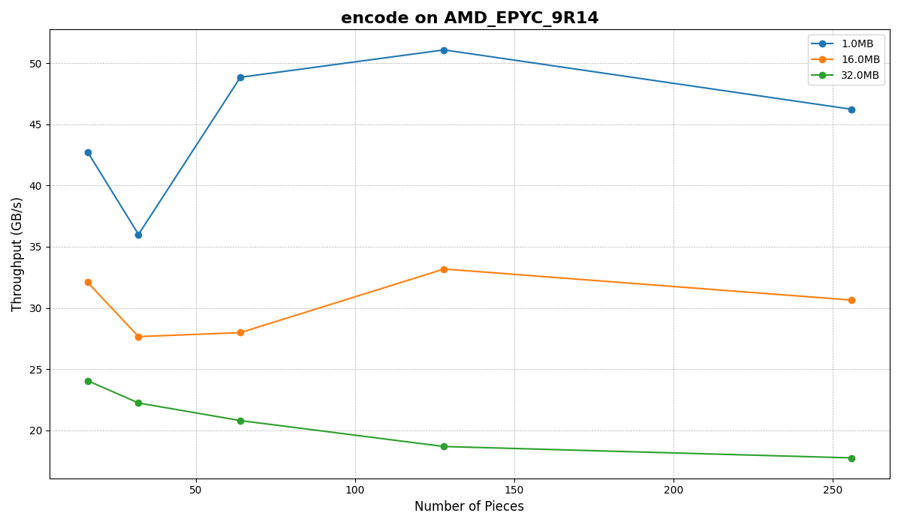
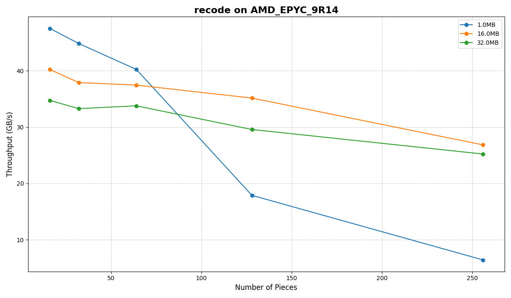
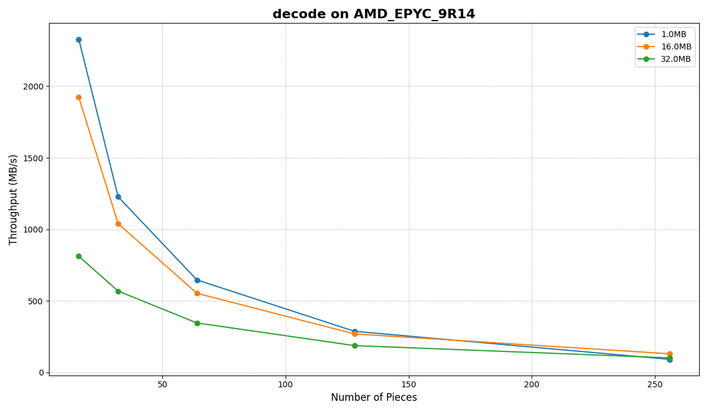

# rlnc

Blazing Fast Erasure-Coding with Random Linear Network Coding (RLNC)

## Introduction

`rlnc` is a Rust library crate that implements an advanced erasure-coding technique Random Linear Network Coding (RLNC) over galois field $GF(2^8)$ with irreducible polynomial $x^8 + x^4 + x^3 + x + 1$. This library provides functionalities for blazing fast erasure-coding of data, reconstructing original data from coded pieces, and recoding existing coded pieces to new erasure-coded pieces, without ever decoding it back to original data. It performs runtime introspection of platform and uses the best of GFNI, AVX512, AVX2 and SSSE3 intrinsics on `x86_64` and NEON intrinsics on `arm64`, for fast vector multiplication by a single scalar over $GF(2^8)$.

Following charts show performance of RLNC encoder, recoder and decoder on **AWS EC2 `m7a.large` with AMD EPYC 9R14** - which has GFNI + AVX512 support. More on performance benchmarking [below](#benchmarking).







---
**Let's take a practical example of how RLNC can be useful.**

Imagine you want to send a book, split into 10 chapters, to a friend over a very unreliable mail service that often loses envelopes.

The old way is to send each of the 10 chapters in a separate envelope. If even 1 envelope gets lost, your friend can't read the whole book. They have to ask you to send that specific missing chapter again, which is slow and inefficient.

Random Linear Network Coding (RLNC) works like this: instead of sending the original chapters, you create 20 new "summary" envelopes. Each summary envelope is a unique, random mix of sentences from all the original 10 chapters. You then mail these 20 summary envelopes.

The magic is that your friend only needs to receive any 10 of these summary envelopes to perfectly reconstruct the entire book. It doesn't matter if the third one you sent gets lost, as long as another one arrives. Because each envelope contains information from the whole book, any 10 of them provide enough clues to solve the puzzle and rebuild the original 10 chapters.

This makes the transfer incredibly robust and efficient, as you don't need to worry about specific envelopes getting lost, just that enough of them make it to the destination.

RLNC can be used for erasure-coding both data-in-transit and data-in-rest - essentially increasing availability of original data by spreading it into many more pieces s.t. each of them is equally important. For a quick understanding of RLNC, have a look at my blog post @ <https://itzmeanjan.in/pages/rlnc-in-depth.html>.

---

Random Linear Network Coding (RLNC) excels in highly dynamic and lossy environments like multicast, peer-to-peer networks, and distributed storage, due to interesting properties such as encoding with random-sampled coefficients, any `k` out of `n` coded-pieces are sufficient to recover and recoding new pieces with existing erasure-coded pieces. Unlike Reed-Solomon, which requires specific symbols for deterministic recovery, RLNC allows decoding from *any* set of linearly independent packets. Compared to Fountain Codes, RLNC offers robust algebraic linearity with coding vector overhead, whereas Fountain codes prioritize very low decoding complexity and indefinite symbol generation, often for large-scale broadcasts.

## Features

For now this crate implements only **Full RLNC** scheme.

- **Encoder**: Splits original data into fixed-size pieces and generates new coded pieces by linearly combining these original pieces with random coefficients, sampled from $GF(2^8)$.
- **Decoder**: Receives coded pieces, applies Gaussian elimination to recover the original data, and handles linearly dependent pieces gracefully.
- **Recoder**: Takes already coded pieces and generates new coded pieces from them, facilitating multi-hop data distribution without requiring intermediate decoding.
- **Error Handling**: Defines a custom `RLNCError` enum to provide clear error messages for various operational failures.

## Prerequisites

Rust stable toolchain; see <https://rustup.rs> for installation guide. MSRV for this crate is 1.89.0.

 ```bash
# While developing this library, I was using
$ rustc --version
rustc 1.89.0 (29483883e 2025-08-04)
```

## Testing

For ensuring functional correctness of RLNC operations, the library includes a comprehensive test suite. Run all the tests by running following commands.

```bash
# Testing on host, first with `default` feature, then with `parallel` feature enabled.
make test

# Testing on web assembly target, using `wasmtime`.
rustup target add wasm32-wasip1
rustup target add wasm32-wasip2
cargo install wasmtime-cli@35.0.0 --locked

make test-wasm
```

```bash
running 17 tests
test full::decoder::tests::test_decoder_decode_invalid_piece_length ... ok
test full::decoder::tests::test_decoder_new_invalid_inputs ... ok
test full::encoder::tests::test_encoder_code_with_buf_invalid_inputs ... ok
test full::decoder_matrix::test::test_swap_rows ... ok
test full::encoder::tests::test_encoder_code_with_coding_vector_invalid_inputs ... ok
test full::encoder::tests::test_encoder_getters ... ok
test full::decoder::tests::test_decoder_getters ... ok
test full::encoder::tests::test_encoder_new_invalid_inputs ... ok
test full::encoder::tests::test_encoder_without_padding_invalid_data ... ok
test full::recoder::tests::test_recoder_getters ... ok
test full::recoder::tests::test_recoder_new_invalid_inputs ... ok
test full::recoder::tests::test_recoder_recode_with_buf_invalid_inputs ... ok
test common::gf256::test::prop_test_gf256_operations ... ok
test full::decoder_matrix::test::prop_test_rref_is_idempotent ... ok
test full::tests::prop_test_rlnc_encoder_decoder ... ok
test full::tests::prop_test_rlnc_decoding_with_useless_pieces ... ok
test full::tests::prop_test_rlnc_encoder_recoder_decoder has been running for over 60 seconds
test full::tests::prop_test_rlnc_encoder_recoder_decoder ... ok

test result: ok. 17 passed; 0 failed; 0 ignored; 0 measured; 0 filtered out; finished in 72.24s

   Doc-tests rlnc

running 3 tests
test src/common/simd_mul_table.rs - common::simd_mul_table (line 25) ... ignored
test src/common/simd_mul_table.rs - common::simd_mul_table (line 8) ... ignored
test src/lib.rs - (line 58) ... ok

test result: ok. 1 passed; 0 failed; 2 ignored; 0 measured; 0 filtered out; finished in 0.00s
```

### Code Coverage

To generate a detailed code coverage report in HTML format, use [cargo-tarpaulin](https://github.com/xd009642/tarpaulin):

```bash
# Install cargo-tarpaulin if not already installed
cargo install cargo-tarpaulin
make coverage
```

```bash
Coverage Results:
|| Tested/Total Lines:
|| src/common/errors.rs: 0/1
|| src/common/gf256.rs: 9/11
|| src/common/simd/mod.rs: 8/12
|| src/common/simd/x86/avx2.rs: 10/10
|| src/common/simd/x86/avx512.rs: 0/10
|| src/common/simd/x86/gfni/m128i.rs: 0/5
|| src/common/simd/x86/gfni/m256i.rs: 0/5
|| src/common/simd/x86/gfni/m512i.rs: 0/5
|| src/common/simd/x86/mod.rs: 18/33
|| src/common/simd/x86/ssse3.rs: 0/10
|| src/full/decoder.rs: 26/31
|| src/full/decoder_matrix.rs: 51/58
|| src/full/encoder.rs: 25/33
|| src/full/recoder.rs: 27/39
||
66.16% coverage, 174/263 lines covered
```

This will create an HTML coverage report at `tarpaulin-report.html` that you can open in your web browser to view detailed line-by-line coverage information for all source files.

> [!NOTE]
> There is a help menu, which introduces you to all available commands; just run `$ make` from the root directory of this project.

## Benchmarking

Performance benchmarks for several input configurations are included to evaluate the efficiency of this RLNC implementation.

To run the benchmarks, execute the following command from the root of the project:

```bash
make bench          # Runs with `default` feature
make bench_parallel # Runs with `parallel` feature
```

> [!WARNING]
> When benchmarking make sure you've disabled CPU frequency scaling, otherwise numbers you see can be misleading. I find <https://github.com/google/benchmark/blob/b40db869/docs/reducing_variance.md> helpful.

For visualizing benchmark results, run following command, which will produce PNG figures inside [./plots](./plots/) directory.

```bash
make bench_then_plot # Only runs with `default` features enabled
```

### On 12th Gen Intel(R) Core(TM) i7-1260P

Running benchmarks on `Linux 6.14.0-27-generic x86_64`, compiled with `rustc 1.88.0 (6b00bc388 2025-06-23)`.

Component | Peak Median Throughput (`default` feature) | Peak Median Throughput (`parallel` feature) | Impact of number of pieces on performance
--- | --- | --- | ---
Full RLNC Encoder | **30.14 GiB/s** | **23.39 GiB/s** | The number of pieces original data got split into has a **minimal** impact on the encoding speed.
Full RLNC Recoder | **27.26 GiB/s** | **12.63 GiB/s** | Similar to the encoder, the recoder's performance remains largely consistent regardless of how many pieces the original data is split into.
Full RLNC Decoder | **1.59 GiB/s** | **Doesn't yet implement a parallel decoding mode** | As the number of pieces increases, the decoding time increases substantially, leading to a considerable drop in throughput. This indicates that decoding is the most computationally intensive part of the full RLNC scheme, and its performance is inversely proportional to the number of pieces.

In summary, the full RLNC implementation demonstrates excellent encoding and recoding speeds, consistently achieving GiB/s throughputs with minimal sensitivity to the number of data pieces. The `parallel` feature, leveraging Rust `rayon` data-parallelism framework, also provides good performance for both encoding and recoding. Whether you want to use that feature, completely depends on your usecase. However, decoding remains a much slower operation, with its performance significantly diminishing as the data is split into a greater number of pieces, and currently does **not** implement a parallel decoding algorithm.

## Usage

To use `rlnc` library crate in your Rust project, add it as a dependency in your `Cargo.toml`:

```toml
[dependencies]
rlnc = "=0.8.5"                                      # On x86_64 and aarch64 targets, it offers fast encoding, recoding and decoding, using SIMD intrinsics.
# or
rlnc = { version = "=0.8.5", features = "parallel" } # Uses `rayon`-based data-parallelism for fast encoding and recoding. Note, this feature, doesn't yet parallelize RLNC decoding.

rand = { version = "=0.9.2" } # Required for random number generation
```

### Full RLNC Workflow Example

I maintain an example demonstrating the Full RLNC workflow:

- Encoding original data into coded pieces.
- Recoding to generate new pieces from received coded pieces. It simulates a relay node.
- Finally decoding all received pieces to recover the original data.

> [!NOTE]
> New recoded pieces could be either useful or not for the Decoder, based on Recoder input coded pieces i.e. from which they are recoded and whether they have already been seen by Decoder or not.

See [full_rlnc.rs](./examples/full_rlnc.rs) example program. Run the program with `$ make example`.

<details>
<summary>Click to view detailed example run output 👇</summary>

```bash
Initialized Encoder with 10240 bytes of data, split into 32 pieces, each of 321 bytes. Each coded piece will be of 353 bytes.
Overhead of encoding: 10.31%
Initializing Decoder, expecting 32 original pieces of 321 bytes each.

Sender generating 16 initial coded pieces...
  Decoded direct piece 1: Useful.
  Decoded direct piece 2: Useful.
  Decoded direct piece 3: Useful.
  Decoded direct piece 4: Useful.
  Decoded direct piece 5: Useful.
  Decoded direct piece 6: Useful.
  Decoded direct piece 7: Useful.
  Decoded direct piece 8: Useful.
  Decoded direct piece 9: Useful.
  Decoded direct piece 10: Useful.
  Decoded direct piece 11: Useful.
  Decoded direct piece 12: Useful.
  Decoded direct piece 13: Useful.
  Decoded direct piece 14: Useful.
  Decoded direct piece 15: Useful.
  Decoded direct piece 16: Useful.

Initializing Recoder with 5648 bytes of received coded pieces.

Recoder active. Generating recoded pieces...
  Decoded recoded piece 1: Not useful.
  Decoded recoded piece 2: Not useful.
  Decoded recoded piece 3: Not useful.
  Decoded recoded piece 4: Not useful.
  Decoded recoded piece 5: Not useful.
  Decoded recoded piece 6: Not useful.
  Decoded recoded piece 7: Not useful.
  Decoded recoded piece 8: Not useful.
  Decoded recoded piece 9: Not useful.
  Decoded recoded piece 10: Not useful.
  Decoded recoded piece 11: Not useful.
  Decoded recoded piece 12: Not useful.
  Decoded recoded piece 13: Not useful.
  Decoded recoded piece 14: Not useful.
  Decoded recoded piece 15: Not useful.
  Decoded recoded piece 16: Not useful.
  Decoded recoded piece 17: Not useful.
  Decoded recoded piece 18: Not useful.
  Decoded recoded piece 19: Not useful.
  Decoded recoded piece 20: Not useful.
  Decoded recoded piece 21: Not useful.
  Decoded recoded piece 22: Not useful.
  Decoded recoded piece 23: Not useful.
  Decoded recoded piece 24: Not useful.
  Decoded recoded piece 25: Not useful.
  Decoded recoded piece 26: Not useful.
  Decoded recoded piece 27: Not useful.
  Decoded recoded piece 28: Not useful.
  Decoded recoded piece 29: Not useful.
  Decoded recoded piece 30: Not useful.
  Decoded recoded piece 31: Not useful.
  Decoded recoded piece 32: Not useful.
  Decoded recoded piece 33: Not useful.
  Decoded recoded piece 34: Not useful.
  Decoded recoded piece 35: Not useful.
  Decoded recoded piece 36: Not useful.
  Decoded recoded piece 37: Not useful.
  Decoded recoded piece 38: Not useful.
  Decoded recoded piece 39: Not useful.
  Decoded recoded piece 40: Not useful.
  Decoded recoded piece 41: Not useful.
  Decoded recoded piece 42: Not useful.
  Decoded recoded piece 43: Not useful.
  Decoded recoded piece 44: Not useful.
  Decoded recoded piece 45: Not useful.
  Decoded recoded piece 46: Not useful.
  Decoded recoded piece 47: Not useful.
  Decoded recoded piece 48: Not useful.
  Decoded recoded piece 49: Not useful.
  Decoded recoded piece 50: Not useful.
  Decoded recoded piece 51: Not useful.
  Decoded recoded piece 52: Not useful.
  Decoded recoded piece 53: Not useful.
  Decoded recoded piece 54: Not useful.
  Decoded recoded piece 55: Not useful.
  Decoded recoded piece 56: Not useful.
  Decoded recoded piece 57: Not useful.
  Decoded recoded piece 58: Not useful.
  Decoded recoded piece 59: Not useful.
  Decoded recoded piece 60: Not useful.
  Decoded recoded piece 61: Not useful.
  Decoded recoded piece 62: Not useful.
  Decoded recoded piece 63: Not useful.
  Decoded recoded piece 64: Not useful.

Initializing a new Recoder with 5648 bytes of received coded pieces.
  Decoded recoded piece 1: Useful.
  Decoded recoded piece 2: Useful.
  Decoded recoded piece 3: Useful.
  Decoded recoded piece 4: Useful.
  Decoded recoded piece 5: Useful.
  Decoded recoded piece 6: Useful.
  Decoded recoded piece 7: Useful.
  Decoded recoded piece 8: Useful.

Still need more pieces. Generating direct piece 17 from encoder...
  Decoded direct piece 17: Useful.

Still need more pieces. Generating direct piece 18 from encoder...
  Decoded direct piece 18: Useful.

Still need more pieces. Generating direct piece 19 from encoder...
  Decoded direct piece 19: Useful.

Still need more pieces. Generating direct piece 20 from encoder...
  Decoded direct piece 20: Useful.

Still need more pieces. Generating direct piece 21 from encoder...
  Decoded direct piece 21: Useful.

Still need more pieces. Generating direct piece 22 from encoder...
  Decoded direct piece 22: Useful.

Still need more pieces. Generating direct piece 23 from encoder...
  Decoded direct piece 23: Useful.

Still need more pieces. Generating direct piece 24 from encoder...
  Decoded direct piece 24: Useful.

Retrieving decoded data...

RLNC workflow completed successfully! Original data matches decoded data.
```

</details>
