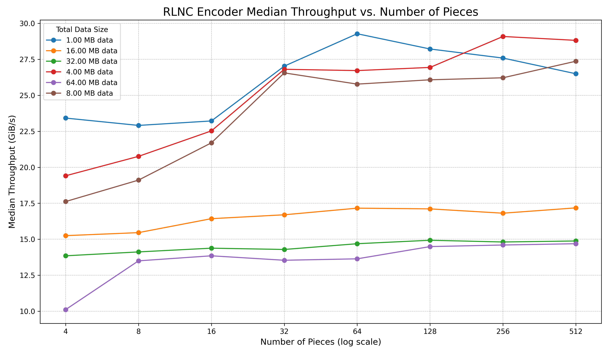
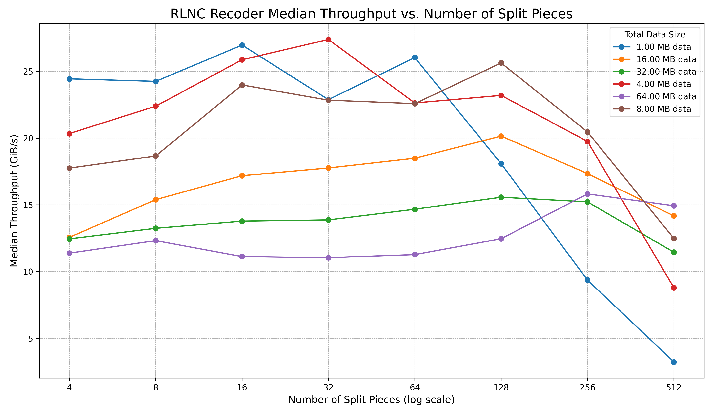
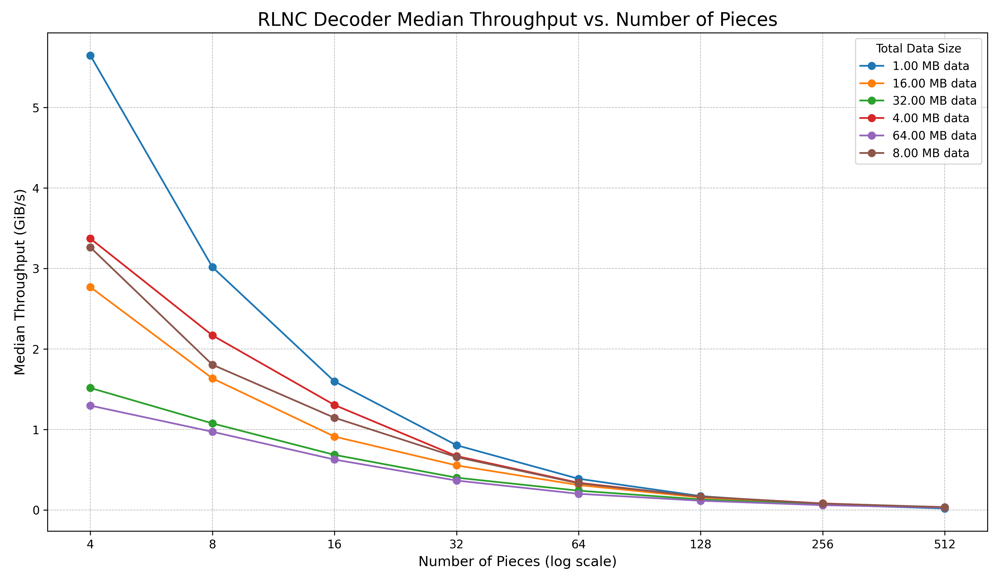

# How to generate plots from `divan` benchmark results ?

>[!NOTE]
> `divan` is benchmark harness we use in `rlnc` library crate. More about `divan` @ <https://docs.rs/divan/latest/divan>. These scripts for visualizing benchmark results are both `rlnc` and `divan` specific. They are not generic. Originally I used Google Gemini 2.5 Pro to generate these scripts.

1. First create a virtual environment using `venv`.

    ```bash
    python -m venv .venv
    source .venv/bin/activate # When done with plot generation, run `deactivate`
    ```

2. Install all the dependencies inside the virtual environment.

    ```bash
    pip install -r plots/scripts/requirements.txt
    ```

3. Apply git patch [visualize-plot-bench-result.patch](./visualize-plot-bench-result.patch) to extend benchmark input parameter set of RLNC encoder, recoder and decoder. This patch also disables custom memory allocator which can track memory allocation when benchmarking encoding, recoding or decoding. But for plotting purposes, we are only interested in throughput for various input configurations, so we can safely disable everything else.

    ```bash
    # This patch was generated on git tag v0.8.4 of this crate
    # If the benchmark files are not touched after that, this patch should work.
    git apply plots/scripts/visualize-plot-bench-result.patch
    ```

4. Run benchmark program and collect console output.

    ```bash
    RUSTFLAGS="-C target-cpu=native" cargo bench --profile optimized --bench full_rlnc_encoder
    RUSTFLAGS="-C target-cpu=native" cargo bench --profile optimized --bench full_rlnc_recoder
    RUSTFLAGS="-C target-cpu=native" cargo bench --profile optimized --bench full_rlnc_decoder
    ```

5. Copy console output of benchmark run; open corresponding Python script, say [encoder](./scripts/plot_encoder_bench_result.py), which plots RLNC Encoder benchmark results; update `benchmark_data` string with the result you copied and you want to visualize.

6. Save the updated script and run the script to get resulting plot.

    ```bash
    python plots/scripts/plot_encoder_bench_result.py
    # or, provide desired output filename
    python plots/scripts/plot_encoder_bench_result.py rlnc_encoder.png
    ```

7. Do same for RLNC Recoder or Decoder.

All scripts are inside [scripts](./scripts) directory.

---

Plots generated with benchmark result of running RLNC encoder, recoder and decoder on x86_64 target with AVX2 feature.






