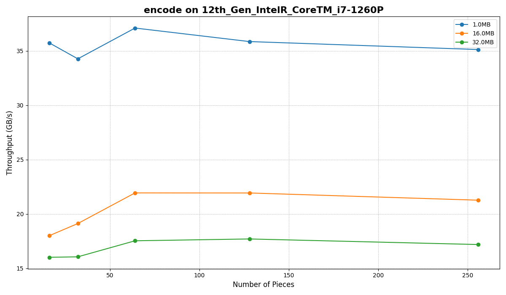
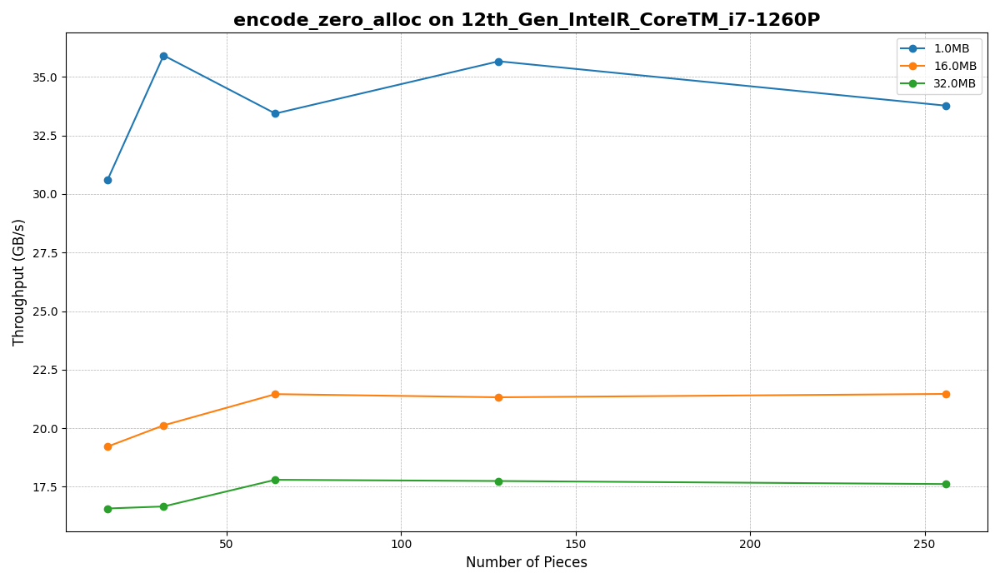
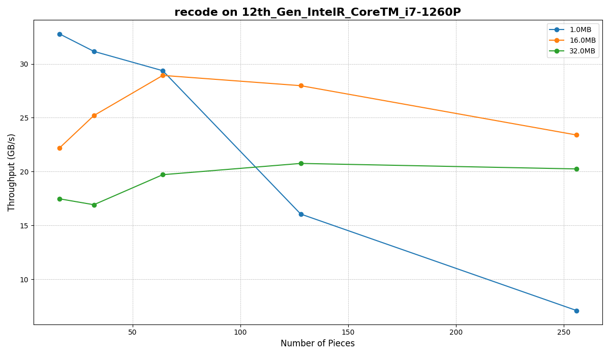
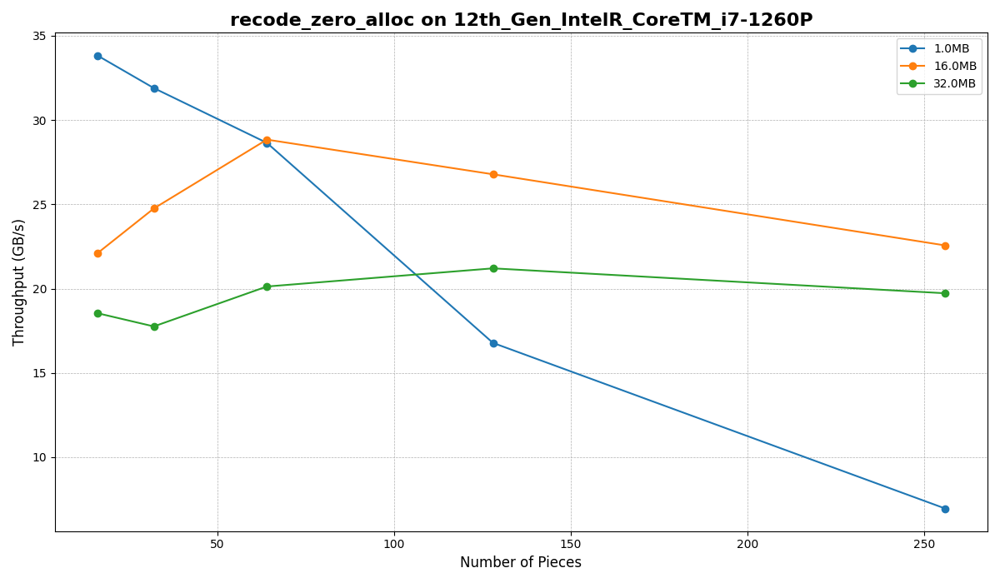
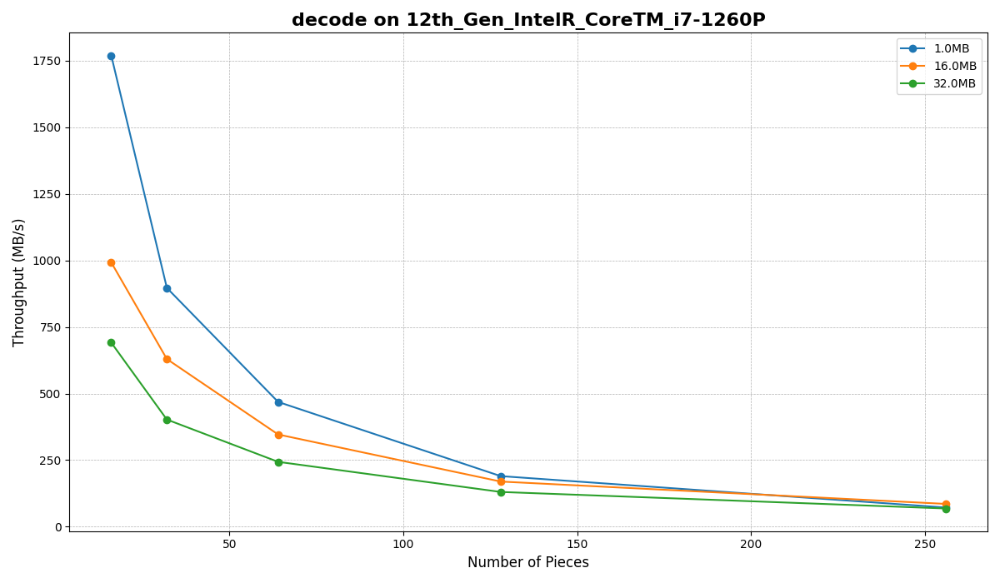

# Plotted Performance Benchmark Results

Following plots are generated by running this make recipe, from root of the repository, on machines with specified configuration.

> [!NOTE]
> These benchmark results don't capture the performance of running RLNC encoder, recoder and decoder with `parallel` feature.

```bash
make bench_then_plot
```

## Performance Characteristics

Algorithm | Characteristics
--- | ---
Encoding | The number of pieces original data got split into has a **minimal** impact on the encoding speed.
Recoding | Recoding is a wrapper over encoding, with an additional matrix-vector multiplication. If number of pieces increases, the dimension of matrix-vector multiplication also increases, resulting in higher computational complexity, during Recoding.
Decoding | As the number of pieces increases, the decoding time increases substantially, leading to a considerable drop in throughput. This indicates that decoding is the most computationally intensive part of the full RLNC scheme, and its performance is inversely proportional to the number of pieces.

In summary, this RLNC implementation demonstrates excellent encoding and recoding speeds, consistently achieving GiB/s throughputs with relatively minimal sensitivity to the number of data pieces. The `parallel` feature, leveraging Rust `rayon` data-parallelism framework, also provides good performance for both encoding and recoding. Whether you want to use that feature, completely depends on your use case. However, decoding remains a much slower operation, with its performance significantly diminishing as the data is split into a greater number of pieces, and currently does **not** implement a parallel decoding algorithm.

## On 12th Gen Intel(R) Core(TM) i7-1260P

Running Linux kernel

```bash
$ uname -srm
Linux 6.17.0-5-generic x86_64
```

with Rust compiler

```bash
$ rustc --version
rustc 1.90.0 (1159e78c4 2025-09-14)
```

and following CPU feature flags

```bash
$ lscpu | awk -F': *' '/Flags/{gsub(" ", ", ", $2);print $2}'
fpu, vme, de, pse, tsc, msr, pae, mce, cx8, apic, sep, mtrr, pge, mca, cmov, pat, pse36, clflush, dts, acpi, mmx, fxsr, sse, sse2, ss, ht, tm, pbe, syscall, nx, pdpe1gb, rdtscp, lm, constant_tsc, art, arch_perfmon, pebs, bts, rep_good, nopl, xtopology, nonstop_tsc, cpuid, aperfmperf, tsc_known_freq, pni, pclmulqdq, dtes64, monitor, ds_cpl, vmx, smx, est, tm2, ssse3, sdbg, fma, cx16, xtpr, pdcm, pcid, sse4_1, sse4_2, x2apic, movbe, popcnt, tsc_deadline_timer, aes, xsave, avx, f16c, rdrand, lahf_lm, abm, 3dnowprefetch, cpuid_fault, epb, ssbd, ibrs, ibpb, stibp, ibrs_enhanced, tpr_shadow, flexpriority, ept, vpid, ept_ad, fsgsbase, tsc_adjust, bmi1, avx2, smep, bmi2, erms, invpcid, rdseed, adx, smap, clflushopt, clwb, intel_pt, sha_ni, xsaveopt, xsavec, xgetbv1, xsaves, split_lock_detect, user_shstk, avx_vnni, dtherm, ida, arat, pln, pts, hwp, hwp_notify, hwp_act_window, hwp_epp, hwp_pkg_req, hfi, vnmi, umip, pku, ospke, waitpkg, gfni, vaes, vpclmulqdq, rdpid, movdiri, movdir64b, fsrm, md_clear, serialize, arch_lbr, ibt, flush_l1d, arch_capabilities
```

### Encoder





### Recoder





### Decoder


